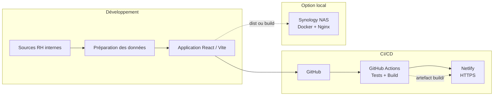

# Hublot

**Tableau de bord des effectifs et statistiques RH** pour la [**Direction interrégionale de la Mer Méditerranée (DIRM Méditerranée)**](https://www.dirm.mediterranee.developpement-durable.gouv.fr), au sein du **Ministère chargé de la Mer et de la Pêche**.

Application web de visualisation et d'analyse des **données agents** (effectifs, missions, régions, services, statuts, contrats, parité, âges, temps de travail) — avec filtres globaux, méthodologie des calculs par onglet et déploiement automatisé (CI/CD). Les jeux de données sources sont **internes à la DIRM** et ne sont pas exposés dans ce dépôt public.

<p align="center">
  <a href="https://github.com/Meriem1403/Hublot/actions/workflows/ci.yml">
    
  </a>
  <a href="https://dirmhublot.netlify.app">
    
  </a>
  
  
  
  
  
  
</p>

<p align="center">
  <strong>Démo :</strong> <a href="https://dirmhublot.netlify.app">dirmhublot.netlify.app</a>
  &nbsp;·&nbsp;
  <strong>Dépôt :</strong> <a href="https://github.com/Meriem1403/Hublot">github.com/Meriem1403/Hublot</a>
</p>

---

## Sommaire

- [Présentation](#présentation)
- [Fonctionnalités](#fonctionnalités)
- [Stack technique](#stack-technique)
- [Architecture](#architecture)
- [Prérequis](#prérequis)
- [Installation et développement](#installation-et-développement)
- [Données](#données)
- [Tests et qualité](#tests-et-qualité)
- [Déploiement](#déploiement)
- [Sécurité](#sécurité)
- [Structure du projet](#structure-du-projet)
- [Documentation](#documentation)
- [Scripts disponibles](#scripts-disponibles)

---

## Présentation

**Hublot** est un outil de pilotage RH pour la **DIRM Méditerranée**. Il centralise et restitue les effectifs à partir de **données métier internes**, dans un cadre sécurisé et non accessible depuis ce dépôt.

L'application permet aux gestionnaires RH et aux équipes métier de la DIRM de :

- explorer les effectifs via **12 vues analytiques** (cartes, graphiques, carte interactive, tableaux filtrables) ;
- croiser les données par **région, service, mission, PASA, corps, fonction, statut** ;
- comprendre chaque indicateur grâce à la **méthodologie des calculs** (sources et formules documentées dans l'interface) ;
- s'appuyer sur des **données traçables** (agrégations calculées, sans indicateurs fictifs).

Le projet suit une démarche **Agile** (sprints, user stories, incréments) et **DevOps** (Git, CI GitHub Actions, déploiement Netlify, hébergement NAS Docker).

---

## Fonctionnalités

| Module | Description |
|--------|-------------|
| **Vue d'ensemble** | Synthèse des effectifs, répartition PASA, indicateurs clés |
| **Par mission** | Effectifs par mission ou regroupement PASA (politique, segment, sous-segment) |
| **Par région** | Carte interactive France + détails par région (parité, temps de travail, ETP, top métiers) |
| **Par service** | Cartes par service (effectifs, TP/TPP, ETP, métiers en tension) |
| **Statuts** | Répartition titulaires / CDI / CDD / stagiaires |
| **Contrats** | Temps plein, temps partiel, CDD par service |
| **Responsabilités** | Pyramide hiérarchique (Direction, Encadrement, Opérationnel) |
| **Métiers** | Top 20 libellés (Libellé NNE, Poste, Grade) + correspondances |
| **Âges** | Pyramide des âges et tranches démographiques |
| **Parité H/F** | Distribution globale, par service et par niveau |
| **Temps de travail** | TP, TPP, non renseigné, ETP |
| **Vue dynamique** | Exploration filtrée type tableur + export Excel |

**Filtres globaux** : région, service (dont DIRM Méditerranée), statut, PASA, corps, fonction.

---

## Stack technique

| Couche | Technologies |
|--------|----------------|
| Frontend | React 18, TypeScript, Vite 6 |
| UI | Tailwind CSS, Radix UI, Recharts, react-simple-maps |
| Données | Référentiel agents interne, API Netlify Functions + PostgreSQL (Neon) en production |
| Tests | Vitest, jsdom |
| CI | GitHub Actions (Node 20, `npm ci`, tests, build) |
| CD | Netlify (`build/`, headers sécurité, SPA) |
| Conteneurisation | Docker, Nginx (déploiement NAS Synology) |
| Outils données | Python (pandas), ExcelJS (export utilisateur) |

---

## Architecture



**Pipeline CI/CD (alignée Netlify) :**

1. `push` sur `main` → déclenchement **CI/CD Pipeline**
2. `npm ci` → `npm run test:run` → `npm run build`
3. Vérification du dossier `build/` (publish Netlify)
4. Netlify déploie automatiquement si le build distant réussit

---

## Prérequis

- **Node.js** 20 LTS et **npm**
- **Git**
- *(Optionnel)* **Docker** / Docker Desktop (dev ou NAS)
- *(Optionnel)* **Python 3** pour les scripts de préparation des données (usage interne)
- Compte **Netlify** + extension **Neon** si déploiement cloud avec base distante

---

## Installation et développement

```bash
# Cloner le dépôt
git clone https://github.com/Meriem1403/Hublot.git
cd Hublot

# Installer les dépendances (lockfile versionné pour CI reproductible)
npm ci

# Lancer le serveur de développement
npm run dev
```

L'application est accessible sur **http://localhost:5173**.

### Variables d'environnement (local)

Créer un fichier `.env` à la racine (jamais commité) :

```env
VITE_APP_USERNAME=admin
VITE_APP_PASSWORD=votre_mot_de_passe
```

Voir `env.docker.example` pour les variables liées à Docker / Neon.

---

## Données

Les données agents sont **confidentielles** : elles ne sont ni versionnées dans Git, ni décrites dans ce README.

| Environnement | Mode de chargement |
|---------------|-------------------|
| Développement local | Référentiel agents préparé en interne (hors dépôt) |
| Production (Netlify) | API sécurisée + base **PostgreSQL (Neon)** via variables d'environnement |

La procédure d'import, de mise à jour et de déploiement des données est documentée **en interne** pour les équipes habilitées uniquement.

---

## Tests et qualité

```bash
# Tests unitaires (48 tests)
npm run test:run

# Build de production
npm run build

# Audit des vulnérabilités npm
npm audit
```

Les tests s'exécutent automatiquement dans **GitHub Actions** à chaque push et pull request sur `main`.

Plan de test complet : [docs/PLAN_TEST.md](./docs/PLAN_TEST.md)

---

## Déploiement

### Production cloud — Netlify

| Paramètre | Valeur |
|-----------|--------|
| Build command | `npm run build` |
| Publish directory | `build` |
| Branche | `main` |
| URL | [dirmhublot.netlify.app](https://dirmhublot.netlify.app) |

Configuration : [`netlify.toml`](./netlify.toml)

### Hébergement local — NAS Synology

Déploiement statique sans build sur le NAS (recommandé si `npm ci` est lent sur le NAS) :

```bash
npm run build
cp -R build dist   # si votre compose monte ./dist
```

Sur le NAS : **Container Manager** → projet avec [`docker-compose.yml`](./docker-compose.yml) → accès `http://IP_DU_NAS:8080`.

Guide pas à pas : [DEPLOY_SYNOLOGY_LOCAL.md](./DEPLOY_SYNOLOGY_LOCAL.md)

### Docker (alternatives)

```bash
make dev    # développement (port 5173)
make prod   # production Docker multi-stage
make check-docker
```

Voir [docs/DOCKER.md](./docs/DOCKER.md) et [Makefile](./Makefile).

---

## Sécurité

- **Secrets** : jamais dans Git (`.env`, mots de passe, URLs DB) — variables Netlify / Neon uniquement
- **Headers HTTP** : configurés dans `netlify.toml` (X-Frame-Options, CSP, etc.)
- **HTTPS** : fourni par Netlify en production
- **Audit** : `npm audit` en CI (étape informative)
- **Données RH** : référentiels agents, exports métier et secrets exclus via `.gitignore`

Checklist : [docs/CHECKLIST_SECURITE.md](./docs/CHECKLIST_SECURITE.md) · [docs/SECURITE.md](./docs/SECURITE.md)

---

## Structure du projet

```
Hublot/
├── .github/workflows/ci.yml      # Pipeline CI
├── src/
│   ├── components/               # Vues (onglets, graphiques, carte)
│   ├── hooks/                    # Chargement et agrégation des données
│   ├── services/                 # dataService, filtres
│   ├── utils/                    # Calculs, coordonnées régions
│   └── types/                    # Modèles TypeScript
├── scripts/                      # Scripts données (interne), Neon, déploiement
├── docs/                         # Documentation complète + annexes
├── public/                       # Assets statiques
├── netlify.toml                  # Config Netlify
├── docker-compose.yml            # NAS / Nginx statique
├── nginx.conf                    # Config Nginx (SPA + sécurité)
└── vite.config.ts
```

---

## Documentation

| Document | Contenu |
|----------|---------|
| [**docs/README.md**](./docs/README.md) | Index de toute la documentation |
| [DEVOPS.md](./docs/DEVOPS.md) | Synthèse DevOps (CI/CD, périmètre, évolutions) |
| [DOCUMENTATION_DEPLOIEMENT.md](./docs/DOCUMENTATION_DEPLOIEMENT.md) | Installation, rollback, CI, logs |
| [ARCHITECTURE_DEPLOIEMENT.md](./docs/ARCHITECTURE_DEPLOIEMENT.md) | Git, YAML, build, déploiement |
| [ENVIRONNEMENT_TEST.md](./docs/ENVIRONNEMENT_TEST.md) | Environnements DEV, TEST, PROD |
| [SECURITE_4_DEPLOIEMENT.md](./docs/SECURITE_4_DEPLOIEMENT.md) | HTTPS, secrets, headers, npm audit |
| [ENJEUX_PLAN_TEST.md](./docs/ENJEUX_PLAN_TEST.md) | Enjeux des plans de test (référentiel Studi) |
| [PLAN_TEST.md](./docs/PLAN_TEST.md) | Plan de test (tableau synthétique + statuts) |
| [PLAYWRIGHT_DEMO.md](./docs/PLAYWRIGHT_DEMO.md) | Guide démo Playwright (jury) |
| [SCENARIOS_TEST.md](./docs/SCENARIOS_TEST.md) | Scénarios formalisés (Étant donné / Quand / Alors, Annexe 13) |
| [COMPETENCE_DEPLOIEMENT_STUDI.md](./docs/COMPETENCE_DEPLOIEMENT_STUDI.md) | Synthèse compétence déploiement sécurisé |
| [DEPLOIEMENT_NAS_SYNOLOGY.md](./docs/DEPLOIEMENT_NAS_SYNOLOGY.md) | Déploiement sur NAS Synology |
| [DATA_MODEL.md](./docs/DATA_MODEL.md) | Modèle de données agents |
| [TROUBLESHOOTING.md](./docs/TROUBLESHOOTING.md) | Dépannage |

---

## Scripts disponibles

| Commande | Description |
|----------|-------------|
| `npm run dev` | DEV — serveur local (mode development, port 3000) |
| `npm run dev:test` | Serveur local en mode test (`.env.test`) |
| `npm run check:env` | Vérifie DEV + chaîne TEST (lint, tests, audit, build) |
| `npm run build:test` | Build pour QA locale / Docker test |
| `npm run test:preview:docker` | Preview TEST sur http://localhost:4173 |
| `npm run build` | Build production → `build/` |
| `npm run test` | Vitest en mode watch |
| `npm run test:run` | Vitest une fois (CI) |
| `npm run lint` | ESLint |
| `npm run test:e2e` | Tests E2E Playwright (headless, rapide) |
| **`npm run test:e2e:demo`** | **Démo jury** — smoke visible, ralenti 800 ms |
| `npm run test:e2e:headed` | E2E avec fenêtre navigateur visible |
| `npm run test:e2e:slow` | E2E visible + ralenti 400 ms |
| `npm run test:e2e:ui` | Interface Playwright (pas à pas) |
| `npm run audit:prod` | Audit npm dépendances production |
| `npm run docker:dev` | Docker développement |
| `npm run docker:prod` | Docker production |
| `make convert` | Préparation des données via Docker (usage interne) |
| `make check-docker` | Vérifier que Docker est démarré |

---

## Auteur et contexte

Projet réalisé dans le cadre de la compétence **« Préparer le déploiement d'une application sécurisée »** (Studi) — démarche Agile, DevOps, CI/CD, tests automatisés et documentation de déploiement.

---

<p align="center">
  <sub><a href="https://www.dirm.mediterranee.developpement-durable.gouv.fr">DIRM Méditerranée</a> — Ministère chargé de la Mer et de la Pêche · Données RH sensibles : accès restreint, aucun jeu de données métier dans le dépôt public.</sub>
</p>
