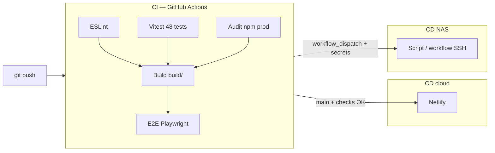

# Pipelines CI / CD — architecture à deux canaux

Hublot utilise une **CI centralisée** (GitHub Actions) et des **CD distincts** selon la cible. Ce n’est pas un pipeline monolithique unique : c’est le modèle courant **GitHub + Netlify**.

---

## Vue d’ensemble

| Workflow | Fichier | Rôle |
|----------|---------|------|
| **CI** | `.github/workflows/ci.yml` | Qualité : lint, tests, audit, build, E2E |
| **CD Netlify** | `.github/workflows/cd-netlify.yml` | Optionnel : POST build hook après CI |
| **CD NAS** | `.github/workflows/cd-nas.yml` | Optionnel : rsync SSH si secrets configurés |
| **Audit planifié** | `.github/workflows/audit-scheduled.yml` | Chaque lundi — rapport npm |

---

## CI (obligatoire)

Déclenchée sur `main`, `staging` et les pull requests.

| Job | Bloquant |
|-----|----------|
| ESLint | Oui |
| Tests unitaires (48) | Oui |
| Audit production (`npm run audit:prod`) | Oui (critical + high hors allowlist) |
| Build `build/` | Oui |
| E2E Playwright (3 scénarios) | Oui |

---

## CD Netlify (cloud)

**Mécanisme principal :** webhook Git → Netlify build (`netlify.toml`).

**Gate recommandée (sans double build) :**

1. Netlify → **Site configuration** → **Build & deploy** → **Deploy contexts**
2. **Production branch** → **Deploy only when required checks pass**
3. Cocher le check **`CI`** (workflow GitHub Actions)

**Mécanisme optionnel :** secret `NETLIFY_BUILD_HOOK` + workflow `cd-netlify.yml` pour déclencher un build **après** CI verte. Si vous utilisez le hook, désactivez le build automatique sur chaque push dans Netlify pour éviter deux builds.

---

## CD NAS (réseau interne)

| Mode | Comment |
|------|---------|
| **Manuel** | `./scripts/deploy-nas.sh` puis copie / Docker sur le NAS |
| **Semi-auto** | GitHub → Actions → **CD NAS Synology** (secrets `NAS_HOST`, `NAS_USER`, `NAS_PATH`, `NAS_SSH_KEY`) |
| **Rsync local** | `NAS_HOST=… NAS_USER=… NAS_PATH=… ./scripts/deploy-nas.sh --rsync` |

Le compose NAS monte `./build` (voir `docker-compose.yml`).

---

## Environnement staging

Voir [ENVIRONNEMENT_STAGING.md](./1.2 Préparer le déploiement d'une application/1.2.3 Mettre en place un environnement de test.md) — branche `staging` + deploy previews Netlify.

---

## Fichiers liés

- [DEVOPS.md](../1.1 Les bases de la démarche DevOps/1.1.2 La démarche DevOps.md)
- [ARCHITECTURE_DEPLOIEMENT.md](../1.1 Les bases de la démarche DevOps/1.1.4 La mise en place de l'intégration continue (CI).md)
- [MONITORING.md](./1.1 Les bases de la démarche DevOps/1.1.2.1 Monitoring et supervision.md)
- [SECURITE_AUDIT.md](./1.2 Préparer le déploiement d'une application/1.2.4.3 Audit des dépendances.md)
