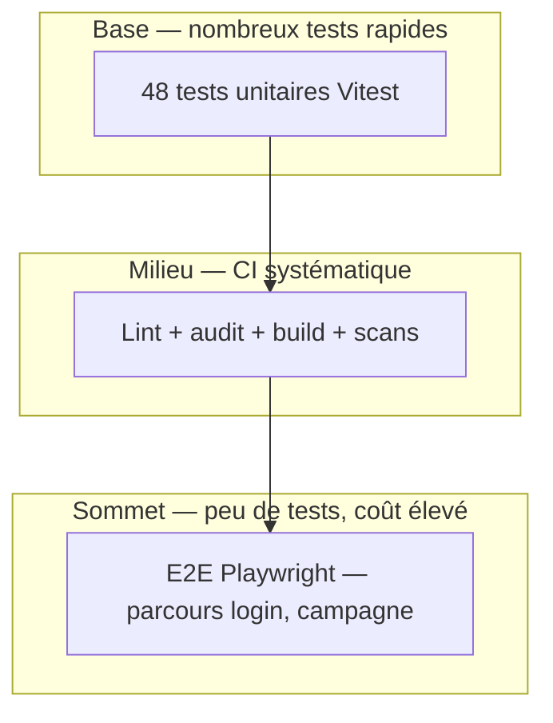

# 1.2.1 Les enjeux des plans de test

## En bref

Un **plan de test** structure ce qu'il faut vérifier avant de livrer Hublot : données RH, accès au tableau de bord, chaîne DevOps. Sur le dépôt `Meriem1403/Hublot`, nous combinons **48 tests unitaires Vitest**, une **CI bloquante** et des **scénarios documentés** (ST-F*, ST-SEC*) complétés par des contrôles manuels tracés. Ce chapitre explique pourquoi ce cadre est indispensable pour un déploiement sécurisé sur `dirmhublot.netlify.app`.

---

## Objectif pédagogique

Comprendre les **enjeux d'un plan de test** dans le cadre de la compétence « Préparer le déploiement d'une application sécurisée » : risques métier, traçabilité, automatisation et alignement avec les environnements.

---

## Contexte — projet Hublot

Hublot est l'application DIRM Méditerranée de pilotage des effectifs (filtres région/service, calculs ETP, exports). Les décisions de gestion reposent sur des agrégations correctes ; l'accès est réservé au personnel habilité. Les déploiements sont fréquents via GitHub et Netlify : sans plan de test, une régression peut atteindre la production sans filet.

---

## Définitions

| Terme | Définition |
|-------|------------|
| **Plan de test** | Contrat de qualité : quoi tester, comment, quand la livraison est acceptable. |
| **Scénario** | Cas reproductible (préconditions, actions, résultats) — identifiants ST-F*, ST-SEC*. |
| **Régression** | Comportement correct qui casse après une modification. |
| **Pyramide des tests** | Stratégie : beaucoup de tests rapides en base, peu de tests lents au sommet. |
| **Definition of Done** | Critères obligatoires avant merge ou mise en production. |
| **Traçabilité** | Lien vérifiable entre risque, scénario, exécution et preuve (CI, rapport). |

---

## Ce qui a été mis en place

Nous avons structuré la qualité autour de trois piliers. Le **tableau de plan** ([1.3.7 Automatiser les tests en DevOps](../1.3%20R%C3%A9diger%20des%20scriptes%20dans%20la%20d%C3%A9marche%20DevOps/1.3.7%20Automatiser%20les%20tests%20en%20DevOps.md)) liste objectifs, résultats attendus et statuts. Les **scénarios formalisés** ([1.2.2](./1.2.2%20Elaborer%20un%20sc%C3%A9nario%20de%20test.md)) décrivent les cas manuels et sécurité. La **CI** (`.github/workflows/ci.yml`) exécute lint, 48 tests, audit production, build et E2E Playwright à chaque push sur `main` et `staging`.

| Niveau | Outil | Volume Hublot |
|--------|-------|---------------|
| Unitaire | Vitest | 48 tests (métier + sécurité) |
| Intégration | Build Vite + preview | Artefact `build/` |
| Système | Playwright | 3 smoke + campagne ST-F* |
| Sécurité | npm audit, Gitleaks, CodeQL, headers | Voir [1.2.4](./1.2.4%20Les%20outils%20et%20les%20strat%C3%A9gies%20des%20tests%20de%20s%C3%A9curit%C3%A9.md) |
| Acceptation | Tests manuels documentés | ST-F01 à ST-F06 |

---

## Pourquoi ces choix

Les **données RH** imposent de prioriser filtres, calculs et contrôle d'accès : une erreur de chiffre ou une fuite n'est pas acceptable. La **chaîne DevOps** impose l'automatisation du répétitif (48 tests à chaque commit) pour éviter l'oubli humain. Les **tests manuels** restent pour l'UX (responsive, performance perçue) et les données réelles en staging, difficiles à scripter sans coût excessif. Nous avons limité les E2E à un parcours critique pour garder une CI rapide et stable.

| Enjeu | Conséquence si non testé | Réponse dans le plan |
|-------|-------------------------|----------------------|
| Données RH fausses | Mauvaises décisions de gestion | `dataService.test.ts`, `dataCalculations.test.ts`, ST-F02, ST-F03 |
| Accès non autorisé | Tableau de bord exposé | ST-F01, E2E login, `security.test.ts` |
| Régression à chaque push | Bug en production | CI bloquante |
| Secrets / CVE | Compromission | Gitleaks, `audit:prod`, CodeQL |
| Multi-environnements | Bug visible seulement en prod | DEV, CI, staging, prod — [1.1.3](../1.1%20Les%20bases%20de%20la%20d%C3%A9marche%20DevOps/1.1.3%20Les%20bases%20d%27un%20environnement%20de%20test.md), [1.2.3](./1.2.3%20Mettre%20en%20place%20un%20environnement%20de%20test.md) |

---

## Comment ça fonctionne

Le plan répond à trois questions avant chaque livraison : **quoi** vérifier, **comment**, et **quand** c'est acceptable.

1. **Identifier les risques** (données, auth, régression, sécurité).
2. **Prioriser** (Critique / Haute / Moyenne / Basse) — méthode détaillée en [1.2.5](./1.2.5%20Planifier%20efficacement%20les%20tests.md).
3. **Choisir le type de test** (auto vs manuel) selon la pyramide.
4. **Rédiger les scénarios** ST-* en format Étant donné / Quand / Alors.
5. **Exécuter au bon environnement** (local, CI, staging, prod).
6. **Statuer et conserver les preuves** — [1.2.6](./1.2.6%20Valider%20les%20r%C3%A9sultats%20des%20tests.md).



**Definition of Done** avant merge `main` : CI verte ; tests critiques Passé dans le plan ; pas de secret dans le diff.

---

## Quand

| Événement | Action de test |
|-----------|----------------|
| Développement local | `npm run test`, `npm run lint` |
| Avant commit | `npm run test:run` |
| Push / PR `main` ou `staging` | CI complète (bloquante) |
| Avant démonstration | Campagne ST-F*, `npm run security:*` |
| Après deploy PROD | Headers, `/health.json` |
| Hebdomadaire | Audit planifié, CodeQL, Trivy |

---

## Preuves et démonstration

```bash
npm run test:run    # 48 tests — base du plan
npm run lint
npm run audit:prod
npm run build
npm run test:e2e
```

| Preuve | Où la trouver |
|--------|----------------|
| Run CI vert | [github.com/Meriem1403/Hublot/actions](https://github.com/Meriem1403/Hublot/actions) |
| Statuts plan | [1.3.7](../1.3%20R%C3%A9diger%20des%20scriptes%20dans%20la%20d%C3%A9marche%20DevOps/1.3.7%20Automatiser%20les%20tests%20en%20DevOps.md) |
| Campagne datée | [1.2.9](./1.2.9%20Rapport%20d%27ex%C3%A9cution%20des%20tests.md) |
| Commandes de validation | [1.2.8](./1.2.8%20Proc%C3%A9dure%20d%27ex%C3%A9cution%20des%20tests%20(%C3%A9preuve).md) |

**Limites assumées :** pas de tests de charge ; couverture code non à 100 % mais ciblée sur le métier ; données RH réelles validées en staging, pas en CI (mocks).

---

## Synthèse

Le plan de test Hublot structure quoi valider, comment et quand livrer : fiabilité des données RH, sécurité d'accès et absence de régression dans une chaîne DevOps automatisée, prouvée par 48 tests unitaires, CI et scénarios tracés.

---

## Documents liés

- [1.2.2 Elaborer un scénario de test](./1.2.2%20Elaborer%20un%20sc%C3%A9nario%20de%20test.md)
- [1.2.3 Mettre en place un environnement de test](./1.2.3%20Mettre%20en%20place%20un%20environnement%20de%20test.md)
- [1.2.5 Planifier efficacement les tests](./1.2.5%20Planifier%20efficacement%20les%20tests.md)
- [1.2.6 Valider les résultats des tests](./1.2.6%20Valider%20les%20r%C3%A9sultats%20des%20tests.md)
- [1.1.3 Les bases d'un environnement de test](../1.1%20Les%20bases%20de%20la%20d%C3%A9marche%20DevOps/1.1.3%20Les%20bases%20d%27un%20environnement%20de%20test.md)
- [1.1.4 La mise en place de l'intégration continue (CI)](../1.1%20Les%20bases%20de%20la%20d%C3%A9marche%20DevOps/1.1.4%20La%20mise%20en%20place%20de%20l%27int%C3%A9gration%20continue%20(CI).md)
- [1.3.7 Automatiser les tests en DevOps](../1.3%20R%C3%A9diger%20des%20scriptes%20dans%20la%20d%C3%A9marche%20DevOps/1.3.7%20Automatiser%20les%20tests%20en%20DevOps.md)
