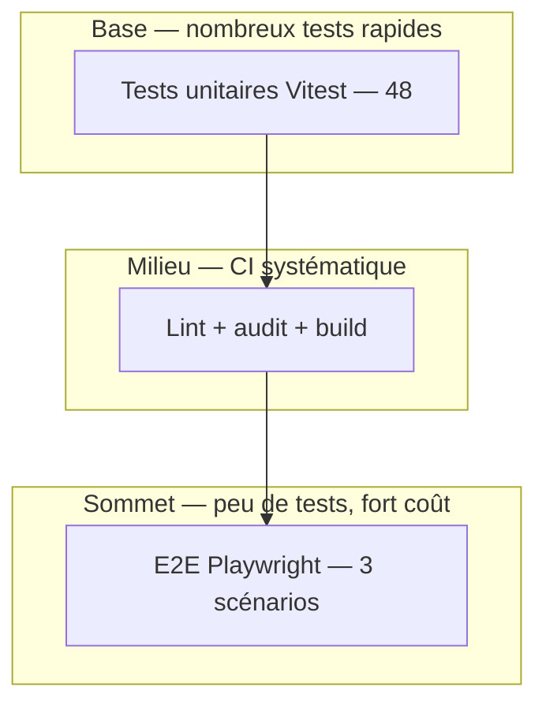

# Les enjeux des plans de test — Hublot

Document de référence pour la compétence **« Préparer le déploiement d'une application sécurisée »** — complète le [PLAN_TEST.md](../1.3 Rédiger des scriptes dans la démarche DevOps/1.3.7 Automatiser les tests en DevOps.md).

**Méthode opérationnelle :** [PLANIFIER_EFFICACEMENT_LES_TESTS.md](../1.2 Préparer le déploiement d'une application/1.2.5 Planifier efficacement les tests.md) — comment prioriser, choisir auto vs manuel, et tracer les résultats.

---

## 1. Pourquoi un plan de test ?

Un **plan de test** n'est pas une simple liste de commandes : c'est un **contrat de qualité** entre l'équipe, le métier et les utilisateurs. Il répond à trois questions avant chaque mise en production :

1. **Quoi** vérifier ? (fonctionnel, sécurité, performance, accessibilité…)
2. **Comment** ? (automatique vs manuel, outil, environnement)
3. **Quand** c'est **acceptable** de livrer ? (critères de succès, statut Passé / Échec)

Sans plan structuré, on déploie « à l'aveugle » : régressions silencieuses, données incohérentes, failles de sécurité découvertes par les utilisateurs.

---

## 2. Enjeux spécifiques au projet Hublot

| Enjeu | Description | Conséquence si non testé |
|-------|-------------|-------------------------|
| **Données RH sensibles** | Effectifs, statuts, missions — usage interne DIRM | Erreurs de calcul ou fuite d'information ; perte de confiance institutionnelle |
| **Décisions de gestion** | Tableaux de bord pour pilotage des effectifs | Chiffres faux → mauvaises décisions (budget, organisation) |
| **Authentification** | Accès réservé aux personnels habilités | Tableau de bord exposé sans contrôle d'accès |
| **Chaîne DevOps** | CI/CD, déploiements fréquents sur `main` | Régression livrée en production sans filet |
| **Multi-environnements** | DEV, TEST, STAGING, PROD | Bug visible seulement en prod ou config oubliée |
| **Conformité déploiement sécurisé** | HTTPS, headers, audit npm, pas de secrets dans Git | Non-conformité au référentiel Studi / exigences admin |

---

## 3. Les six enjeux transverses (référentiel)

### 3.1 Couvrir les risques métier

Le plan priorise ce qui **fait mal** si ça casse :

- Filtres et agrégations (région, service, PASA…) — **tests unitaires** `dataService` / `dataCalculations`
- Parcours critique login → tableau de bord — **E2E Playwright**
- Build déployable — **CI** + Netlify

### 3.2 Élaborer et documenter les scénarios

Chaque scénario opérationnel est décrit sous forme **Étant donné / Quand / Alors**, avec identifiants **ST-F01**, **ST-SEC01**, etc., dans **[SCENARIOS_TEST.md](../1.2 Préparer le déploiement d'une application/1.2.2 Elaborer un scénario de test.md)** (**Annexe 13**).

### 3.3 Tracer et prouver (auditabilité)

Chaque ligne du [PLAN_TEST.md](../1.3 Rédiger des scriptes dans la démarche DevOps/1.3.7 Automatiser les tests en DevOps.md) comporte :

| Colonne | Enjeu |
|---------|--------|
| **Objectif** | Pourquoi ce test existe |
| **Résultat attendu** | Critère mesurable de succès |
| **Statut** | Preuve d'exécution (Passé / Échec / À exécuter) |

En jury : le tableau **et** les fiches **ST-\*** **et** les runs GitHub Actions = traçabilité complète.

### 3.4 Automatiser le répétitif

| Type | Enjeu de l'automatisation |
|------|---------------------------|
| **Unitaires (48)** | Répétables à chaque commit, rapides, pas d'oubli humain |
| **Lint / build / audit** | Qualité code et sécurité des dépendances |
| **E2E (3)** | Parcours utilisateur critique sans régression manuelle |

Les tests **manuels** restent pour l'UX (responsive, performance perçue) difficiles à scripter sans outillage lourd.

### 3.5 Aligner test et environnement

Un même test n'a pas le même sens selon l'env. :

| Test | DEV | TEST (CI) | STAGING | PROD |
|------|-----|-----------|---------|------|
| Unitaires | Local | Bloquant | — | — |
| E2E | Local | Bloquant | Recommandé | — |
| Auth manuelle | `.env.development` | — | Comptes staging | Comptes prod |
| Headers HTTPS | — | — | curl staging | curl prod |

Voir [ENVIRONNEMENT_TEST.md](../1.1 Les bases de la démarche DevOps/1.1.3 Les bases d'un environnement de test.md).

### 3.6 Intégrer la sécurité dans le plan

La sécurité n'est pas un add-on :

- Authentification (manuel + E2E)
- Headers HTTP (curl / Annexe 02)
- `npm run audit:prod` (CI)
- Absence de données RH dans le dépôt (revue + `.gitignore`)

Voir [SECURITE_4_DEPLOIEMENT.md](./1.2 Préparer le déploiement d'une application/1.2.4.2 Sécurité du déploiement.md).

### 3.7 Coût / bénéfice (pyramide des tests)

- **Base large** : beaucoup de tests unitaires peu coûteux
- **Milieu** : pipeline CI systématique
- **Sommet** : peu d'E2E, ciblés sur le parcours critique

Trop d'E2E = pipeline lent et fragile ; trop peu = trous sur l'intégration réelle.

---

## 4. Stratégie retenue pour Hublot

| Niveau | Outil | Rôle dans le plan |
|--------|-------|------------------|
| **Statique** | ESLint | Conventions, erreurs évidentes |
| **Unitaire** | Vitest | Logique métier (filtres, stats) |
| **Intégration** | Build Vite + preview Docker | Fichiers statiques servis comme en prod |
| **Système** | Playwright | Login + health + navigation |
| **Acceptation** | Tests manuels documentés | Responsive, données réelles, perf |
| **Sécurité** | npm audit, curl headers | Dépendances et exposition HTTP |

**Definition of Done (qualité)** avant merge `main` :

- [ ] CI verte (lint, 48 tests, audit, build, E2E)
- [ ] Tests manuels critiques exécutés sur STAGING si changement UI
- [ ] Statuts mis à jour dans `PLAN_TEST.md`

---

## 5. Limites assumées (honnêteté jury)

| Limite | Mitigation |
|--------|------------|
| Pas de tests de charge (load) | Application statique ; surveillance uptime `/health.json` |
| Couverture code non mesurée à 100 % | Ciblage des modules à fort impact métier |
| Données réelles hors CI | Tests sur JSON mockés ; validation manuelle en STAGING |
| E2E limités à 3 scénarios | Évolutif (Playwright) sans bloquer la CI |

---

## 6. Lien avec Agile et DevOps

| Agile | Plan de test |
|-------|----------------|
| User story « En tant que RH… » | Scénarios manuels + critères d'acceptation |
| Definition of Done | CI + lignes Passé du plan |
| Sprint Review | Démo sur STAGING, pas directement en PROD |
| Rétrospective | Mise à jour du plan si bug échappé en prod |

| DevOps | Plan de test |
|--------|----------------|
| CI | Exécute automatiquement la partie répétable du plan |
| CD | Ne remplace pas les tests — les **précède** |
| Feedback rapide | Échec CI < 10 min → correction avant deploy |

---

## 7. Synthèse oral (30 secondes)

> « Le plan de test Hublot structure **quoi** valider, **comment** et **quand** on peut livrer. Les enjeux sont la fiabilité des **données RH**, la **sécurité d'accès**, et l'absence de régression dans une chaîne **DevOps** avec déploiements automatiques. On combine **48 tests unitaires**, **CI complète** et **E2E** sur le parcours critique, complétés par des **tests manuels** tracés dans un tableau avec statuts. »

---

## Documents liés

- [PLAN_TEST.md](../1.3 Rédiger des scriptes dans la démarche DevOps/1.3.7 Automatiser les tests en DevOps.md) — tableau et statuts
- [PLANIFIER_EFFICACEMENT_LES_TESTS.md](../1.2 Préparer le déploiement d'une application/1.2.5 Planifier efficacement les tests.md) — méthode en 6 étapes, pyramide, démo
- [VALIDER_RESULTATS_TESTS.md](../1.2 Préparer le déploiement d'une application/1.2.6 Valider les résultats des tests.md) — statuer Passé/Échec, preuves, livraison
- [SCENARIOS_TEST.md](../1.2 Préparer le déploiement d'une application/1.2.2 Elaborer un scénario de test.md) — fiches Étant donné / Quand / Alors (**Annexe 13**)
- [DEMO_EPREUVE.md](./1.2 Préparer le déploiement d'une application/1.2.8 Procédure d'exécution des tests (épreuve).md) — commandes pour le jury
- [ENVIRONNEMENT_TEST.md](../1.1 Les bases de la démarche DevOps/1.1.3 Les bases d'un environnement de test.md) — où exécuter chaque test
