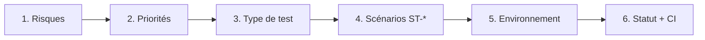
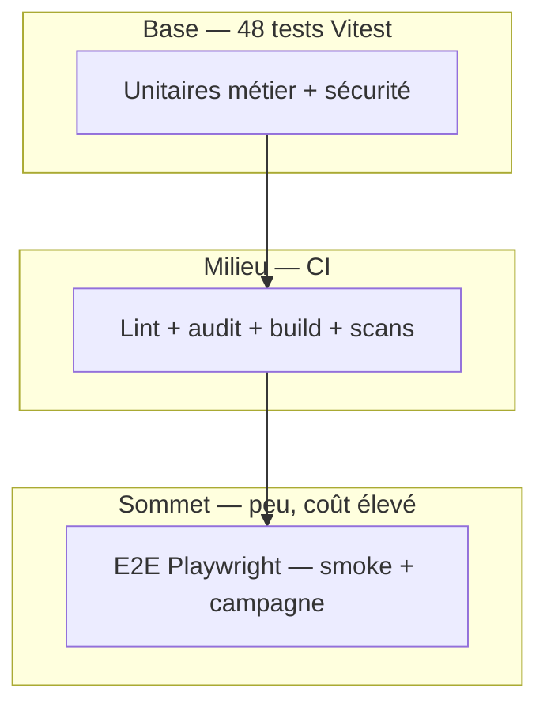

# 1.2.5 Planifier efficacement les tests

## En bref

Planifier efficacement, ce n'est pas « tout tester » : c'est cibler les risques qui coûtent cher s'ils se produisent (données RH, accès, régression), choisir le bon niveau de test et tracer les résultats. Sur Hublot, la méthode en six étapes relie risques, scénarios ST-*, les **48 tests Vitest** et la CI du dépôt `Meriem1403/Hublot`.

---

## Objectif pédagogique

**Planifier efficacement les tests** : priorisation, pyramide des tests, choix auto vs manuel, traçabilité vers le plan.

---

## Contexte — projet Hublot

Les livraisons sont fréquentes (données, UI, sécurité). Sans planification, on surcharge la CI d'E2E fragiles ou on oublie les tests manuels sur données réelles. Le tableau central reste [1.3.7](../1.3%20R%C3%A9diger%20des%20scriptes%20dans%20la%20d%C3%A9marche%20DevOps/1.3.7%20Automatiser%20les%20tests%20en%20DevOps.md) ; ce chapitre en explique la méthode.

---

## Définitions

| Terme | Définition |
|-------|------------|
| **Plan efficace** | Maximum de confiance pour un effort maîtrisé. |
| **Pyramide des tests** | Beaucoup d'unitaires, peu d'E2E. |
| **Priorité Critique** | Bloque la livraison si non Passé. |
| **Campagne** | Série de scénarios (`npm run test:campaign`). |
| **Shift-left** | Tester tôt (commit / CI). |

---

## Ce qui a été mis en place

### Méthode en 6 étapes



| Étape | Question | Livrable |
|-------|----------|----------|
| 1. Risques | Qu'est-ce qui ferait mal ? | Tableau § risques ci-dessous |
| 2. Priorités | Critique / Haute / Moyenne / Basse ? | [1.2.2](./1.2.2%20Elaborer%20un%20sc%C3%A9nario%20de%20test.md) |
| 3. Type | Auto ou manuel ? | Pyramide + règles § auto vs manuel |
| 4. Scénarios | Cas Étant donné / Quand / Alors ? | ST-F01…ST-SEC05 |
| 5. Environnement | DEV, CI, STAGING, PROD ? | [1.2.3](./1.2.3%20Mettre%20en%20place%20un%20environnement%20de%20test.md) |
| 6. Traçabilité | Passé / Échec ? | [1.3.7](../1.3%20R%C3%A9diger%20des%20scriptes%20dans%20la%20d%C3%A9marche%20DevOps/1.3.7%20Automatiser%20les%20tests%20en%20DevOps.md) + Actions |

### Batterie unitaire (48 tests)

| Fichier | Tests | Rôle |
|---------|-------|------|
| `dataCalculations.test.ts` | 20 | Calculs RH (âge, ETP, répartitions) |
| `dataService.test.ts` | 12 | Filtres, normalisation, chargement |
| `security.test.ts` | 15 | Sanitization, session, masquage |
| `environment.test.ts` | 1 | Libellé environnement |

---

## Pourquoi ces choix

Nous partons des **conséquences métier**, pas de la liste des onglets. Les risques Critique sont automatisés en CI dès que possible. Les tests manuels restent pour l'UX et les données réelles en staging.

| Risque | Impact | Priorité | Réponse |
|--------|--------|----------|---------|
| Données RH fausses | Décisions erronées | Critique | 48 tests + ST-F02, ST-F03 |
| Accès non autorisé | Fuite consultation | Critique | ST-F01 + E2E + security.test |
| Régression push | Bug en prod | Critique | CI bloquante |
| Fuite secret / CVE | Compromission | Critique | Gitleaks, audit:prod |
| UI mobile | Usage terrain | Moyenne | ST-F04 |
| Lenteur perçue | Adoption | Moyenne | ST-F05 |
| Confusion env | Test sur prod | Basse | ST-F06 |

**Règle d'or :** un test **Critique** doit être **automatisé en CI** quand c'est faisable.

### Automatiser ou garder manuel ?

| Critère | Automatiser | Manuel documenté |
|---------|-------------|-------------------|
| Répétitif à chaque commit | Oui | Non |
| Logique pure (calcul, filtre) | Oui | Non |
| Parcours login court | Oui (E2E) | Compléter UX |
| Responsive / perf perçue | Non | ST-F04, F05 |
| Données réelles Excel | Non en CI | ST-F02 staging |
| Headers prod | Script + CI | Après deploy |

---

## Comment ça fonctionne

### Pyramide Hublot



### Planning par moment

| Moment | Actions | Outils |
|--------|---------|--------|
| Dev local | Unitaires ciblés, lint | `npm run test`, `npm run lint` |
| Avant commit | Suite complète | `npm run test:run` |
| PR | CI bloquante | `ci.yml` |
| Merge `main` | CI + Netlify | CD |
| Avant démo | Campagne ST-F* | `npm run test:campaign` |
| Après deploy PROD | Headers, health | `security:headers`, `/health.json` |

### Definition of Done (qualité)

- [ ] CI verte : lint, 48 tests, `audit:prod`, build, E2E
- [ ] Gitleaks OK
- [ ] ST-F01, ST-F02, ST-F03 **Passé**
- [ ] Statuts à jour dans [1.3.7](../1.3%20R%C3%A9diger%20des%20scriptes%20dans%20la%20d%C3%A9marche%20DevOps/1.3.7%20Automatiser%20les%20tests%20en%20DevOps.md)
- [ ] Pas de secret dans le diff

### Chaîne de preuve

```
Risque → Priorité → Scénario ST-* → Ligne plan → Preuve (CI, rapport)
```

---

## Quand

Voir tableau « Planning par moment » ci-dessus. La planification est vivante : tout bug échappé en prod met à jour le plan (rétrospective Agile).

---

## Preuves et démonstration

| # | Commande | Message démo |
|---|----------|--------------|
| 1 | `npm run test:run` | 48 tests — base pyramide |
| 2 | `npm run lint` | Qualité statique |
| 3 | `npm run audit:prod` | Dépendances prod |
| 4 | `npm run build` | Artefact déployable |
| 5 | `npm run test:e2e` | Parcours login |
| 6 | `npm run test:campaign` | Scénarios ST-F* |
| 7 | `npm run check:env` | Chaîne locale complète |

```bash
npm run test:run
npm run lint
npm run audit:prod
npm run build
npm run test:e2e
npm run test:campaign
```

GitHub **Actions** : pipeline CI lint → unit-tests → audit → build → e2e.

---

## Synthèse

Planifier efficacement sur Hublot, c'est partir des risques RH et d'accès, prioriser, placer 48 tests unitaires en base, la CI au milieu, peu d'E2E au sommet, et tracer chaque résultat dans le plan et les rapports.

---

## Documents liés

- [1.2.1 Les enjeux des plans de test](./1.2.1%20Les%20enjeux%20des%20plans%20de%20test.md)
- [1.2.2 Elaborer un scénario de test](./1.2.2%20Elaborer%20un%20sc%C3%A9nario%20de%20test.md)
- [1.2.6 Valider les résultats des tests](./1.2.6%20Valider%20les%20r%C3%A9sultats%20des%20tests.md)
- [1.2.9 Rapport d'exécution des tests](./1.2.9%20Rapport%20d%27ex%C3%A9cution%20des%20tests.md)
- [1.2.4 Les outils et les stratégies des tests de sécurité](./1.2.4%20Les%20outils%20et%20les%20strat%C3%A9gies%20des%20tests%20de%20s%C3%A9curit%C3%A9.md)
- [1.1.3 Les bases d'un environnement de test](../1.1%20Les%20bases%20de%20la%20d%C3%A9marche%20DevOps/1.1.3%20Les%20bases%20d%27un%20environnement%20de%20test.md)
- [1.3.7 Automatiser les tests en DevOps](../1.3%20R%C3%A9diger%20des%20scriptes%20dans%20la%20d%C3%A9marche%20DevOps/1.3.7%20Automatiser%20les%20tests%20en%20DevOps.md)
