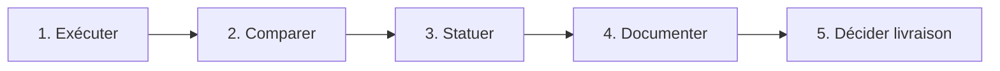

# 1.2.6 Valider les résultats des tests

## En bref

**Valider** un résultat, ce n'est pas lancer une commande : c'est comparer le résultat obtenu au **résultat attendu**, statuer **Passé** ou **Échec**, conserver une **preuve**, puis décider si la livraison est acceptable. Sur Hublot, la CI valide l'automatisé ; la campagne Playwright et le rapport daté valident les scénarios ST-F*.

---

## Objectif pédagogique

**Valider les résultats des tests** : statuts, critères par type de test, preuves documentées, décision de livraison.

---

## Contexte — projet Hublot

Le dépôt `Meriem1403/Hublot` livre via Netlify après CI verte. Le lecteur et le métier exigent une traçabilité : colonne Statut du plan, runs GitHub Actions, [1.2.9](./1.2.9%20Rapport%20d%27ex%C3%A9cution%20des%20tests.md).

---

## Définitions

| Statut | Signification |
|--------|---------------|
| **Passé** | Exécuté et conforme au résultat attendu |
| **Échec** | Exécuté et non conforme — corriger puis rejouer |
| **À exécuter** | Pas encore lancé |
| **À vérifier** | Exécuté mais preuve ou environnement incertain |
| **Preuve** | Log, run CI, rapport, capture |
| **Definition of Done** | Critères obligatoires avant merge / prod |

**Règle :** aucun **Passé** sans preuve.

---

## Ce qui a été mis en place

Nous appliquons une procédure en cinq étapes et une matrice de référence alignée sur [1.3.7](../1.3%20R%C3%A9diger%20des%20scriptes%20dans%20la%20d%C3%A9marche%20DevOps/1.3.7%20Automatiser%20les%20tests%20en%20DevOps.md).



---

## Pourquoi ces choix

Sans statut ni preuve, un test « qui a l'air de marcher » ne prouve rien en audit. Séparer automatisé (CI) et manuel (campagne) clarifie qui valide quoi. En cas d'échec Critique, la livraison est bloquée jusqu'à rejeu complet.

---

## Comment ça fonctionne

### Critères — tests automatisés (CI)

| Test | Résultat attendu | Preuve |
|------|------------------|--------|
| Lint | 0 erreur ESLint | Job ESLint |
| Unitaires | 48 passed | `npm run test:run` / CI |
| Audit prod | exit 0 | Job Audit npm |
| Build | `build/index.html` + assets | CI + Netlify |
| E2E | 3 passed Playwright | Job E2E |
| Gitleaks | no leaks found | workflow Scans sécurité |
| Headers ST-SEC01 | script exit 0 | `npm run security:headers` |

Run global **vert** = tous les jobs bloquants passent.

### Critères — manuels / semi-auto

| Scénario | Succès (résumé) | Validation |
|----------|-----------------|------------|
| ST-F01 | Auth refusée / acceptée / déconnexion | Campagne + E2E |
| ST-F02 | 3 onglets alimentés, console OK | Campagne |
| ST-F03 | Filtres + reset | Campagne + unitaires |
| ST-F04 | 375 px utilisable | Campagne |
| ST-F05 | 3 onglets < 15 s | Campagne |
| ST-F06 | Badge QA vs pas de badge PROD | Campagne |
| ST-SEC02 | 15 tests sécurité | `security:test` |

Détail : [1.2.2](./1.2.2%20Elaborer%20un%20sc%C3%A9nario%20de%20test.md).

### En cas d'échec

| Situation | Action |
|-----------|--------|
| Unitaire rouge | Corriger → `npm run test:run` |
| E2E login | `build:e2e`, `.env.test` → `test:e2e` |
| Audit bloque | `npm audit fix` ou allowlist PR |
| Headers manquants | `netlify.toml` → redeploy |
| Manuel Échec | Corriger → rejouer ST-* → mettre à jour rapport |

Ne jamais passer à **Passé** sans **rejouer** après correction.

---

## Quand

| Étape | Moment |
|-------|--------|
| Exécuter auto | Chaque push / PR |
| Statuer plan | Après CI + campagne |
| Décider livraison | Avant merge `main` / démo |
| Mettre à jour rapport | Après campagne datée |

---

## Preuves et démonstration

### Matrice de référence (état documenté)

| ID / Test | Type | Statut | Preuve |
|-----------|------|--------|--------|
| ST-AUTO lint | Auto | Passé | CI |
| ST-AUTO unitaires | Auto | Passé | 48 tests |
| ST-AUTO build | Auto | Passé | CI + Netlify |
| ST-AUTO audit | Auto | Passé | CI |
| ST-AUTO E2E | Auto | Passé | CI |
| ST-F01 … F06 | Manuel/E2E | Passé | Campagne 2026-05-27 |
| ST-SEC01 | Semi-auto | Passé | `security:headers` |
| ST-SEC02 | Auto | Passé | 15 tests |
| ST-SEC03 | Auto | À vérifier | security-scan.yml |
| ST-SEC04 | Auto | Passé | CI + Trivy info |
| ST-SEC05 | Auto | À vérifier | CodeQL Security |

### Checklist de validation

1. `npm run test:run` → **48 passed**
2. GitHub Actions → **CI** vert
3. [1.3.7](../1.3%20R%C3%A9diger%20des%20scriptes%20dans%20la%20d%C3%A9marche%20DevOps/1.3.7%20Automatiser%20les%20tests%20en%20DevOps.md) → colonne Statut
4. [1.2.9](./1.2.9%20Rapport%20d%27ex%C3%A9cution%20des%20tests.md) → date campagne
5. `npm run security:headers` → ST-SEC01

```bash
npm run test:run && npm run lint && npm run audit:prod && npm run build && npm run security:test
```

### Décision de livraison (DoD)

- [ ] CI verte sur le commit livré
- [ ] Aucun **Échec** Critique dans le plan
- [ ] ST-F01, ST-F02, ST-F03 **Passé**
- [ ] ST-SEC01 **Passé**
- [ ] Rapport à jour
- [ ] Pas de secret dans le diff

Un seul Critique en **Échec** → pas de livraison.

---

## Synthèse

Valider les tests Hublot, c'est comparer, statuer avec preuve, et n'accepter la livraison que si la CI et les scénarios critiques sont Passé sur `Meriem1403/Hublot`.

---

## Documents liés

- [1.2.2 Elaborer un scénario de test](./1.2.2%20Elaborer%20un%20sc%C3%A9nario%20de%20test.md)
- [1.2.5 Planifier efficacement les tests](./1.2.5%20Planifier%20efficacement%20les%20tests.md)
- [1.2.8 Procédure d'exécution des tests ](./1.2.8%20Proc%C3%A9dure%20d%27ex%C3%A9cution%20des%20tests%20(%C3%A9preuve).md)
- [1.2.9 Rapport d'exécution des tests](./1.2.9%20Rapport%20d%27ex%C3%A9cution%20des%20tests.md)
- [1.2.10 Guide Playwright](./1.2.10%20Guide%20Playwright.md)
- [1.3.7 Automatiser les tests en DevOps](../1.3%20R%C3%A9diger%20des%20scriptes%20dans%20la%20d%C3%A9marche%20DevOps/1.3.7%20Automatiser%20les%20tests%20en%20DevOps.md)
