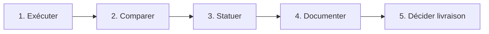

# ✅ Valider les résultats des tests

Guide pour **interpréter, statuer et prouver** les résultats des tests sur **Hublot** (DIRM Méditerranée) — avant livraison ou démo jury.

Ce document complète :
- [PLAN_TEST.md](../1.3 Rédiger des scriptes dans la démarche DevOps/1.3.7 Automatiser les tests en DevOps.md) — tableau Objectif / Résultat attendu / **Statut**
- [SCENARIOS_TEST.md](../1.2 Préparer le déploiement d'une application/1.2.2 Elaborer un scénario de test.md) — scénarios ST-F*, ST-SEC*
- [PLANIFIER_EFFICACEMENT_LES_TESTS.md](../1.2 Préparer le déploiement d'une application/1.2.5 Planifier efficacement les tests.md) — méthode de planification
- [RAPPORT_EXECUTION_TESTS.md](./1.2 Préparer le déploiement d'une application/1.2.9 Rapport d'exécution des tests.md) — rapport de campagne daté
- [DEMO_EPREUVE.md](./1.2 Préparer le déploiement d'une application/1.2.8 Procédure d'exécution des tests (épreuve).md) — commandes pour reproduire devant le jury

**Annexes :** [08](../Annexes/Annexe_08_PLAN_TEST.md) (plan) · [13](../Annexes/Annexe_13_SCENARIOS_TEST.md) (scénarios)

---

## 1. Valider un résultat : c'est quoi ?

**Valider** un résultat de test, ce n'est pas « lancer la commande ». C'est :

1. **Exécuter** le test (ou consulter la preuve CI).
2. **Comparer** le résultat obtenu au **résultat attendu** (critère mesurable).
3. **Statuer** : **Passé**, **Échec**, **À exécuter** ou **À vérifier**.
4. **Documenter** la preuve (log, capture, rapport).
5. **Décider** si la livraison est acceptable (Definition of Done).

> Un test sans statut ni preuve n'est **pas validé** — même s'il a « l'air de marcher ».

---

## 2. Les statuts officiels

| Statut | Signification | Action |
|--------|---------------|--------|
| **Passé** | Exécuté ; conforme au résultat attendu | Peut contribuer à la livraison |
| **Échec** | Exécuté ; non conforme | **Corriger** puis ré-exécuter |
| **À exécuter** | Pas encore lancé (souvent manuel) | Planifier avant démo / prod |
| **À vérifier** | Exécuté mais preuve incomplète ou environnement incertain | Compléter la vérification |

**Règle Hublot :** aucun statut **Passé** sans **preuve** (log terminal, run CI vert, ligne du rapport).

---

## 3. Critères de validation par type de test

### 3.1 Tests automatisés (CI)

| Test | Résultat attendu | Preuve | Où statuer |
|------|------------------|--------|------------|
| **Lint** | Exit code 0, 0 erreur ESLint | Log job `ESLint` | CI + [PLAN_TEST.md](../1.3 Rédiger des scriptes dans la démarche DevOps/1.3.7 Automatiser les tests en DevOps.md) |
| **Unitaires** | `48 passed`, 0 failed | `npm run test:run` ou job `Tests unitaires` | CI + PLAN_TEST |
| **Audit prod** | Exit code 0 (`audit:prod`) | Job `Audit npm` | CI + [SECURITE_AUDIT.md](./1.2 Préparer le déploiement d'une application/1.2.4.3 Audit des dépendances.md) |
| **Build** | `build/index.html` + `build/assets/` | Job `Build production` | CI + Netlify deploy |
| **E2E smoke** | 3 passed (Playwright) | Job `Tests E2E` | CI + PLAN_TEST |
| **Gitleaks** | `no leaks found` | Workflow `Scans sécurité` | GitHub Actions |
| **Headers (ST-SEC01)** | Script exit 0 | `npm run security:headers` | [RAPPORT_EXECUTION_TESTS.md](./1.2 Préparer le déploiement d'une application/1.2.9 Rapport d'exécution des tests.md) |

**Validation CI :** le run global est **vert** si tous les jobs **bloquants** passent. Un job rouge = statut **Échec** sur la ligne correspondante du plan.

### 3.2 Tests manuels / semi-automatisés

| Scénario | Critère de succès (résumé) | Outil de validation |
|----------|----------------------------|---------------------|
| **ST-F01** | Login refusé si invalide ; dashboard si valide ; déconnexion OK | Playwright campagne + revue PROD |
| **ST-F02** | ≥ 3 onglets alimentés, pas d'erreur console bloquante | Playwright + F12 Console |
| **ST-F03** | Filtres mettent à jour les vues ; réinitialisation OK | Playwright |
| **ST-F04** | Viewport 375 px utilisable, pas de débordement majeur | Playwright |
| **ST-F05** | 3 changements d'onglet en < 15 s perçues | Playwright |
| **ST-F06** | Badge env visible en QA ; absent en PROD | Playwright + navigateur PROD |
| **ST-SEC02** | 15 tests `security.test.ts` passés | `npm run security:test` |

Détail complet : [SCENARIOS_TEST.md](../1.2 Préparer le déploiement d'une application/1.2.2 Elaborer un scénario de test.md).

---

## 4. La procédure en 5 étapes



| Étape | Automatisé | Manuel |
|-------|------------|--------|
| **1. Exécuter** | Push → CI ou `npm run test:run` | Campagne Playwright / navigation |
| **2. Comparer** | Sortie vs « Résultat attendu » du plan | Comportement vs scénario ST-* |
| **3. Statuer** | Passé si vert ; Échec si rouge | Passé / Échec dans SCENARIOS_TEST §8 |
| **4. Documenter** | Lien run GitHub Actions (SHA, date) | [RAPPORT_EXECUTION_TESTS.md](./1.2 Préparer le déploiement d'une application/1.2.9 Rapport d'exécution des tests.md) |
| **5. Décider** | Merge `main` si DoD OK | Démo jury / mise en prod |

---

## 5. Matrice de validation Hublot (état de référence)

Synthèse alignée sur [PLAN_TEST.md](../1.3 Rédiger des scriptes dans la démarche DevOps/1.3.7 Automatiser les tests en DevOps.md) — à mettre à jour après chaque campagne.

| ID / Test | Type | Résultat attendu (extrait) | Statut | Preuve |
|-----------|------|----------------------------|--------|--------|
| ST-AUTO lint | Auto | 0 erreur ESLint | **Passé** | CI job ESLint |
| ST-AUTO unitaires | Auto | 48 tests passés | **Passé** | `npm run test:run` / CI |
| ST-AUTO build | Auto | Artefact `build/` | **Passé** | CI + Netlify |
| ST-AUTO audit | Auto | `audit:prod` OK | **Passé** | CI |
| ST-AUTO E2E | Auto | 3 smoke Playwright | **Passé** | CI |
| ST-F01 | Manuel/E2E | Auth refusée / acceptée | **Passé** | Campagne 2026-05-27 |
| ST-F02 … ST-F06 | Manuel/E2E | Voir scénarios | **Passé** | Rapport exécution |
| ST-SEC01 | Semi-auto | Headers HTTPS + X-Frame + nosniff | **Passé** | `security:headers` / curl |
| ST-SEC02 | Auto | 15 tests sécurité | **Passé** | `security.test.ts` |
| ST-SEC03 | Auto | Gitleaks sans fuite | **À vérifier** | Workflow `security-scan.yml` |
| ST-SEC04 | Auto | Audit + Trivy | **Passé** / informatif Trivy | CI |
| ST-SEC05 | Auto | CodeQL sans alerte critique | **À vérifier** | Onglet Security GitHub |

> **ST-SEC03 / ST-SEC05 :** statut **À vérifier** tant que les workflows n'ont pas été exécutés au moins une fois sur `main` après leur ajout.

---

## 6. Que faire en cas d'échec ?

| Situation | Action | Re-validation |
|-----------|--------|---------------|
| Test unitaire rouge | Corriger le code ou le test ; relancer `npm run test:run` | Passé si 48/48 |
| E2E login échoue | Vérifier `build:e2e`, identifiants `.env.test` | `npm run test:e2e` |
| Audit npm bloque | `npm audit` → correctif ou allowlist documentée | `npm run audit:prod` |
| Headers manquants | Corriger `netlify.toml` / nginx ; redeploy | `npm run security:headers` |
| Scénario manuel Échec | Corriger UI ou données ; rejouer ST-* | Mettre à jour rapport + plan |

**Ne jamais** passer un statut à **Passé** sans avoir **rejoué** le test après correction.

---

## 7. Preuves à conserver pour le jury

| Preuve | Contenu | Où la trouver |
|--------|---------|---------------|
| **Run CI** | SHA commit, jobs verts, durée | GitHub → Actions → workflow CI |
| **Log tests unitaires** | `48 passed` | Terminal ou artefact CI |
| **Rapport Playwright** | Résultats campagne ST-F* | `npm run test:campaign` ; dossier `playwright-report/` |
| **Rapport daté** | Synthèse campagne | [RAPPORT_EXECUTION_TESTS.md](./1.2 Préparer le déploiement d'une application/1.2.9 Rapport d'exécution des tests.md) |
| **Headers PROD** | Sortie curl / script | `npm run security:headers` |
| **Plan à jour** | Colonne Statut | [PLAN_TEST.md](../1.3 Rédiger des scriptes dans la démarche DevOps/1.3.7 Automatiser les tests en DevOps.md) |

**Checklist jury (5 min) :**

1. Montrer `npm run test:run` → **48 passed**
2. Ouvrir GitHub Actions → dernier run **CI** vert
3. Ouvrir **PLAN_TEST.md** → colonne Statut
4. Ouvrir **RAPPORT_EXECUTION_TESTS.md** → date + ST-F* Passé
5. `npm run security:headers` → ST-SEC01 Passé

---

## 8. Commandes pour valider (démo)

| # | Commande | Validation si… |
|---|----------|----------------|
| 1 | `npm run test:run` | `Tests 48 passed`, exit 0 |
| 2 | `npm run lint` | 0 errors (warnings ≤ seuil projet) |
| 3 | `npm run audit:prod` | Exit 0 |
| 4 | `npm run build` | Dossier `build/` présent |
| 5 | `npm run test:e2e` | 3 passed (après `npm run build:e2e`) |
| 6 | `npm run test:campaign` | Campagne ST-F* + PROD OK |
| 7 | `npm run security:test` | 15 passed (ST-SEC02) |
| 8 | `npm run security:headers` | Exit 0, X-Frame-Options + nosniff (ST-SEC01) |
| 9 | `npm run check:env` | Chaîne complète locale OK |

### Bloc copier-coller (validation complète locale)

```bash
npm run test:run && \
npm run lint && \
npm run audit:prod && \
npm run build && \
npm run security:test && \
echo "✅ Validation locale OK — comparer avec PLAN_TEST.md et pousser pour CI"
```

Puis sur GitHub : vérifier que le run **CI** du commit est **vert** (= validation intégration).

---

## 9. Décision de livraison (Definition of Done)

La livraison sur `main` / PROD est **acceptable** si :

- [ ] **CI verte** sur le commit livré (lint, 48 tests, audit, build, E2E)
- [ ] **Aucun Échec** dans [PLAN_TEST.md](../1.3 Rédiger des scriptes dans la démarche DevOps/1.3.7 Automatiser les tests en DevOps.md) pour les tests **Critiques**
- [ ] **ST-F01, ST-F02, ST-F03** au statut **Passé** (auth, données, filtres)
- [ ] **ST-SEC01** Passé (headers prod)
- [ ] **Rapport d'exécution** à jour ou campagne datée récente
- [ ] Pas de secret dans le diff (Gitleaks / revue)

Si un seul critère **Critique** est en **Échec** → **pas de livraison** tant que non corrigé et re-validé.

---

## 10. Glossaire

| Terme | Définition |
|-------|------------|
| **Valider** | Confirmer qu'un résultat obtenu correspond au résultat attendu, avec preuve. |
| **Statut Passé** | Test exécuté et conforme — seul statut qui compte pour la livraison. |
| **Statut Échec** | Test exécuté et non conforme — bloque la livraison si priorité Critique. |
| **Résultat attendu** | Critère mesurable de succès (ex. « 48 tests passés »). |
| **Preuve** | Artefact vérifiable : log, run CI, rapport, capture. |
| **Non-régression** | Vérifier qu'une modification n'a pas cassé un comportement déjà validé. |
| **Run CI** | Exécution unique d'un workflow GitHub Actions sur un commit. |
| **Job vert / rouge** | Succès / échec d'une étape de la CI. |
| **Campagne de tests** | Série de scénarios exécutés ensemble (`test:campaign`). |
| **Rapport d'exécution** | Document daté synthétisant les statuts et preuves d'une campagne. |
| **Definition of Done** | Liste de critères remplis pour considérer une livraison acceptable. |
| **Critique** | Priorité : doit être Passé avant toute mise en production. |
| **Exit code** | Code retour shell : 0 = succès, ≠ 0 = échec (utilisé par les scripts). |
| **Artefact CI** | Fichier conservé par GitHub Actions (build, rapport audit…). |
| **Traçabilité** | Lien commit → run CI → statut plan → rapport. |

---

## Synthèse jury

> « Valider les résultats des tests, c'est comparer chaque **résultat obtenu** au **résultat attendu** du plan, statuer **Passé** ou **Échec**, et **documenter la preuve**. Sur Hublot, les tests automatisés sont validés par la **CI GitHub** (48 tests unitaires, lint, audit, build, E2E) ; les scénarios manuels par la **campagne Playwright** et le **rapport daté**. Aucune livraison sur `main` sans **CI verte** et sans statuts **Passé** sur les tests **Critiques** (auth, données, filtres, headers). En cas d'échec, on corrige et on **rejoue** avant de statuer Passé. »
