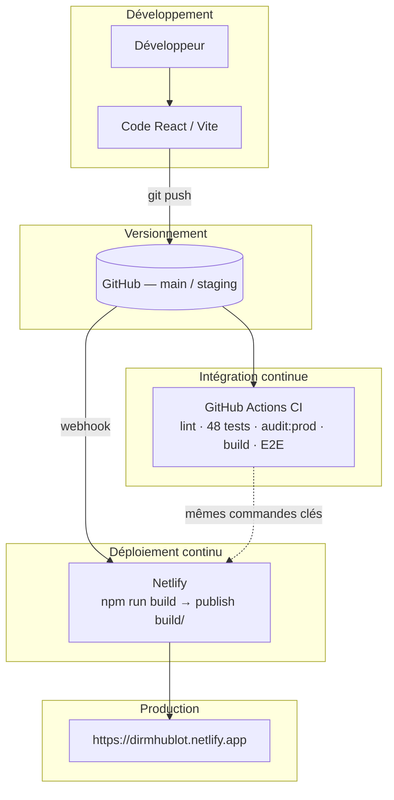

# Annexe 05 — Architecture de déploiement

> Copie pour livrable — document principal : [1.2.7 Documenter le processus de déploiement](../1.2%20Pr%C3%A9parer%20le%20d%C3%A9ploiement%20d%27une%20application/1.2.7%20Documenter%20le%20processus%20de%20d%C3%A9ploiement.md)

---

## Objectif

Décrire comment le code source Hublot devient une application accessible en production, avec **traçabilité**, **automatisation** et **sécurité**.

**Application :** tableau de bord DIRM Méditerranée — dépôt [Meriem1403/Hublot](https://github.com/Meriem1403/Hublot)  
**Production :** https://dirmhublot.netlify.app

---

## Composants

| Composant | Rôle | Technologie |
|-----------|------|-------------|
| **Dépôt Git** | Source de vérité | GitHub `Meriem1403/Hublot` |
| **CI** | Qualité bloquante (lint, tests, audit, build, E2E) | GitHub Actions — workflow **CI** (`.github/workflows/ci.yml`) |
| **CD cloud** | Publication après push `main` | Netlify (`netlify.toml`, webhook Git) |
| **CD NAS** | Hébergement réseau interne (optionnel) | `scripts/deploy-nas.sh` + `.github/workflows/cd-nas.yml` |
| **Données agents** | Fichier statique + option Neon | `public/data/agents.json`, pipeline 1.3.x |
| **Secrets** | Identifiants sensibles | Variables Netlify / `.env` locaux (jamais dans Git) |

Workflows complémentaires : `cd-netlify.yml`, `security-scan.yml` (Gitleaks), `codeql.yml` (SAST).

---

## Schéma global

---

## Flux détaillé (push sur `main`)

1. **Développeur** : commit + `git push origin main`
2. **GitHub Actions — CI** (`ci.yml`) :
   - `npm ci` (Node 20)
   - `npm run lint`
   - `npm run test:run` (**48 tests** Vitest)
   - `npm run audit:prod`
   - `npm run build` → artefact `build/`
   - `npm run test:e2e` (Playwright sur build de test)
3. **Netlify** (CD, en parallèle après le push) :
   - `npm run build`
   - Publication du dossier `build/`
   - HTTPS + headers (`netlify.toml`)
4. **Utilisateur** : accès à l'URL de production

---

## Fichiers de configuration

| Fichier | Annexe | Rôle |
|---------|--------|------|
| `.github/workflows/ci.yml` | [01](./Annexe_01_build.yml) | Pipeline CI (YAML) |
| `netlify.toml` | [02](./Annexe_02_netlify.toml) | Build, publish, redirects SPA, headers |
| `package.json` | [03](./Annexe_03_package.json) | Scripts npm (extrait) |
| `.gitignore` | [04](./Annexe_04_gitignore) | Exclusion secrets et données RH |

---

## Alignement CI ↔ Netlify

| Étape | GitHub Actions (CI) | Netlify |
|-------|---------------------|---------|
| Install | `npm ci` | `npm ci` (auto) |
| Lint / tests / audit | `lint`, `test:run`, `audit:prod` | — |
| Build | `npm run build` | `npm run build` |
| Publish | vérifie `build/` + artefact | `publish = build` |
| E2E | `test:e2e` après `build:e2e` | — |

Ce qui passe en **CI** correspond à l'artefact déployé par Netlify.

---

## Déploiement NAS (complément)

Hors chaîne CD Git automatique :

1. `npm run build` (ou `deploy-nas.sh` : lint + tests + build)
2. Copie / rsync vers le NAS
3. Docker + Nginx (`docker-compose.prod.yml`)

Voir [1.3.2 Rédiger et utiliser un script de déploiement](../1.3%20R%C3%A9diger%20des%20scriptes%20dans%20la%20d%C3%A9marche%20DevOps/1.3.2%20R%C3%A9diger%20et%20utiliser%20un%20script%20de%20d%C3%A9ploiement.md).

---

## Rollback

| Canal | Méthode |
|-------|---------|
| **Netlify** | Dashboard → Deploys → **Publish deploy** (version antérieure) |
| **Git** | `git revert` + push → Netlify redéploie |
| **NAS** | Remplacer fichiers + redémarrer conteneur |

Détail : [1.2.7 § Rollback](../1.2%20Pr%C3%A9parer%20le%20d%C3%A9ploiement%20d%27une%20application/1.2.7%20Documenter%20le%20processus%20de%20d%C3%A9ploiement.md).

---

## Documents liés

- [1.1.2 La démarche DevOps](../1.1%20Les%20bases%20de%20la%20d%C3%A9marche%20DevOps/1.1.2%20La%20d%C3%A9marche%20DevOps.md)
- [1.1.3 Les bases d'un environnement de test](../1.1%20Les%20bases%20de%20la%20d%C3%A9marche%20DevOps/1.1.3%20Les%20bases%20d%27un%20environnement%20de%20test.md) — Annexe 06
- [1.1.4 La mise en place de l'intégration continue (CI)](../1.1%20Les%20bases%20de%20la%20d%C3%A9marche%20DevOps/1.1.4%20La%20mise%20en%20place%20de%20l%27int%C3%A9gration%20continue%20(CI).md)
- [1.1.5 La mise en place de la livraison ou déploiement continu (CD)](../1.1%20Les%20bases%20de%20la%20d%C3%A9marche%20DevOps/1.1.5%20La%20mise%20en%20place%20de%20la%20livraison%20ou%20d%C3%A9ploiement%20continu%20(CD).md)
- [1.2.4.2 Sécurité du déploiement](../1.2%20Pr%C3%A9parer%20le%20d%C3%A9ploiement%20d%27une%20application/1.2.4.2%20S%C3%A9curit%C3%A9%20du%20d%C3%A9ploiement.md) — Annexe 07
