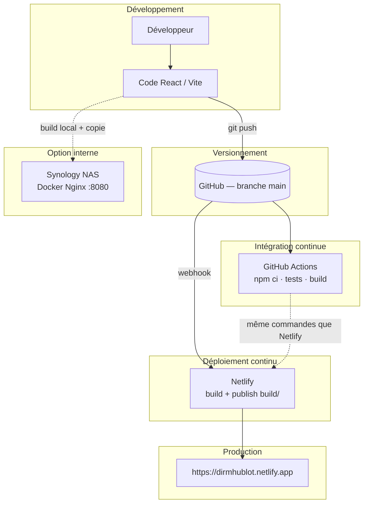

# Annexe 05 — Architecture de déploiement

> Copie pour livrable — document principal : `../ARCHITECTURE_DEPLOIEMENT.md`

---

# 1️⃣ Architecture de déploiement

Document de référence pour la compétence **« Préparer le déploiement d'une application sécurisée »** — projet **Hublot** (DIRM Méditerranée).

**Annexe associée :** [Annexe 05](./Annexes/Annexe_05_ARCHITECTURE_DEPLOIEMENT.md)

---

## Objectif

Décrire comment le code source devient une application accessible en production, avec **traçabilité**, **automatisation** et **sécurité**.

---

## Composants

| Composant | Rôle | Technologie |
|-----------|------|-------------|
| **Dépôt Git** | Source de vérité, historique, collaboration | GitHub `Meriem1403/Hublot` |
| **CI** | Vérification automatique (deps, tests, build) | GitHub Actions — workflow `CI/CD Pipeline` |
| **CD cloud** | Publication automatique après push | Netlify |
| **CD local** | Hébergement réseau interne (optionnel) | Synology NAS + Docker + Nginx |
| **Base de données** | Données agents en production (option) | PostgreSQL via Neon + Netlify Functions |
| **Secrets** | Identifiants et URLs sensibles | Variables d'environnement (jamais dans Git) |

---

## Schéma global

---

## Flux détaillé (push sur `main`)

1. **Développeur** : commit + `git push origin main`
2. **GitHub Actions** (CI) :
   - Checkout du code
   - Node.js 20 + `npm ci`
   - `npm run test:run` (32 tests Vitest)
   - `npm run build` → dossier `build/`
   - Vérification : `build/index.html` et `build/assets/` présents
   - `npm audit` (informatif)
3. **Netlify** (CD) — en parallèle / après le push :
   - `npm run build`
   - Publication du dossier `build/`
   - HTTPS, headers de sécurité (`netlify.toml`)
4. **Utilisateur** : accès à l'URL de production

---

## Fichiers de configuration

| Fichier | Annexe | Rôle |
|---------|--------|------|
| `.github/workflows/build.yml` | [01](./Annexes/Annexe_01_build.yml) | Pipeline CI/CD (YAML) |
| `netlify.toml` | [02](./Annexes/Annexe_02_netlify.toml) | Build, publish, redirects SPA, headers |
| `package.json` | [03](./Annexes/Annexe_03_package.json) | Scripts `dev`, `build`, `test:run` |
| `.gitignore` | [04](./Annexes/Annexe_04_gitignore) | Exclusion secrets et données RH |
| `docker-compose.yml` | — | Déploiement NAS (Nginx + `dist` ou `build`) |

---

## Alignement CI ↔ Netlify

| Étape | GitHub Actions | Netlify |
|-------|----------------|---------|
| Install | `npm ci` | `npm ci` (auto) |
| Tests | `npm run test:run` | — |
| Build | `npm run build` | `npm run build` |
| Publish | vérifie `build/` | `publish = build` |

Cette cohérence garantit que **ce qui passe en CI** correspond à **ce qui est déployé**.

---

## Déploiement NAS (complément)

Le NAS n'est **pas** dans la chaîne CD automatique Git :

1. Build sur poste de dev : `npm run build`
2. Copie du projet (dont `build/` ou `dist/`) sur le NAS
3. Lancement via **Container Manager** + `docker-compose.yml`
4. Accès : `http://IP_DU_NAS:8080`

Voir [DEPLOIEMENT_NAS_SYNOLOGY.md](./DEPLOIEMENT_NAS_SYNOLOGY.md).

---

## Rollback

| Canal | Méthode |
|-------|---------|
| **Netlify** | Restaurer un deploy précédent (Dashboard → Deploys → Publish deploy) |
| **Git** | Revert du commit + nouveau push |
| **NAS** | Remplacer les fichiers + redémarrer le conteneur |

Détail : [DOCUMENTATION_DEPLOIEMENT.md](./DOCUMENTATION_DEPLOIEMENT.md#2-procédure-de-rollback).

---

## Documents liés

- [DEVOPS.md](./DEVOPS.md) — Synthèse démarche DevOps complète
- [ENVIRONNEMENT_TEST.md](./ENVIRONNEMENT_TEST.md) — DEV / TEST / PROD
- [SECURITE_4_DEPLOIEMENT.md](./SECURITE_4_DEPLOIEMENT.md) — Sécurité du déploiement
- [DOCUMENTATION_DEPLOIEMENT.md](./DOCUMENTATION_DEPLOIEMENT.md) — Installation, logs, captures CI
