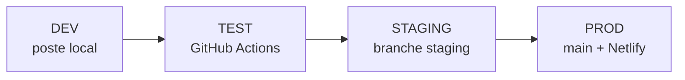

# Annexe 06 — Environnements DEV, TEST, STAGING, PROD

> Copie pour livrable — document principal : `../1.1 Les bases de la démarche DevOps/1.1.3 Les bases d'un environnement de test.md`

---

# 2️⃣ Les bases d'un environnement de test

Document de référence **Studi** — séparation **DEV**, **TEST**, **STAGING** et **PROD** pour Hublot.

**Annexe :** [Annexe 06](./Annexes/Annexe_06_ENVIRONNEMENT_TEST.md) · **Staging :** [ENVIRONNEMENT_STAGING.md](./1.2 Préparer le déploiement d'une application/1.2.3 Mettre en place un environnement de test.md)

---

## Principe

Chaque environnement a un **rôle**, une **configuration** et des **données** distincts. On ne teste jamais directement en production : on progresse de la machine locale vers la CI, puis la préproduction, puis la prod.



---

## Tableau récapitulatif

| Env. | Rôle | Où | URL / accès | Fichier config |
|------|------|-----|-------------|----------------|
| **DEV** | Coder, debug, tests manuels | Poste développeur | http://localhost:3000 | `.env.development` |
| **TEST** | Qualité automatisée (reproductible) | GitHub Actions — workflow **CI** | github.com/Meriem1403/Hublot/actions | `.github/workflows/ci.yml` |
| **TEST local** | QA manuelle « comme la prod » | Docker ou preview | http://localhost:4173 | `.env.test` + `docker-compose.test.yml` |
| **STAGING** | Préproduction métier | Netlify — branche `staging` | `staging--dirmhublot.netlify.app` | `netlify.toml` + variables Netlify |
| **PROD** | Utilisateurs habilités | Netlify — branche `main` | https://dirmhublot.netlify.app | Variables Netlify (secrets) |

---

## 1. DEV — Développement

### Objectif

Environnement **isolé** : aucun impact sur les utilisateurs ni sur la production.

### Démarrage

```bash
git clone https://github.com/Meriem1403/Hublot.git
cd Hublot
npm ci
cp .env.example .env    # optionnel : surcharges perso
npm run dev
```

| Élément | Détail |
|---------|--------|
| Commande | `npm run dev` → Vite mode `development` |
| URL | http://localhost:3000 |
| Variables | `.env.development` (versionné, comptes **démo** locaux) |
| Badge UI | Bandeau **« Développement (DEV) »** dans l'app |
| Tests avant push | `npm run test:run` · `npm run lint` |

### Fichier `.env.development`

```env
VITE_APP_ENV=development
VITE_APP_USERNAME=admin
VITE_APP_PASSWORD=demo
```

---

## 2. TEST — Intégration continue (CI)

### Objectif

Même chaîne pour **tous les développeurs** : impossible de merger du code qui ne compile pas, ne passe pas les tests ou ne respecte pas l'audit sécurité.

### Où

- **Plateforme :** GitHub Actions
- **Workflow :** **CI** (`.github/workflows/ci.yml`)
- **Déclencheurs :** push / PR sur `main` et `staging`

### Pipeline (environnement TEST)

| Étape | Commande / action |
|-------|-------------------|
| ESLint | `npm run lint` |
| Tests unitaires | `npm run test:run` (48 tests) |
| Audit npm prod | `npm run audit:prod` |
| Build | `npm run build` |
| E2E | `npm run test:e2e` (Playwright) |

### Critère de succès

- Tous les jobs **verts** sur l'onglet Actions
- Netlify (PROD) : **Deploy only when required checks pass** → check **CI**

### Ce n'est pas un serveur

L'environnement TEST est **éphémère** : une VM Ubuntu est créée, exécute la chaîne, puis est détruite. Pas de base de données partagée — données mockées / JSON de test dans les tests unitaires.

---

## 3. TEST local — QA manuelle (complément)

### Objectif

Tester le **build de production** (fichiers statiques) sans déployer sur Netlify.

### Option A — Preview Vite

```bash
npm run build:test
npm run preview:test
# → http://localhost:4173  (identifiants e2e-user / e2e-pass)
```

### Option B — Docker (comme le NAS)

```bash
npm run test:preview:docker
# build:test + nginx sur le port 4173
```

Fichiers : `.env.test`, `docker-compose.test.yml`

### Vérification complète (checklist machine)

```bash
npm run check:env
```

Exécute : présence des `.env`, `npm ci`, lint, tests, audit, `build:test`.

---

## 4. STAGING — Préproduction

Branche Git **`staging`** → déploiement Netlify séparé de `main`.

Voir [ENVIRONNEMENT_STAGING.md](./1.2 Préparer le déploiement d'une application/1.2.3 Mettre en place un environnement de test.md).

| Élément | Valeur |
|---------|--------|
| Branche | `staging` |
| Variable | `VITE_APP_ENV=staging` (netlify.toml) |
| Badge UI | **« Préproduction (STAGING) »** |
| Promotion | Merge `staging` → `main` après validation |

---

## 5. PROD — Production

| Élément | Valeur |
|---------|--------|
| Branche | `main` |
| URL | https://dirmhublot.netlify.app |
| Secrets | Uniquement dans Netlify (jamais dans Git) |
| Badge UI | **aucun** (environnement production) |

---

## Matrice : quel test où ?

| Type | DEV | TEST (CI) | TEST local | STAGING | PROD |
|------|-----|-----------|------------|---------|------|
| Unitaires Vitest | `npm run test:run` | Auto | `check:env` | — | — |
| ESLint | `npm run lint` | Auto | `check:env` | — | — |
| E2E Playwright | `npm run test:e2e` | Auto | `build:test` + preview | Manuel | — |
| Build | `npm run build` | Auto | `build:test` | Auto Netlify | Auto Netlify |
| Audit npm prod | `npm run audit:prod` | Auto | `check:env` | — | — |
| Tests manuels UI | Navigateur | — | :4173 | URL staging | URL prod |
| Headers sécurité | — | — | — | curl -I | curl -I |

Plan détaillé : [PLAN_TEST.md](../1.3 Rédiger des scriptes dans la démarche DevOps/1.3.7 Automatiser les tests en DevOps.md)

---

## Variables d'environnement (résumé)

| Fichier | Commité | Usage |
|---------|---------|--------|
| `.env.example` | Oui | Modèle documentation |
| `.env.development` | Oui | DEV — démo locale |
| `.env.test` | Oui | TEST local + E2E |
| `.env.staging.example` | Oui | Modèle STAGING |
| `.env` / `.env.staging` | **Non** | Secrets réels |

Code : `src/config/environment.ts` — libellé et badge selon `VITE_APP_ENV`.

---

## Parcours jury (5 minutes)

1. Montrer **DEV** : `npm run dev` → badge « Développement » + login démo.
2. Montrer **TEST** : GitHub Actions → workflow **CI** → jobs verts.
3. Montrer **TEST local** : `npm run check:env` ou preview :4173.
4. Montrer **STAGING** : branche `staging` + URL Netlify (si activée).
5. Montrer **PROD** : https://dirmhublot.netlify.app — pas de badge.

---

## Bonnes pratiques

1. Développer sur **DEV**, valider avec `npm run check:env` avant push.
2. Pousser sur **`staging`** pour une démo métier ; merger vers **`main`** seulement si CI verte.
3. Ne jamais committer `.env` avec mots de passe réels.
4. Conserver des identifiants **différents** entre STAGING et PROD.
