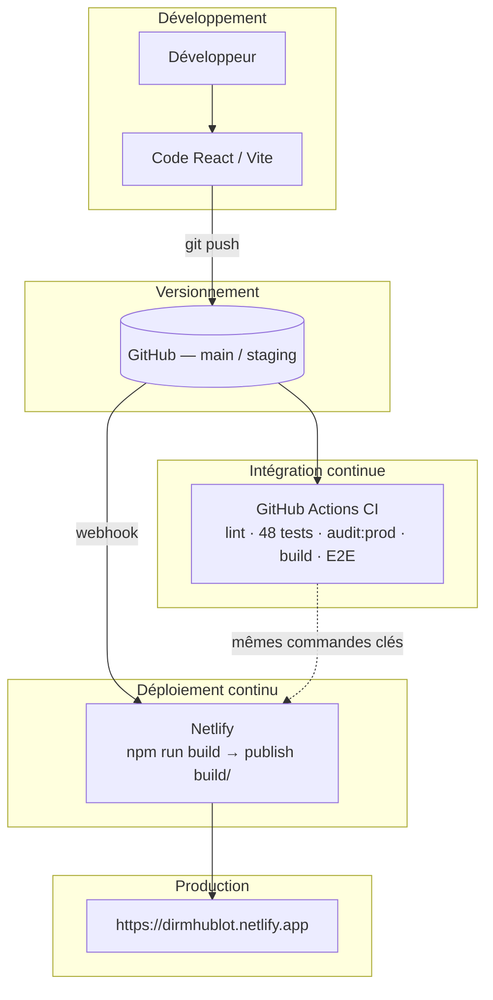
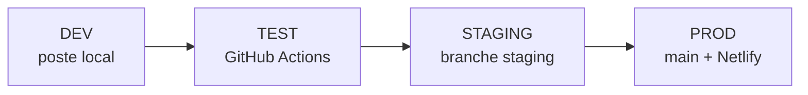

# Toutes les annexes (01 à 13)

Document généré automatiquement — **ne pas éditer à la main**.
Commande : `node scripts/sync-annexes-bundle.js`

Index : [README.md](./README.md)

---

## Annexe_01_build.yml

# Annexe 01 — Workflow CI (GitHub Actions)
# Fichier original : .github/workflows/ci.yml

# CI — qualité et build (sans déploiement)
# CD cloud : Netlify (voir cd-netlify.yml + netlify.toml)
# CD NAS   : scripts/deploy-nas.sh + cd-nas.yml (manuel / secrets)

name: CI

on:
  push:
    branches: [main, staging]
  pull_request:
    branches: [main, staging]
  workflow_dispatch:

concurrency:
  group: ci-${{ github.ref }}
  cancel-in-progress: true

jobs:
  lint:
    name: ESLint
    runs-on: ubuntu-latest
    steps:
      - uses: actions/checkout@v4
      - uses: actions/setup-node@v4
        with:
          node-version: "20"
          cache: npm
      - run: npm ci
      - run: npm run lint

  unit-tests:
    name: Tests unitaires
    runs-on: ubuntu-latest
    steps:
      - uses: actions/checkout@v4
      - uses: actions/setup-node@v4
        with:
          node-version: "20"
          cache: npm
      - run: npm ci
      - run: npm run test:run

  audit:
    name: Audit npm (production)
    runs-on: ubuntu-latest
    steps:
      - uses: actions/checkout@v4
      - uses: actions/setup-node@v4
        with:
          node-version: "20"
          cache: npm
      - run: npm ci
      - run: npm run audit:prod

  build:
    name: Build production
    runs-on: ubuntu-latest
    needs: [lint, unit-tests, audit]
    steps:
      - uses: actions/checkout@v4
      - uses: actions/setup-node@v4
        with:
          node-version: "20"
          cache: npm
      - run: npm ci
      - run: npm run build
      - run: |
          test -f build/index.html
          test -d build/assets
      - uses: actions/upload-artifact@v4
        with:
          name: build-${{ github.sha }}
          path: build/
          retention-days: 7

  e2e:
    name: Tests E2E (Playwright)
    runs-on: ubuntu-latest
    needs: build
    steps:
      - uses: actions/checkout@v4
      - uses: actions/setup-node@v4
        with:
          node-version: "20"
          cache: npm
      - run: npm ci
      - run: npx playwright install --with-deps chromium
      - run: npm run build:e2e
      - run: npm run test:e2e
        env:
          CI: true

---

## Annexe_02_netlify.toml

# Annexe 02 — Configuration Netlify (build, headers, redirects)
# Fichier original : netlify.toml

# Netlify : CD cloud (complète la CI GitHub Actions — voir docs/CD_PIPELINES.md)
# La variable NETLIFY_DATABASE_URL est créée par l’extension Neon sur Netlify.

[build]
  command   = "npm run build"
  publish   = "build"

[build.environment]
  NODE_VERSION = "20"
  # Contexte affiché côté monitoring (Sentry, logs)
  VITE_APP_ENV = "production"

# Branche staging → URL dédiée (ex. staging--dirmhublot.netlify.app)
[context.staging]
  command = "npm run build"
  [context.staging.environment]
    VITE_APP_ENV = "staging"

# Pull requests → deploy preview (préproduction)
[context.deploy-preview]
  command = "npm run build"
  [context.deploy-preview.environment]
    VITE_APP_ENV = "preview"

[context.branch-deploy]
  command = "npm run build"

# Headers de sécurité (voir docs/SECURITE_4_DEPLOIEMENT.md)
[[headers]]
  for = "/*"
  [headers.values]
    X-Frame-Options = "DENY"
    X-Content-Type-Options = "nosniff"
    Referrer-Policy = "strict-origin-when-cross-origin"
    Permissions-Policy = "camera=(), microphone=(), geolocation=()"

# SPA : toutes les autres URLs → index.html
[[redirects]]
  from = "/*"
  to   = "/index.html"
  status = 200

---

## Annexe_03_package.json

{
  "_comment": "Annexe 03 — Scripts npm (extrait). Fichier original : package.json",
  "name": "Statistiques DIRM Application",
  "version": "0.1.0",
  "private": true,
  "scripts": {
    "dev": "vite --mode development",
    "dev:test": "vite --mode test",
    "build": "vite build",
    "build:test": "vite build --mode test",
    "build:staging": "vite build --mode staging",
    "build:e2e": "VITE_APP_USERNAME=e2e-user VITE_APP_PASSWORD=e2e-pass VITE_APP_ENV=test vite build --mode test",
    "preview": "vite preview",
    "preview:test": "vite preview --port 4173 --host 127.0.0.1",
    "test:preview:docker": "npm run build:test && docker compose -f docker-compose.test.yml up",
    "check:env": "bash scripts/check-test-environment.sh",
    "lint": "eslint . --max-warnings 30",
    "lint:fix": "eslint . --fix",
    "test": "vitest",
    "test:run": "vitest run",
    "test:e2e": "playwright test",
    "test:e2e:headed": "playwright test --headed",
    "test:e2e:demo": "PLAYWRIGHT_SLOW_MS=800 playwright test --headed --workers=1 e2e/smoke.spec.ts",
    "test:e2e:slow": "PLAYWRIGHT_SLOW_MS=400 playwright test --headed --workers=1",
    "test:campaign": "playwright test e2e/campaign-manual.spec.ts e2e/campaign-prod.spec.ts",
    "test:e2e:ui": "playwright test --ui",
    "audit:prod": "bash scripts/npm-audit-prod.sh",
    "security:headers": "bash scripts/check-security-headers.sh",
    "security:test": "vitest run src/utils/security.test.ts",
    "docker:dev": "docker-compose -f docker-compose.dev.yml up",
    "docker:dev:build": "docker-compose -f docker-compose.dev.yml up --build",
    "docker:prod": "docker-compose -f docker-compose.prod.yml up -d",
    "docker:prod:build": "docker-compose -f docker-compose.prod.yml up --build -d",
    "docker:stop": "docker-compose -f docker-compose.dev.yml -f docker-compose.prod.yml down",
    "docker:logs": "docker-compose -f docker-compose.dev.yml logs -f",
    "docker:convert": "docker-compose run --rm converter python3 scripts/convert_excel_to_json.py",
    "push-agents-to-neon": "node scripts/push-agents-to-neon.js",
    "reset-neon-agents": "node scripts/reset-neon-agents.js",
    "check-neon-agents": "node scripts/check-neon-agents.js",
    "data:evolution": "bash scripts/run-evolution-pipeline.sh",
    "docs:pdf": "node scripts/build-pdf.js --merged",
    "docs:pdf:full": "node scripts/build-pdf.js --merged --full --output docs/Rendus/pdf/Documentation_Complete_Fusionnee_Full.pdf",
    "docs:pdf:preview": "node scripts/build-pdf.js --merged --compact --output docs/Rendus/pdf/Documentation_Preview_Redaction.pdf",
    "docs:pdf:one": "node scripts/build-pdf.js"
  }
}

---

## Annexe_04_gitignore

# Annexe 04 — Fichiers exclus du dépôt (sécurité, secrets)
# Fichier original : .gitignore

# Tests E2E
test-results/
playwright-report/
blob-report/
playwright/.cache/

# Dépendances
node_modules
npm-debug.log
yarn-error.log
yarn.lock

# Build
build
dist
.next
out

# Environnement (ne jamais commiter de vrais identifiants prod)
.env
.env.local
.env.production
.env.production.local
.env.*.local
.env.staging
# Fichiers de modes versionnés (sans secrets prod) :
!.env.example
!.env.development
!.env.test
!.env.staging.example

# IDE
.vscode
.idea
*.swp
*.swo
*~

# OS
.DS_Store
Thumbs.db

# Git
.git
.gitignore
.gitattributes

# Documentation (README à la racine + tout le dossier docs/)
*.md
!README.md
!docs/
!docs/**/*.md

# Scripts Python (gardés séparément)
__pycache__
*.pyc
*.pyo
*.pyd
.Python
venv/
env/

# Données sensibles - NE JAMAIS COMMITTER
trdata/
src/data/
**/agents.json
*.xlsx
*.xls
*.htpasswd
*.pem
*.key
*.crt
*.p12
*.pfx
scripts/rapport_analyse.json
**/rapport*.json
scripts/backups/

# Rapports et logs
*.log
coverage
.nyc_output

# Tests
test-results
playwright-report

# Sécurité
secrets/
*.secret

---

## Annexe_05_ARCHITECTURE_DEPLOIEMENT.md

# Annexe 05 — Architecture de déploiement

> Copie pour livrable — document principal : [1.2.7 Documenter le processus de déploiement](../1.2%20Pr%C3%A9parer%20le%20d%C3%A9ploiement%20d%27une%20application/1.2.7%20Documenter%20le%20processus%20de%20d%C3%A9ploiement.md)

---

## Objectif

Décrire comment le code source Hublot devient une application accessible en production, avec **traçabilité**, **automatisation** et **sécurité**.

**Application :** tableau de bord DIRM Méditerranée — dépôt [Meriem1403/Hublot](https://github.com/Meriem1403/Hublot)  
**Production :** https://dirmhublot.netlify.app

---

## Composants

| Composant | Rôle | Technologie |
|-----------|------|-------------|
| **Dépôt Git** | Source de vérité | GitHub `Meriem1403/Hublot` |
| **CI** | Qualité bloquante (lint, tests, audit, build, E2E) | GitHub Actions — workflow **CI** (`.github/workflows/ci.yml`) |
| **CD cloud** | Publication après push `main` | Netlify (`netlify.toml`, webhook Git) |
| **CD NAS** | Hébergement réseau interne (optionnel) | `scripts/deploy-nas.sh` + `.github/workflows/cd-nas.yml` |
| **Données agents** | Fichier statique + option Neon | `public/data/agents.json`, pipeline 1.3.x |
| **Secrets** | Identifiants sensibles | Variables Netlify / `.env` locaux (jamais dans Git) |

Workflows complémentaires : `cd-netlify.yml`, `security-scan.yml` (Gitleaks), `codeql.yml` (SAST).

---

## Schéma global



---

## Flux détaillé (push sur `main`)

1. **Développeur** : commit + `git push origin main`
2. **GitHub Actions — CI** (`ci.yml`) :
   - `npm ci` (Node 20)
   - `npm run lint`
   - `npm run test:run` (**48 tests** Vitest)
   - `npm run audit:prod`
   - `npm run build` → artefact `build/`
   - `npm run test:e2e` (Playwright sur build de test)
3. **Netlify** (CD, en parallèle après le push) :
   - `npm run build`
   - Publication du dossier `build/`
   - HTTPS + headers (`netlify.toml`)
4. **Utilisateur** : accès à l'URL de production

---

## Fichiers de configuration

| Fichier | Annexe | Rôle |
|---------|--------|------|
| `.github/workflows/ci.yml` | [01](./Annexe_01_build.yml) | Pipeline CI (YAML) |
| `netlify.toml` | [02](./Annexe_02_netlify.toml) | Build, publish, redirects SPA, headers |
| `package.json` | [03](./Annexe_03_package.json) | Scripts npm (extrait) |
| `.gitignore` | [04](./Annexe_04_gitignore) | Exclusion secrets et données RH |

---

## Alignement CI ↔ Netlify

| Étape | GitHub Actions (CI) | Netlify |
|-------|---------------------|---------|
| Install | `npm ci` | `npm ci` (auto) |
| Lint / tests / audit | `lint`, `test:run`, `audit:prod` | — |
| Build | `npm run build` | `npm run build` |
| Publish | vérifie `build/` + artefact | `publish = build` |
| E2E | `test:e2e` après `build:e2e` | — |

Ce qui passe en **CI** correspond à l'artefact déployé par Netlify.

---

## Déploiement NAS (complément)

Hors chaîne CD Git automatique :

1. `npm run build` (ou `deploy-nas.sh` : lint + tests + build)
2. Copie / rsync vers le NAS
3. Docker + Nginx (`docker-compose.prod.yml`)

Voir [1.3.2 Rédiger et utiliser un script de déploiement](../1.3%20R%C3%A9diger%20des%20scriptes%20dans%20la%20d%C3%A9marche%20DevOps/1.3.2%20R%C3%A9diger%20et%20utiliser%20un%20script%20de%20d%C3%A9ploiement.md).

---

## Rollback

| Canal | Méthode |
|-------|---------|
| **Netlify** | Dashboard → Deploys → **Publish deploy** (version antérieure) |
| **Git** | `git revert` + push → Netlify redéploie |
| **NAS** | Remplacer fichiers + redémarrer conteneur |

Détail : [1.2.7 § Rollback](../1.2%20Pr%C3%A9parer%20le%20d%C3%A9ploiement%20d%27une%20application/1.2.7%20Documenter%20le%20processus%20de%20d%C3%A9ploiement.md).

---

## Documents liés

- [1.1.2 La démarche DevOps](../1.1%20Les%20bases%20de%20la%20d%C3%A9marche%20DevOps/1.1.2%20La%20d%C3%A9marche%20DevOps.md)
- [1.1.3 Les bases d'un environnement de test](../1.1%20Les%20bases%20de%20la%20d%C3%A9marche%20DevOps/1.1.3%20Les%20bases%20d%27un%20environnement%20de%20test.md) — Annexe 06
- [1.1.4 La mise en place de l'intégration continue (CI)](../1.1%20Les%20bases%20de%20la%20d%C3%A9marche%20DevOps/1.1.4%20La%20mise%20en%20place%20de%20l%27int%C3%A9gration%20continue%20(CI).md)
- [1.1.5 La mise en place de la livraison ou déploiement continu (CD)](../1.1%20Les%20bases%20de%20la%20d%C3%A9marche%20DevOps/1.1.5%20La%20mise%20en%20place%20de%20la%20livraison%20ou%20d%C3%A9ploiement%20continu%20(CD).md)
- [1.2.4.2 Sécurité du déploiement](../1.2%20Pr%C3%A9parer%20le%20d%C3%A9ploiement%20d%27une%20application/1.2.4.2%20S%C3%A9curit%C3%A9%20du%20d%C3%A9ploiement.md) — Annexe 07

---

## Annexe_06_ENVIRONNEMENT_TEST.md

# Annexe 06 — Environnements DEV, TEST, STAGING, PROD

> Copie pour livrable — document principal : `../1.1 Les bases de la démarche DevOps/1.1.3 Les bases d'un environnement de test.md`

---

# 2️⃣ Les bases d'un environnement de test

Document de référence **Studi** — séparation **DEV**, **TEST**, **STAGING** et **PROD** pour Hublot.

**Annexe :** [Annexe 06](./Annexe_06_ENVIRONNEMENT_TEST.md) · **Staging :** [1.2.3 Mettre en place un environnement de test](../1.2%20Pr%C3%A9parer%20le%20d%C3%A9ploiement%20d%27une%20application/1.2.3%20Mettre%20en%20place%20un%20environnement%20de%20test.md)

---

## Principe

Chaque environnement a un **rôle**, une **configuration** et des **données** distincts. On ne teste jamais directement en production : on progresse de la machine locale vers la CI, puis la préproduction, puis la prod.



---

## Tableau récapitulatif

| Env. | Rôle | Où | URL / accès | Fichier config |
|------|------|-----|-------------|----------------|
| **DEV** | Coder, debug, tests manuels | Poste développeur | http://localhost:3000 | `.env.development` |
| **TEST** | Qualité automatisée (reproductible) | GitHub Actions — workflow **CI** | github.com/Meriem1403/Hublot/actions | `.github/workflows/ci.yml` |
| **TEST local** | QA manuelle « comme la prod » | Docker ou preview | http://localhost:4173 | `.env.test` + `docker-compose.test.yml` |
| **STAGING** | Préproduction métier | Netlify — branche `staging` | `staging--dirmhublot.netlify.app` | `netlify.toml` + variables Netlify |
| **PROD** | Utilisateurs habilités | Netlify — branche `main` | https://dirmhublot.netlify.app | Variables Netlify (secrets) |

---

## 1. DEV — Développement

### Objectif

Environnement **isolé** : aucun impact sur les utilisateurs ni sur la production.

### Démarrage

```bash
git clone https://github.com/Meriem1403/Hublot.git
cd Hublot
npm ci
cp .env.example .env    # optionnel : surcharges perso
npm run dev
```

| Élément | Détail |
|---------|--------|
| Commande | `npm run dev` → Vite mode `development` |
| URL | http://localhost:3000 |
| Variables | `.env.development` (versionné, comptes **démo** locaux) |
| Badge UI | Bandeau **« Développement (DEV) »** dans l'app |
| Tests avant push | `npm run test:run` · `npm run lint` |

### Fichier `.env.development`

```env
VITE_APP_ENV=development
VITE_APP_USERNAME=admin
VITE_APP_PASSWORD=demo
```

---

## 2. TEST — Intégration continue (CI)

### Objectif

Même chaîne pour **tous les développeurs** : impossible de merger du code qui ne compile pas, ne passe pas les tests ou ne respecte pas l'audit sécurité.

### Où

- **Plateforme :** GitHub Actions
- **Workflow :** **CI** (`.github/workflows/ci.yml`)
- **Déclencheurs :** push / PR sur `main` et `staging`

### Pipeline (environnement TEST)

| Étape | Commande / action |
|-------|-------------------|
| ESLint | `npm run lint` |
| Tests unitaires | `npm run test:run` (48 tests) |
| Audit npm prod | `npm run audit:prod` |
| Build | `npm run build` |
| E2E | `npm run test:e2e` (Playwright) |

### Critère de succès

- Tous les jobs **verts** sur l'onglet Actions
- Netlify (PROD) : **Deploy only when required checks pass** → check **CI**

### Ce n'est pas un serveur

L'environnement TEST est **éphémère** : une VM Ubuntu est créée, exécute la chaîne, puis est détruite. Pas de base de données partagée — données mockées / JSON de test dans les tests unitaires.

---

## 3. TEST local — QA manuelle (complément)

### Objectif

Tester le **build de production** (fichiers statiques) sans déployer sur Netlify.

### Option A — Preview Vite

```bash
npm run build:test
npm run preview:test
# → http://localhost:4173  (identifiants e2e-user / e2e-pass)
```

### Option B — Docker (comme le NAS)

```bash
npm run test:preview:docker
# build:test + nginx sur le port 4173
```

Fichiers : `.env.test`, `docker-compose.test.yml`

### Vérification complète (checklist machine)

```bash
npm run check:env
```

Exécute : présence des `.env`, `npm ci`, lint, tests, audit, `build:test`.

---

## 4. STAGING — Préproduction

Branche Git **`staging`** → déploiement Netlify séparé de `main`.

Voir [ENVIRONNEMENT_STAGING.md](./1.2 Préparer le déploiement d'une application/1.2.3 Mettre en place un environnement de test.md).

| Élément | Valeur |
|---------|--------|
| Branche | `staging` |
| Variable | `VITE_APP_ENV=staging` (netlify.toml) |
| Badge UI | **« Préproduction (STAGING) »** |
| Promotion | Merge `staging` → `main` après validation |

---

## 5. PROD — Production

| Élément | Valeur |
|---------|--------|
| Branche | `main` |
| URL | https://dirmhublot.netlify.app |
| Secrets | Uniquement dans Netlify (jamais dans Git) |
| Badge UI | **aucun** (environnement production) |

---

## Matrice : quel test où ?

| Type | DEV | TEST (CI) | TEST local | STAGING | PROD |
|------|-----|-----------|------------|---------|------|
| Unitaires Vitest | `npm run test:run` | Auto | `check:env` | — | — |
| ESLint | `npm run lint` | Auto | `check:env` | — | — |
| E2E Playwright | `npm run test:e2e` | Auto | `build:test` + preview | Manuel | — |
| Build | `npm run build` | Auto | `build:test` | Auto Netlify | Auto Netlify |
| Audit npm prod | `npm run audit:prod` | Auto | `check:env` | — | — |
| Tests manuels UI | Navigateur | — | :4173 | URL staging | URL prod |
| Headers sécurité | — | — | — | curl -I | curl -I |

Plan détaillé : [1.3.7 Automatiser les tests en DevOps](../1.3%20R%C3%A9diger%20des%20scriptes%20dans%20la%20d%C3%A9marche%20DevOps/1.3.7%20Automatiser%20les%20tests%20en%20DevOps.md) — **Annexe 08**

---

## Variables d'environnement (résumé)

| Fichier | Commité | Usage |
|---------|---------|--------|
| `.env.example` | Oui | Modèle documentation |
| `.env.development` | Oui | DEV — démo locale |
| `.env.test` | Oui | TEST local + E2E |
| `.env.staging.example` | Oui | Modèle STAGING |
| `.env` / `.env.staging` | **Non** | Secrets réels |

Code : `src/config/environment.ts` — libellé et badge selon `VITE_APP_ENV`.

---

## Parcours de démonstration (5 minutes)

1. **DEV** : `npm run dev` → badge « Développement » + login démo.
2. **TEST** : GitHub Actions → workflow **CI** (`.github/workflows/ci.yml`) → jobs verts.
3. **TEST local** : `npm run check:env` ou preview `:4173`.
4. **STAGING** : branche `staging` + URL Netlify (`staging--dirmhublot.netlify.app` si activée).
5. **PROD** : https://dirmhublot.netlify.app — pas de badge staging.

---

## Bonnes pratiques

1. Développer sur **DEV**, valider avec `npm run check:env` avant push.
2. Pousser sur **`staging`** pour une démo métier ; merger vers **`main`** seulement si CI verte.
3. Ne jamais committer `.env` avec mots de passe réels.
4. Conserver des identifiants **différents** entre STAGING et PROD.

---

## Annexe_07_SECURITE_4_DEPLOIEMENT.md

# Annexe 07 — Sécurité du déploiement

> Copie pour livrable — document principal : `../1.2 Préparer le déploiement d'une application/1.2.4.2 Sécurité du déploiement.md`

---

# 4️⃣ Sécurité du déploiement

Mesures de sécurité pour le déploiement de **Hublot** (DIRM Méditerranée).

**Annexe associée :** [Annexe 07](./Annexes/Annexe_07_SECURITE_4_DEPLOIEMENT.md)

---

## 1. HTTPS

| Canal | Mise en œuvre |
|-------|----------------|
| **Netlify (PROD)** | Certificat TLS géré automatiquement par Netlify |
| **NAS (local)** | HTTP par défaut ; HTTPS possible via **Reverse Proxy DSM** + certificat interne |

**Vérification :**

```bash
curl -I https://dirmhublot.netlify.app
```

Attendu : URL en `https://`, réponse `200` ou `304`.

---

## 2. Variables d'environnement sécurisées

Les secrets ne sont **jamais** dans le dépôt Git.

| Variable (exemples) | Où la configurer | Usage |
|---------------------|------------------|--------|
| `VITE_APP_USERNAME` | Netlify → Environment variables | Connexion application |
| `VITE_APP_PASSWORD` | Netlify → Environment variables | Connexion application |
| `NETLIFY_DATABASE_URL` | Netlify (extension Neon) | Accès base PostgreSQL |

En local : fichier `.env` (listé dans `.gitignore`).

---

## 3. Gestion des secrets

| Règle | Application |
|-------|-------------|
| Pas de commit de secrets | `.gitignore` : `.env`, `agents.json`, `*.xlsx`, certificats |
| Séparation des rôles | Comptes Netlify / GitHub distincts des comptes métier |
| Données RH internes | Hors dépôt public ; accès restreint aux équipes habilitées |
| Rotation | Changer les mots de passe en cas de fuite suspectée |

Fichier de référence : [Annexe 04 — .gitignore](./Annexes/Annexe_04_gitignore)

---

## 4. Pas de données sensibles exposées

- Aucun export métier dans le README public.
- Données agents non versionnées (`src/data/`, `trdata/` ignorés).
- API / base en production protégées par authentification applicative.

---

## 5. Headers de sécurité

Configurés dans **`netlify.toml`** (Annexe 02) :

| Header | Valeur | Protection |
|--------|--------|------------|
| `X-Frame-Options` | `DENY` | Clickjacking |
| `X-Content-Type-Options` | `nosniff` | MIME sniffing |
| `Referrer-Policy` | `strict-origin-when-cross-origin` | Fuite de référent |
| `Permissions-Policy` | camera/micro/geo désactivés | Permissions navigateur |

**Vérification :**

```bash
curl -I https://dirmhublot.netlify.app | grep -i x-frame
```

Configuration Nginx (NAS) : voir `nginx.conf` (CSP, X-Frame-Options en commentaire ou actif selon version).

---

## 6. Tests de vulnérabilité (npm audit)

| Contexte | Commande | CI |
|----------|----------|-----|
| Local | `npm audit` | — |
| Pipeline | `npm audit --audit-level=high` | Étape **informatif** (n'empêche pas le build) |

**Interprétation :** certaines alertes concernent des dépendances de **développement** (Vitest, outils de build). Le site en production sert uniquement les fichiers statiques du dossier `build/`.

**Plan d'action :**

1. `npm audit` régulier
2. `npm audit fix` pour les correctifs sans breaking change
3. Documenter les vulnérabilités résiduelles acceptées

---

## 7. Authentification applicative

- Page de connexion avant accès au tableau de bord.
- Identifiants injectés au build via variables d'environnement (`import.meta.env`).
- Session côté navigateur (`sessionStorage`) — à renforcer (JWT / SSO) en évolution future.

Test manuel : **Annexe 08** / **Annexe 13** — scénario **ST-F01** (authentification).

---

## 8. Checklist avant mise en production

Utiliser [1.2.4.4 Checklist sécurité](../1.2%20Pr%C3%A9parer%20le%20d%C3%A9ploiement%20d%27une%20application/1.2.4.4%20Checklist%20s%C3%A9curit%C3%A9.md) :

- [ ] Mots de passe forts configurés sur Netlify
- [ ] `.env` absent du dépôt
- [ ] CI verte sur `main`
- [ ] Headers vérifiés en production
- [ ] Rollback testé (au moins une fois)

Compléments : [1.2.4.1 Mesures de sécurité applicative](../1.2%20Pr%C3%A9parer%20le%20d%C3%A9ploiement%20d%27une%20application/1.2.4.1%20Mesures%20de%20s%C3%A9curit%C3%A9%20applicative.md), [1.3.1 Les bases du déploiement automatique](../1.3%20R%C3%A9diger%20des%20scriptes%20dans%20la%20d%C3%A9marche%20DevOps/1.3.1%20Les%20bases%20du%20d%C3%A9ploiement%20automatique.md)

---

## Synthèse

Le déploiement Hublot repose sur HTTPS Netlify, variables d'environnement pour les secrets, exclusion des données RH du dépôt (**.gitignore**, Annexe 04), headers HTTP durcis (**Annexe 02**), `npm run audit:prod` et scans Gitleaks/Trivy/CodeQL en CI. L'authentification protège le tableau de bord ; les scénarios **ST-SEC01** à **ST-SEC05** sont détaillés dans **Annexe 13**.

---

## Annexe_08_PLAN_TEST.md

# Annexe 08 — Plan de test

> Copie pour livrable — documents principaux : [1.2.1 Les enjeux des plans de test](../1.2%20Pr%C3%A9parer%20le%20d%C3%A9ploiement%20d%27une%20application/1.2.1%20Les%20enjeux%20des%20plans%20de%20test.md), [1.3.7 Automatiser les tests en DevOps](../1.3%20R%C3%A9diger%20des%20scriptes%20dans%20la%20d%C3%A9marche%20DevOps/1.3.7%20Automatiser%20les%20tests%20en%20DevOps.md)

---

Chaque test est décrit avec un **objectif**, un **résultat attendu** et le **statut** constaté. La colonne **Type** indique si le test est **automatisé** ou **manuel**.

**Liens :** [Annexe 13](./Annexe_13_SCENARIOS_TEST.md) (scénarios ST-*) · [Annexe 09](./Annexe_09_DEMO_EPREUVE.md) (procédure) · [1.2.9 Rapport d'exécution](../1.2%20Pr%C3%A9parer%20le%20d%C3%A9ploiement%20d%27une%20application/1.2.9%20Rapport%20d%27ex%C3%A9cution%20des%20tests.md)

---

## Enjeux en résumé

| Enjeu | Comment le plan y répond |
|-------|---------------------------|
| **Données RH fiables** | 20 + 12 tests unitaires + scénarios ST-F02, ST-F03 |
| **Pas de régression CI/CD** | Workflow **CI** sur `main` / `staging` |
| **Sécurité** | ST-SEC01 à 05, auth, audit prod, Gitleaks |
| **Traçabilité** | IDs ST-*, statuts, logs GitHub Actions |
| **Coût maîtrisé** | Pyramide : 48 tests unitaires, 3 E2E smoke, contrôles manuels ciblés |

---

## Batterie automatisée (48 tests unitaires + CI)

| Fichier / outil | Nombre | Couverture |
|-----------------|--------|------------|
| **dataService.test.ts** | 12 | Filtres, normalisation, chargement — **Annexe 11** |
| **dataCalculations.test.ts** | 20 | Âge, ETP, répartitions, stats — **Annexe 12** |
| **security.test.ts** | 15 | Sanitization, session, masquage RH |
| **environment.test.ts** | 1 | Libellé environnement (DEV / staging…) |
| **e2e/smoke.spec.ts** | 3 | Login, dashboard, `/health.json` — CI |
| **ESLint** | — | `npm run lint` |
| **audit prod** | — | `npm run audit:prod` |

Commandes : `npm run test:run` · `npm run test:e2e` · workflow **CI** — **Annexe 01** (`.github/workflows/ci.yml`).

---

## Tableau des tests

| Test | Type | Objectif | Résultat attendu | Statut |
|------|------|----------|------------------|--------|
| **Lint (ESLint)** | Automatisé | Qualité code avant merge | `npm run lint` OK en local et CI | Passé |
| **Tests unitaires** | Automatisé | Logique métier + sécurité session | `npm run test:run` : **48 tests**, 4 fichiers | Passé |
| **Tests E2E** | Automatisé | Parcours critique | `npm run test:e2e` : 3 scénarios smoke | Passé |
| **Build production** | Automatisé | Artefact Netlify/NAS | `build/index.html` + `assets/` | Passé |
| **Audit npm (production)** | Automatisé | Vulnérabilités runtime | `npm run audit:prod` exit 0 | Passé |
| **Authentification** | Manuel / E2E | Accès protégé | ST-F01 | Passé |
| **Chargement données** | Manuel / E2E | Cohérence onglets | ST-F02 | Passé |
| **Filtres** | Manuel / E2E | Filtres globaux | ST-F03 | Passé |
| **Responsive** | Manuel / E2E | Mobile ~375 px | ST-F04 | Passé |
| **Performance** | Manuel / E2E | Réactivité onglets | ST-F05 | Passé |
| **Badge environnement** | Manuel / E2E | DEV vs PROD | ST-F06 | Passé |
| **Headers HTTP** | Auto + manuel | Durcissement prod | ST-SEC01 | Passé |
| **Garde-fous code** | Automatisé | `security.test.ts` | ST-SEC02 | Passé |
| **Secrets (Gitleaks)** | Automatisé | CI `security-scan.yml` | ST-SEC03 | Passé |
| **Dépendances prod** | Automatisé | audit + Trivy | ST-SEC04 | Passé |
| **SAST (CodeQL)** | Automatisé | `codeql.yml` | ST-SEC05 | Passé |

---

## Scénarios détaillés

Formalisation *Étant donné / Quand / Alors* : [1.2.2 Elaborer un scénario de test](../1.2%20Pr%C3%A9parer%20le%20d%C3%A9ploiement%20d%27une%20application/1.2.2%20Elaborer%20un%20sc%C3%A9nario%20de%20test.md) — **Annexe 13**.

---

## Statuts

| Statut | Signification |
|--------|----------------|
| **Passé** | Conforme au résultat attendu |
| **Échec** | Non conforme — correction requise |
| **À exécuter** | Manuel restant |
| **À vérifier** | À contrôler après deploy |

---

## Alignement référentiel

| Attendu | Document |
|---------|----------|
| Enjeux | [1.2.1](../1.2%20Pr%C3%A9parer%20le%20d%C3%A9ploiement%20d%27une%20application/1.2.1%20Les%20enjeux%20des%20plans%20de%20test.md) |
| Scénarios | [1.2.2](../1.2%20Pr%C3%A9parer%20le%20d%C3%A9ploiement%20d%27une%20application/1.2.2%20Elaborer%20un%20sc%C3%A9nario%20de%20test.md) — Annexe 13 |
| Environnements | [1.1.3](../1.1%20Les%20bases%20de%20la%20d%C3%A9marche%20DevOps/1.1.3%20Les%20bases%20d%27un%20environnement%20de%20test.md) — Annexe 06 |
| Sécurité | Annexe 07 |
| Exécution | Annexe 09 — [1.2.8](../1.2%20Pr%C3%A9parer%20le%20d%C3%A9ploiement%20d%27une%20application/1.2.8%20Proc%C3%A9dure%20d%27ex%C3%A9cution%20des%20tests%20(%C3%A9preuve).md) |

Index : [Annexes/README.md](./README.md).

---

## Annexe_09_DEMO_EPREUVE.md

# Annexe 09 — Procédure d'exécution des tests

> Copie pour livrable — document principal : [1.2.8 Procédure d'exécution des tests](../1.2%20Pr%C3%A9parer%20le%20d%C3%A9ploiement%20d%27une%20application/1.2.8%20Proc%C3%A9dure%20d%27ex%C3%A9cution%20des%20tests%20(%C3%A9preuve).md)

---

Ce document liste les **commandes à exécuter** pour reproduire les résultats du plan de test Hublot, alignées sur la CI (`.github/workflows/ci.yml`) et le site `https://dirmhublot.netlify.app`.

---

## Prérequis

```bash
git clone https://github.com/Meriem1403/Hublot.git
cd Hublot
node -v    # v18+ ; CI utilise Node 20
npm ci
npx playwright install chromium   # une fois
```

---

## Ordre d'exécution recommandé

| # | Action | Commande | Attendu |
|---|--------|----------|---------|
| 1 | Tests unitaires | `npm run test:run` | **48 tests** passés (4 fichiers Vitest) |
| 2 | Build production | `npm run build` | Dossier `build/` avec `index.html` + `assets/` |
| 3 | Audit dépendances prod | `npm run audit:prod` | Exit 0 (comme job CI `audit`) |
| 4 | Lint (optionnel local) | `npm run lint` | Aucune erreur bloquante |
| 5 | CI distante | GitHub Actions → workflow **CI** | Jobs lint, unit-tests, audit, build, e2e verts |
| 6 | E2E démo | `npm run test:e2e:demo` | 3 passed — `e2e/smoke.spec.ts` |
| 7 | Headers prod | `npm run security:headers` ou `curl -sI https://dirmhublot.netlify.app` | HTTPS, `X-Frame-Options`, `X-Content-Type-Options` |
| 8 | App locale (manuel) | `npm run dev` → http://localhost:5173 | Login, onglets, filtres (ST-F*) |
| 9 | Campagne scénarios | `npm run test:campaign` | ST-F01 à ST-F06 + ST-SEC01 (Playwright) |

---

## 1. Tests unitaires (obligatoire)

```bash
npm run test:run
```

**Résultat attendu :** `Tests  48 passed (48)` — fichiers : `dataService.test.ts` (12), `dataCalculations.test.ts` (20), `security.test.ts` (15), `environment.test.ts` (1).

---

## 2. Build de production

```bash
npm run build
ls -la build/index.html build/assets/
```

**Résultat attendu :** build réussi ; Netlify exécute la même commande.

---

## 3. Audit npm (production)

```bash
npm run audit:prod
```

**Résultat attendu :** exit 0 — identique au job **Audit npm (production)** de `ci.yml`.

---

## 4. Vérification CI (environnement TEST)

1. Ouvrir [github.com/Meriem1403/Hublot/actions/workflows/ci.yml](https://github.com/Meriem1403/Hublot/actions/workflows/ci.yml)
2. Dernier run **CI** sur `main` ou `staging` — tous les jobs verts
3. Chaîne : lint → 48 tests → audit → build → E2E

---

## 5. Tests E2E (Playwright)

```bash
npm run test:e2e:demo
```

**Résultat attendu :** 3 tests passés (login, dashboard, santé). Guide : [1.2.10 Guide Playwright](../1.2%20Pr%C3%A9parer%20le%20d%C3%A9ploiement%20d%27une%20application/1.2.10%20Guide%20Playwright.md).

---

## 6. Headers de sécurité (production)

```bash
npm run security:headers
# ou
curl -sI https://dirmhublot.netlify.app
```

**À vérifier :** HTTPS, `X-Frame-Options: DENY`, `X-Content-Type-Options: nosniff` (définis dans **Annexe 02**).

---

## 7. Garde-fous applicatifs (sécurité code)

```bash
npm run security:test
```

**Résultat attendu :** 15 tests passés — scénario **ST-SEC02**.

---

## 8. Application en local (optionnel)

```bash
npm run dev
```

Parcours manuel rapide : connexion, onglets, filtres — voir **Annexe 13** (ST-F01 à ST-F06).

---

## Résultats constatés (référence)

- **Tests unitaires :** 4 fichiers, **48 tests** Vitest — tous passent en local et en CI.
- **E2E :** 3 scénarios smoke en CI ; campagne étendue via `test:campaign`.
- **Build :** réussi ; sortie dans `build/`.
- **Audit prod :** bloquant en CI ; allowlist documentée dans [1.2.4.3](../1.2%20Pr%C3%A9parer%20le%20d%C3%A9ploiement%20d%27une%20application/1.2.4.3%20Audit%20des%20d%C3%A9pendances.md).

**Rapport d'exécution :** [1.2.9 Rapport d'exécution des tests](../1.2%20Pr%C3%A9parer%20le%20d%C3%A9ploiement%20d%27une%20application/1.2.9%20Rapport%20d%27ex%C3%A9cution%20des%20tests.md)  
**Validation des statuts :** [1.2.6 Valider les résultats des tests](../1.2%20Pr%C3%A9parer%20le%20d%C3%A9ploiement%20d%27une%20application/1.2.6%20Valider%20les%20r%C3%A9sultats%20des%20tests.md)

---

## Annexe_10_COMPETENCE_DEPLOIEMENT_STUDI.md

# Annexe 10 — Validation compétence Studi

> Copie pour livrable — alignée sur les chapitres 1.1, 1.2 et 1.3 du dossier `docs/`.

---

# Validation compétence : Préparer le déploiement d'une application sécurisée

**Application :** Hublot — tableau de bord DIRM Méditerranée  
**Dépôt :** [github.com/Meriem1403/Hublot](https://github.com/Meriem1403/Hublot)  
**Déploiement en ligne :** https://dirmhublot.netlify.app  
**Référentiel :** Déploiement, DevOps, CI/CD, tests, sécurité (programme Studi).

---

## 1. Déploiement continu (CD) et hébergement

- **Application accessible :** https://dirmhublot.netlify.app (HTTPS Netlify).
- **CD :** à chaque `git push` sur `main`, Netlify build et publie le dossier `build/` (voir **Annexe 02**).
- **Configuration :** `netlify.toml` — commande `npm run build`, publish `build`, redirects SPA, headers de sécurité.
- **Documentation :** [1.2.7 Documenter le processus de déploiement](../1.2%20Pr%C3%A9parer%20le%20d%C3%A9ploiement%20d%27une%20application/1.2.7%20Documenter%20le%20processus%20de%20d%C3%A9ploiement.md), [1.1.5 CD](../1.1%20Les%20bases%20de%20la%20d%C3%A9marche%20DevOps/1.1.5%20La%20mise%20en%20place%20de%20la%20livraison%20ou%20d%C3%A9ploiement%20continu%20(CD).md), **Annexe 05**.

---

## 2. Intégration continue (CI) et YAML

- **Workflow CI :** GitHub Actions, nom **CI**, fichier `.github/workflows/ci.yml` (**Annexe 01**).
- **Déclencheurs :** push et pull request sur `main` et `staging`, `workflow_dispatch`.
- **Jobs :** ESLint → `npm run test:run` (**48 tests** Vitest) → `npm run audit:prod` → `npm run build` → `npm run test:e2e` (Playwright).
- **YAML :** `ci.yml`, `netlify.toml`, workflows `cd-netlify.yml`, `security-scan.yml`, `codeql.yml`.
- **Documentation :** [1.1.4 CI](../1.1%20Les%20bases%20de%20la%20d%C3%A9marche%20DevOps/1.1.4%20La%20mise%20en%20place%20de%20l%27int%C3%A9gration%20continue%20(CI).md), [1.1.6 Introduction au YAML](../1.1%20Les%20bases%20de%20la%20d%C3%A9marche%20DevOps/1.1.6%20Introduction%20au%20YAML.md), [1.3.6 Écrire un script YAML d'Intégration Continue](../1.3%20R%C3%A9diger%20des%20scriptes%20dans%20la%20d%C3%A9marche%20DevOps/1.3.6%20Ecrire%20un%20script%20YAML%20d%E2%80%99Int%C3%A9gration%20Continue.md).

**Tests automatisés :**

| Fichier | Tests | Annexe |
|---------|-------|--------|
| `src/services/dataService.test.ts` | 12 | 11 |
| `src/utils/dataCalculations.test.ts` | 20 | 12 |
| `src/utils/security.test.ts` | 15 | — |
| `src/config/environment.test.ts` | 1 | — |

Commande : `npm run test:run`. Détail : [1.3.7 Automatiser les tests en DevOps](../1.3%20R%C3%A9diger%20des%20scriptes%20dans%20la%20d%C3%A9marche%20DevOps/1.3.7%20Automatiser%20les%20tests%20en%20DevOps.md).

---

## 3. Application sécurisée

- **Authentification :** page de connexion ; variables `VITE_APP_USERNAME` / `VITE_APP_PASSWORD` au build (Netlify).
- **Données sensibles :** `.gitignore` (**Annexe 04**) — pas de `agents.json` ni `.env` secrets dans Git.
- **Headers HTTP :** `netlify.toml` — **Annexe 02** ; scénario **ST-SEC01**.
- **Sécurité applicative :** `src/utils/security.ts`, 15 tests — **ST-SEC02** ; Gitleaks / Trivy / CodeQL — **ST-SEC03** à **05**.
- **Documentation :** [1.2.4 Tests de sécurité](../1.2%20Pr%C3%A9parer%20le%20d%C3%A9ploiement%20d%27une%20application/1.2.4%20Les%20outils%20et%20les%20strat%C3%A9gies%20des%20tests%20de%20s%C3%A9curit%C3%A9.md), **Annexe 07**, [1.2.4.4 Checklist sécurité](../1.2%20Pr%C3%A9parer%20le%20d%C3%A9ploiement%20d%27une%20application/1.2.4.4%20Checklist%20s%C3%A9curit%C3%A9.md).

---

## 4. Environnements, plan de test, scripts

| Attendu référentiel | Élément Hublot |
|----------------------|----------------|
| Environnements DEV / TEST / PROD | [1.1.3](../1.1%20Les%20bases%20de%20la%20d%C3%A9marche%20DevOps/1.1.3%20Les%20bases%20d%27un%20environnement%20de%20test.md) — **Annexe 06** |
| Plan de test | [1.2.1](../1.2%20Pr%C3%A9parer%20le%20d%C3%A9ploiement%20d%27une%20application/1.2.1%20Les%20enjeux%20des%20plans%20de%20test.md), **Annexe 08** |
| Scénarios de test | [1.2.2](../1.2%20Pr%C3%A9parer%20le%20d%C3%A9ploiement%20d%27une%20application/1.2.2%20Elaborer%20un%20sc%C3%A9nario%20de%20test.md) — **Annexe 13** |
| Exécution / rapport | **Annexe 09**, [1.2.9](../1.2%20Pr%C3%A9parer%20le%20d%C3%A9ploiement%20d%27une%20application/1.2.9%20Rapport%20d%27ex%C3%A9cution%20des%20tests.md) |
| Scripts d'évolution données | [1.3.3](../1.3%20R%C3%A9diger%20des%20scriptes%20dans%20la%20d%C3%A9marche%20DevOps/1.3.3%20Les%20bases%20des%20scripts%20d%27%C3%A9volution.md), `scripts/run-evolution-pipeline.sh` |
| Déploiement NAS | [1.3.2](../1.3%20R%C3%A9diger%20des%20scriptes%20dans%20la%20d%C3%A9marche%20DevOps/1.3.2%20R%C3%A9diger%20et%20utiliser%20un%20script%20de%20d%C3%A9ploiement.md) |

---

## 5. Synthèse

Le projet Hublot couvre la compétence « Préparer le déploiement d'une application sécurisée » : **CI bloquante** (48 tests, lint, audit prod, E2E), **CD Netlify**, **documentation structurée** (parcours 1.1 / 1.2 / 1.3), **annexes numérotées** 01 à 13 et **sécurisation** (auth, headers, scan secrets, audit dépendances, SAST).

Index des annexes : [README.md](./README.md).

---

## Annexe_11_dataService.test.ts

/**
 * Annexe 11 — Tests unitaires dataService
 * Fichier original : src/services/dataService.test.ts
 * 12 tests : filtres (région, service, statut, mission), normalisation, chargement.
 */

import { describe, it, expect } from 'vitest';
import {
  filterAgentsFrom,
  DIRM_MEDITERANEE_LABEL,
  normalizeAgents,
  loadAgentsDataFrom
} from './dataService';
import type { Agent, StatDirmData } from '../types/data';

function mockAgent(overrides: Partial<Agent> = {}): Agent {
  return {
    id: '1',
    nom: 'Test',
    prenom: 'Agent',
    dateNaissance: '1990-01-01',
    genre: 'H',
    statut: 'Titulaire',
    contratType: 'Temps plein',
    region: "PROVENCE-ALPES-COTE-D'AZUR",
    service: 'DDTM 13',
    mission: 'Mission test',
    metier: 'Métier test',
    niveauResponsabilite: 'Opérationnel',
    poste: 'Poste test',
    dateEmbauche: '2020-01-01',
    etp: 1,
    actif: true,
    dateMaj: '2025-01-01',
    enConges: false,
    enFormation: false,
    enArretMaladie: false,
    ...overrides
  };
}

describe('filterAgentsFrom', () => {
  const agents: Agent[] = [
    mockAgent({ id: '1', region: "PROVENCE-ALPES-COTE-D'AZUR", service: 'DDTM 13' }),
    mockAgent({ id: '2', region: "PROVENCE-ALPES-COTE-D'AZUR", service: 'DDTM 06' }),
    mockAgent({ id: '3', region: "PROVENCE-ALPES-COTE-D'AZUR", service: 'DDTM 83' }),
    mockAgent({ id: '4', region: 'OCCITANIE', service: 'DDTM 34' }),
    mockAgent({ id: '5', region: 'NORMANDIE', service: 'DIRM BNEM' })
  ];

  it('filtre par région', () => {
    const result = filterAgentsFrom(agents, { region: "PROVENCE-ALPES-COTE-D'AZUR" });
    expect(result).toHaveLength(3);
    expect(result.every((a) => a.region === "PROVENCE-ALPES-COTE-D'AZUR")).toBe(true);
  });

  it('filtre par service DIRM Méditerranée (services dédiés)', () => {
    const result = filterAgentsFrom(agents, { service: DIRM_MEDITERANEE_LABEL });
    expect(result).toHaveLength(4);
    const services = result.map((a) => a.service).sort();
    expect(services).toEqual(['DDTM 06', 'DDTM 13', 'DDTM 34', 'DDTM 83']);
  });

  it('filtre par service classique', () => {
    const result = filterAgentsFrom(agents, { service: 'DDTM 06' });
    expect(result).toHaveLength(1);
    expect(result[0].service).toBe('DDTM 06');
    expect(result[0].region).toBe("PROVENCE-ALPES-COTE-D'AZUR");
  });

  it('sans filtre retourne tous les agents', () => {
    const result = filterAgentsFrom(agents, {});
    expect(result).toHaveLength(5);
  });

  it('filtre "all" pour région ne filtre pas', () => {
    const result = filterAgentsFrom(agents, { region: 'all' });
    expect(result).toHaveLength(5);
  });

  it('filtre par statut', () => {
    const agentsWithStatut = [
      mockAgent({ id: '1', statut: 'Titulaire' }),
      mockAgent({ id: '2', statut: 'CDD' }),
      mockAgent({ id: '3', statut: 'Titulaire' })
    ];
    const result = filterAgentsFrom(agentsWithStatut, { statut: 'Titulaire' });
    expect(result).toHaveLength(2);
    expect(result.every((a) => a.statut === 'Titulaire')).toBe(true);
  });

  it('filtre par mission', () => {
    const agentsWithMission = [
      mockAgent({ id: '1', mission: 'Sauvetage en mer' }),
      mockAgent({ id: '2', mission: 'Police des pêches' }),
      mockAgent({ id: '3', mission: 'Sauvetage en mer' })
    ];
    const result = filterAgentsFrom(agentsWithMission, { mission: 'Sauvetage en mer' });
    expect(result).toHaveLength(2);
    expect(result.every((a) => a.mission === 'Sauvetage en mer')).toBe(true);
  });

  it('filtre "all" pour mission ne filtre pas', () => {
    const agentsWithMission = [
      mockAgent({ id: '1', mission: 'M1' }),
      mockAgent({ id: '2', mission: 'M2' })
    ];
    const result = filterAgentsFrom(agentsWithMission, { mission: 'all' });
    expect(result).toHaveLength(2);
  });
});

describe('normalizeAgents', () => {
  it('ne modifie pas la région source', () => {
    const agents: Agent[] = [
      mockAgent({ id: '1', service: 'DDTM 13', region: 'PROVENCE-ALPES-COTE-D\'AZUR' })
    ];
    const result = normalizeAgents(agents);
    expect(result).toHaveLength(1);
    expect(result[0].region).toBe("PROVENCE-ALPES-COTE-D'AZUR");
  });

  it('ne normalise pas le service (conserve DDTM/DIRM/DM/SAM)', () => {
    const agents: Agent[] = [
      mockAgent({ id: '1', service: 'DDTM 13' })
    ];
    const result = normalizeAgents(agents);
    expect(result[0].service).toBe('DDTM 13');
  });

  it('conserve les agents sans mapping inchangés pour les champs non mappés', () => {
    const agents: Agent[] = [
      mockAgent({ id: '1', service: 'Service inconnu', region: 'Paris' })
    ];
    const result = normalizeAgents(agents);
    expect(result).toHaveLength(1);
    expect(result[0].region).toBe('Paris');
    expect(result[0].service).toBe('Service inconnu');
  });
});

describe('loadAgentsDataFrom', () => {
  it('charge et normalise les agents depuis un StatDirmData', () => {
    const data: StatDirmData = {
      agents: [
        mockAgent({ id: '1', service: 'DDTM 06', region: "PROVENCE-ALPES-COTE-D'AZUR" })
      ],
      capacites: { missions: [], regions: [] }
    };
    const result = loadAgentsDataFrom(data);
    expect(result).toHaveLength(1);
    expect(result[0].region).toBe("PROVENCE-ALPES-COTE-D'AZUR");
    expect(result[0].service).toBe('DDTM 06');
  });
});

---

## Annexe_12_dataCalculations.test.ts

/**
 * Annexe 12 — Tests unitaires dataCalculations
 * Fichier original : src/utils/dataCalculations.test.ts
 * 20 tests : âge, ETP, répartitions, stats service.
 */

import { describe, it, expect } from 'vitest';
import {
  calculerAge,
  getTrancheAge,
  calculerETP,
  calculerRepartitionStatut,
  calculerRepartitionContrat,
  calculerOverviewStats,
  calculerStatsParService,
  calculerRepartitionGenre,
  calculerRepartitionResponsabilite,
  calculerRepartitionAge
} from './dataCalculations';
import type { Agent } from '../types/data';

function mockAgent(overrides: Partial<Agent> = {}): Agent {
  return {
    id: '1',
    nom: 'Test',
    prenom: 'Agent',
    dateNaissance: '1990-01-01',
    genre: 'H',
    statut: 'Titulaire',
    contratType: 'Temps plein',
    region: 'Marseille',
    service: 'Service A',
    mission: 'Mission test',
    metier: 'Métier test',
    niveauResponsabilite: 'Opérationnel',
    poste: 'Poste test',
    dateEmbauche: '2020-01-01',
    etp: 1,
    actif: true,
    dateMaj: '2025-01-01',
    enConges: false,
    enFormation: false,
    enArretMaladie: false,
    ...overrides
  };
}

describe('calculerAge', () => {
  it('calcule l’âge à partir d’une date de naissance', () => {
    const age = calculerAge('1990-06-15');
    expect(typeof age).toBe('number');
    expect(age).toBeGreaterThanOrEqual(34);
    expect(age).toBeLessThanOrEqual(36);
  });

  it('retourne un âge cohérent pour 1985', () => {
    const age = calculerAge('1985-01-01');
    expect(age).toBeGreaterThanOrEqual(39);
    expect(age).toBeLessThanOrEqual(41);
  });
});

describe('getTrancheAge', () => {
  it('retourne la tranche < 25 ans pour 24', () => {
    expect(getTrancheAge(24)).toBe('< 25 ans');
  });

  it('retourne la tranche 25-29 ans pour 27', () => {
    expect(getTrancheAge(27)).toBe('25-29 ans');
  });

  it('retourne la tranche 25-29 ans pour 25 (limite)', () => {
    expect(getTrancheAge(25)).toBe('25-29 ans');
  });

  it('retourne la tranche 55-59 ans pour 55', () => {
    expect(getTrancheAge(55)).toBe('55-59 ans');
  });

  it('retourne la tranche 60-64 ans pour 64', () => {
    expect(getTrancheAge(64)).toBe('60-64 ans');
  });

  it('retourne la tranche ≥ 65 ans pour 65 et 70', () => {
    expect(getTrancheAge(65)).toBe('≥ 65 ans');
    expect(getTrancheAge(70)).toBe('≥ 65 ans');
  });
});

describe('calculerETP', () => {
  const baseAgent: Agent = {
    id: '1',
    nom: 'Test',
    prenom: 'Agent',
    dateNaissance: '1990-01-01',
    genre: 'H',
    statut: 'Titulaire',
    contratType: 'Temps plein',
    region: 'Marseille',
    service: 'DDTM 13',
    mission: 'Mission test',
    metier: 'Métier test',
    niveauResponsabilite: 'Opérationnel',
    poste: 'Poste test',
    dateEmbauche: '2020-01-01',
    etp: 1,
    actif: true,
    dateMaj: '2025-01-01',
    enConges: false,
    enFormation: false,
    enArretMaladie: false
  };

  it('retourne 1 pour un agent temps plein', () => {
    expect(calculerETP({ ...baseAgent, contratType: 'Temps plein' })).toBe(1);
  });

  it('retourne 0.8 pour un temps partiel à 80%', () => {
    expect(
      calculerETP({
        ...baseAgent,
        contratType: 'Temps partiel',
        tempsPartielPourcentage: 80
      })
    ).toBe(0.8);
  });

  it('retourne etp si fourni quand temps partiel sans pourcentage', () => {
    expect(
      calculerETP({ ...baseAgent, contratType: 'Temps partiel', etp: 0.5 })
    ).toBe(0.5);
  });
});

describe('calculerRepartitionStatut', () => {
  it('calcule la répartition par statut avec effectifs et pourcentages', () => {
    const agents: Agent[] = [
      mockAgent({ id: '1', statut: 'Titulaire' }),
      mockAgent({ id: '2', statut: 'Titulaire' }),
      mockAgent({ id: '3', statut: 'CDD' })
    ];
    const result = calculerRepartitionStatut(agents);
    expect(result).toHaveLength(2);
    const titulaires = result.find((r) => r.statut === 'Titulaire');
    const cdd = result.find((r) => r.statut === 'CDD');
    expect(titulaires?.nombre).toBe(2);
    expect(titulaires?.pourcentage).toBeCloseTo(66.67, 1);
    expect(cdd?.nombre).toBe(1);
    expect(cdd?.pourcentage).toBeCloseTo(33.33, 1);
  });

  it('exclut les agents inactifs', () => {
    const agents: Agent[] = [
      mockAgent({ id: '1', statut: 'Titulaire', actif: true }),
      mockAgent({ id: '2', statut: 'Titulaire', actif: false })
    ];
    const result = calculerRepartitionStatut(agents);
    expect(result).toHaveLength(1);
    expect(result[0].nombre).toBe(1);
  });
});

describe('calculerRepartitionContrat', () => {
  it('répartit par service : temps plein, temps partiel, CDD, stagiaires', () => {
    const agents: Agent[] = [
      mockAgent({ id: '1', service: 'S1', statut: 'Titulaire', contratType: 'Temps plein' }),
      mockAgent({ id: '2', service: 'S1', statut: 'CDD' }),
      mockAgent({ id: '3', service: 'S1', statut: 'Stagiaire' }),
      mockAgent({ id: '4', service: 'S2', statut: 'Titulaire', contratType: 'Temps partiel' })
    ];
    const result = calculerRepartitionContrat(agents);
    expect(result).toHaveLength(2);
    const s1 = result.find((r) => r.service === 'S1');
    const s2 = result.find((r) => r.service === 'S2');
    expect(s1?.tempsPlein).toBe(1);
    expect(s1?.cdd).toBe(1);
    expect(s1?.stagiaires).toBe(1);
    expect(s2?.tempsPartiel).toBe(1);
  });
});

describe('calculerOverviewStats', () => {
  it('calcule effectifs, postes pourvus/vacants et taux pourvu', () => {
    const agents: Agent[] = [
      mockAgent({ id: '1' }),
      mockAgent({ id: '2' }),
      mockAgent({ id: '3' })
    ];
    const capacitesTotal = 10;
    const result = calculerOverviewStats(agents, capacitesTotal);
    expect(result.effectifsTotaux).toBe(3);
    expect(result).toHaveProperty('ratioEncadrement');
    expect(result).toHaveProperty('etpTotal');
    expect(result).toHaveProperty('nbTempsPlein');
    expect(result).toHaveProperty('nbTempsPartiel');
  });

  it('calcule encadrants et opérationnels depuis niveauResponsabilite', () => {
    const agents: Agent[] = [
      mockAgent({ id: '1', niveauResponsabilite: 'Encadrement' }),
      mockAgent({ id: '2', niveauResponsabilite: 'Opérationnel' }),
      mockAgent({ id: '3', niveauResponsabilite: 'Direction' }),
    ];
    const result = calculerOverviewStats(agents, 0);
    expect(result.encadrantsTotal).toBe(2);
    expect(result.operationnelsTotal).toBe(1);
  });
});

describe('calculerStatsParService', () => {
  it('retourne effectif et statut (normal/fragile/critique) par service', () => {
    const agents: Agent[] = [
      mockAgent({ id: '1', service: 'Grand service' }),
      ...Array.from({ length: 25 }, (_, i) =>
        mockAgent({ id: `g${i}`, service: 'Grand service' })
      ),
      mockAgent({ id: 's1', service: 'Petit service' })
    ];
    const result = calculerStatsParService(agents);
    expect(result.length).toBeGreaterThanOrEqual(2);
    const grand = result.find((r) => r.name === 'Grand service');
    expect(grand?.effectif).toBe(26);
    expect(['normal', 'fragile', 'critique']).toContain(grand?.status);
  });
});

describe('calculerRepartitionGenre', () => {
  it('calcule hommes et femmes avec pourcentages', () => {
    const agents: Agent[] = [
      mockAgent({ id: '1', genre: 'H' }),
      mockAgent({ id: '2', genre: 'H' }),
      mockAgent({ id: '3', genre: 'F' })
    ];
    const result = calculerRepartitionGenre(agents);
    // Le calcul peut désormais inclure une catégorie "Autres / non précisé"
    // selon l’implémentation (ex: présence d’un bucket à 0).
    const hommes = result.find((r) => r.genre === 'Hommes');
    const femmes = result.find((r) => r.genre === 'Femmes');
    expect(hommes?.nombre).toBe(2);
    expect(femmes?.nombre).toBe(1);
    expect(hommes?.pourcentage).toBeCloseTo(66.67, 1);
  });
});

describe('calculerRepartitionResponsabilite', () => {
  it('calcule la répartition par niveau avec pourcentages', () => {
    const agents: Agent[] = [
      mockAgent({ id: '1', niveauResponsabilite: 'Opérationnel' }),
      mockAgent({ id: '2', niveauResponsabilite: 'Opérationnel' }),
      mockAgent({ id: '3', niveauResponsabilite: 'Encadrement' })
    ];
    const result = calculerRepartitionResponsabilite(agents);
    expect(result.length).toBe(2);
    const op = result.find((r) => r.niveau === 'Opérationnel');
    expect(op?.nombre).toBe(2);
    expect(op?.pourcentage).toBeCloseTo(66.67, 1);
  });
});

describe('calculerRepartitionAge', () => {
  it('répartit les agents par tranche d’âge avec genre', () => {
    const agents: Agent[] = [
      mockAgent({ id: '1', dateNaissance: '2001-06-15', genre: 'H' }),
      mockAgent({ id: '2', dateNaissance: '1995-01-01', genre: 'F' })
    ];
    const result = calculerRepartitionAge(agents);
    expect(result.length).toBe(10);
    const tranchesAvecEffectif = result.filter((r) => r.effectif > 0);
    expect(tranchesAvecEffectif.length).toBeGreaterThanOrEqual(2);
    const totalEffectif = result.reduce((sum, r) => sum + r.effectif, 0);
    expect(totalEffectif).toBe(2);
  });
});

---

## Annexe_13_SCENARIOS_TEST.md

# Annexe 13 — Scénarios de test

> Copie pour livrable — document principal : [1.2.2 Elaborer un scénario de test](../1.2%20Pr%C3%A9parer%20le%20d%C3%A9ploiement%20d%27une%20application/1.2.2%20Elaborer%20un%20sc%C3%A9nario%20de%20test.md)

Document **opérationnel** pour élaborer et exécuter des scénarios, en complément de [1.2.1](../1.2%20Pr%C3%A9parer%20le%20d%C3%A9ploiement%20d%27une%20application/1.2.1%20Les%20enjeux%20des%20plans%20de%20test.md) et **Annexe 08** (plan de test).

---

## 1. Ce qu'est un scénario de test

Un **scénario** décrit un comportement attendu de l'application dans un **cas d'usage identifié**. Il va plus loin qu'une ligne dans le plan de test :

| Élément | Rôle |
|---------|------|
| **Préconditions** | État du système avant l'action (données, session, URL) |
| **Actions** | Étapes ordonnées, reproductibles |
| **Résultats attendus** | Critères observables (OK / non OK) |
| **Trace** | Identifiant stable + lien vers ligne du plan |

**Convention de rédaction :** chaque scénario utilise la structure **Étant donné / Quand / Alors** (équivalent Gherkin *Given / When / Then*), largement utilisée en test et en Agile.

---

## 2. Correspondance avec le plan de test

| ID scénario | Ligne du plan ([Annexe 08](./Annexe_08_PLAN_TEST.md)) |
|-------------|------------------------------------------------------|
| ST-F01 | Test authentification |
| ST-F02 | Test chargement des données |
| ST-F03 | Test des filtres |
| ST-F04 | Test responsive |
| ST-F05 | Test performance |
| ST-F06 | Test badge environnement |
| ST-SEC01 | Headers HTTP en production |
| ST-SEC02 | Garde-fous applicatifs |
| ST-SEC03 | Aucun secret commité (Gitleaks) |
| ST-SEC04 | Dépendances de production |
| ST-SEC05 | Analyse statique (CodeQL) |
| ST-AUTO-* | Lint, 48 tests, E2E, build, audit:prod |

---

## 3. Méthode d'élaboration (checklist Studi)

1. **Identifier l'acteur** : utilisateur interne RH, développeur, CI.
2. **Définir le périmètre** : quel écran, quelles données métier réelles uniquement après connexion habilitée.
3. **Formuler une intention** en une phrase (ex. « un utilisateur non authentifié ne voit pas le tableau de bord »).
4. **Découper en étapes atomiques** (une action par étape lorsque possible).
5. **Rendre observable le succès** : texte visible, code HTTP, absence d'erreur console.
6. **Choisir l'environnement** : préférer **STAGING** pour les tests manuels hors DEV — voir [1.1.3](../1.1%20Les%20bases%20de%20la%20d%C3%A9marche%20DevOps/1.1.3%20Les%20bases%20d%27un%20environnement%20de%20test.md) — **Annexe 06**.

---

## 4. Scénarios fonctionnels (manuels)

### ST-F01 — Connexion refusée sans identifiants valides

| Champ | Détail |
|-------|--------|
| **Priorité** | Critique |
| **Type** | Manuel — sécurité / accès |
| **Plan** | Test authentification |
| **Environnement conseillé** | STAGING puis PROD (à valider après STAGING) |
| **Préconditions** | Aucune session active (nouvelle fenêtre privée ou `sessionStorage` vidé). URL de déploiement connue (variables Netlify définies). |

**Étant donné** que l'utilisateur ouvre la page d'accueil de Hublot **sans être connecté**,

**Quand** il saisit un identifiant ou un mot de passe **incorrect** et valide le formulaire,

**Alors** un message d'erreur explicite s'affiche **et** le tableau de bord (onglets, graphiques) **n'est pas** accessible.

**Étant donné** que l'utilisateur saisit les **identifiants valides** (conformément aux variables d'environnement du déploiement),

**Quand** il soumet le formulaire,

**Alors** le tableau de bord s'affiche **et** le bouton permettant de se déconnecter est visible (`title="Se déconnecter"`).

**Étant donné** que l'utilisateur est connecté,

**Quand** il déclenche la déconnexion et confirme si une boîte de dialogue apparaît,

**Alors** il revient à l'écran de connexion sans accès résiduel au contenu métier tant qu'il ne se reconnecte pas.

---

### ST-F02 — Chargement des données sur les principaux écrans

| Champ | Détail |
|-------|--------|
| **Priorité** | Critique |
| **Type** | Manuel — données / intégration |
| **Plan** | Test chargement des données |
| **Préconditions** | Utilisateur **connecté**. Données réelles configurées selon la procédure interne (`agents.json` / Neon — hors dépôt public). |

**Étant donné** que l'utilisateur est authentifié,

**Quand** il ouvre successivement au minimum trois onglets distincts (par ex. **Vue d'ensemble**, **Vue dynamique**, **effectifs ou missions**),

**Alors** chaque écran affiche des **éléments valorisés** (chiffres, graphiques ou tableaux non vides lorsque les données métier sont présentes),

**Et** aucune erreur **bloquante** n'apparaît dans la console développeur (F12 → Console) pour ces navigations,

**Et** les libellés de métier restent lisibles et cohérents avec la DIRM Méditerranée (pas de page blanche).

---

### ST-F03 — Filtres globaux et cohérence des vues

| Champ | Détail |
|-------|--------|
| **Priorité** | Haute |
| **Type** | Manuel — logique métier |
| **Plan** | Test des filtres |
| **Préconditions** | Utilisateur connecté sur un onglet avec filtres actifs (barre « Filtres »). |

**Étant donné** que les filtres sont à leur valeur par défaut (« tous » ou équivalent),

**Quand** l'utilisateur sélectionne une **région** ou un **service** dans la liste (ex. filtre « DIRM Méditerranée » si présent),

**Alors** les indicateurs et graphiques de l'onglet courant se **mettent à jour** sans rechargement complet anormal,

**Et** la sélection reste visible tant qu'il ne réinitialise pas les filtres.

**Quand** l'utilisateur réinitialise les filtres (bouton ou action prévue),

**Alors** la vue revient à l'état agrégé initial.

---

### ST-F04 — Utilisation sur petit écran (responsive)

| Champ | Détail |
|-------|--------|
| **Priorité** | Moyenne |
| **Type** | Manuel — ergonomie |
| **Plan** | Test responsive |
| **Préconditions** | Navigateur Chromium ou équivalent avec outils développeur. |

**Étant donné** une largeur viewport **375 px** (mobile type),

**Quand** l'utilisateur fait défiler la page et utilise les **onglets** et la zone **filtres**,

**Alors** le contenu ne déborde pas horizontalement de manière gênante,

**Et** au moins un graphique principal reste lisible ou accessible par défilement vertical.

---

### ST-F05 — Réactivité perçue (performance)

| Champ | Détail |
|-------|--------|
| **Priorité** | Moyenne |
| **Type** | Manuel — perception |
| **Plan** | Test performance |
| **Préconditions** | Connexion possible sur PROD ou STAGING. |

**Étant donné** que la page d'accueil métier est chargée (connexion OK),

**Quand** l'utilisateur enchaîne **trois changements d'onglet** en moins de 15 secondes,

**Alors** chaque transition s'effectue avec un délai **acceptable** (< 5 s perçues en réseau standard, hors cas extrême),

**Et** aucun gel prolongé sans retour utilisateur.

---

### ST-F06 — Distinction environnement développement vs production

| Champ | Détail |
|-------|--------|
| **Priorité** | Basse |
| **Type** | Manuel — environnement |
| **Plan** | Test badge environnement |
| **Préconditions** | Accès DEV local (`npm run dev`) et navigateur pour PROD. |

**Étant donné** l'application en **mode développement** local selon la doc,

**Quand** l'utilisateur affiche login ou tableau de bord,

**Alors** le **badge d'environnement** (étiquette type « Développement ») est visible conformément au code.

**Étant donné** l'URL de **production** officielle (`dirmhublot.netlify.app`),

**Quand** une session valide ou l'écran de login s'affiche,

**Alors** **aucun** badge orange / indication « staging » ou « preview » prévu pour les non-productions n'est affiché (comportement actuel).

---

## 5. Scénarios sécurité

### ST-SEC01 — Headers HTTP en production

| Champ | Détail |
|-------|--------|
| **Priorité** | Haute |
| **Type** | Semi-automatisable (CLI) |
| **Plan** | Test sécurité (headers) |
| **Trace** | [1.2.4.2 Sécurité du déploiement](../1.2%20Pr%C3%A9parer%20le%20d%C3%A9ploiement%20d%27une%20application/1.2.4.2%20S%C3%A9curit%C3%A9%20du%20d%C3%A9ploiement.md), Annexe 02 |

**Étant donné** le site déployé en HTTPS sur Netlify,

**Quand** l'exécutant lance :

```bash
curl -sI https://dirmhublot.netlify.app
```

**Alors** la réponse utilise **HTTPS** ou une redirection équivalente sûre,

**Et** au moins les en-têtes **X-Frame-Options** et **X-Content-Type-Options** sont présents avec des valeurs restrictives (**Annexe 02**),

**Et** le statut HTTP est acceptable (200, 304, etc.).

**Automatisation :** `npm run security:headers` (`scripts/check-security-headers.sh`).

---

### ST-SEC02 — Garde-fous applicatifs

| Champ | Détail |
|-------|--------|
| **Priorité** | Haute |
| **Type** | Automatisé (Vitest) |
| **Plan** | Test sécurité (code) |
| **Trace** | `src/utils/security.test.ts`, [1.2.4](../1.2%20Pr%C3%A9parer%20le%20d%C3%A9ploiement%20d%27une%20application/1.2.4%20Les%20outils%20et%20les%20strat%C3%A9gies%20des%20tests%20de%20s%C3%A9curit%C3%A9.md) |

**Étant donné** les utilitaires (`sanitizeInput`, `validateFilter`, masquage RH, session),

**Quand** `npm run security:test` est exécuté,

**Alors** les 15 tests passent (entrées dangereuses nettoyées, filtre hors liste refusé, session > 8 h expirée).

---

### ST-SEC03 — Aucun secret commité (Gitleaks)

| Champ | Détail |
|-------|--------|
| **Priorité** | Critique |
| **Type** | Automatisé (CI — bloquant) |
| **Trace** | `.github/workflows/security-scan.yml`, `.gitleaks.toml` |

**Étant donné** l'arborescence du dépôt,

**Quand** Gitleaks scanne les fichiers,

**Alors** aucun secret réel n'est détecté (sinon le job échoue).

---

### ST-SEC04 — Dépendances de production maîtrisées

| Champ | Détail |
|-------|--------|
| **Priorité** | Critique |
| **Type** | Automatisé (CI) |
| **Trace** | `ci.yml`, `security-scan.yml`, [1.2.4.3](../1.2%20Pr%C3%A9parer%20le%20d%C3%A9ploiement%20d%27une%20application/1.2.4.3%20Audit%20des%20d%C3%A9pendances.md) |

**Étant donné** les dépendances de production,

**Quand** `npm run audit:prod` puis Trivy s'exécutent,

**Alors** aucune CVE *critical* (ni *high* hors allowlist documentée).

---

### ST-SEC05 — Analyse statique du code (SAST)

| Champ | Détail |
|-------|--------|
| **Priorité** | Haute |
| **Type** | Automatisé (CI — informatif) |
| **Trace** | `.github/workflows/codeql.yml` |

**Étant donné** le code JS/TS,

**Quand** CodeQL analyse le dépôt,

**Alors** les alertes sont publiées dans *Security > Code scanning*.

---

## 6. Scénarios couverts par l'automatisation (référence)

Ces comportements correspondent à une **suite automatisée** ; le scénario « métier » est : *À chaque intégration, la chaîne bloque la livraison si la qualité n'est pas atteinte.*

| ID | Intention métier technique | Moyen |
|----|----------------------------|-------|
| ST-AUTO-01 | Pas de violation des règles ESLint | `npm run lint` dans la CI |
| ST-AUTO-02 | Régression filtres / calculs | `npm run test:run` (**48 tests** Vitest) |
| ST-AUTO-03 | Régression login / santé | `npm run test:e2e` (`e2e/smoke.spec.ts`) |
| ST-AUTO-04 | Artefact déployable | `npm run build` + vérif `build/` |
| ST-AUTO-05 | Risque dépendances prod | `npm run audit:prod` |

Détail d'exécution : [Annexe 09](./Annexe_09_DEMO_EPREUVE.md) — [1.2.8](../1.2%20Pr%C3%A9parer%20le%20d%C3%A9ploiement%20d%27une%20application/1.2.8%20Proc%C3%A9dure%20d%27ex%C3%A9cution%20des%20tests%20(%C3%A9preuve).md).

---

## 7. Gabarit pour nouveau scénario

Copier-colier et renseigner :

```
### ST-FXX — [Titre court]

| Champ | Détail |
|-------|--------|
| **Priorité** | Critique / Haute / Moyenne / Basse |
| **Type** | Manuel / Automatisé |
| **Plan** | [Référencer Annexe 08 / 1.2.1] |
| **Environnement** | DEV / STAGING / PROD |
| **Préconditions** | ... |

**Étant donné** ...

**Quand** ...

**Alors** ...

**Trace** | Exécutant : ___ — Date : ___ — Statut : Passé / Échec |
```

---

## 8. Suivi d'exécution

| ID | Scénario | Exécutant | Date | Environnement | Résultat |
|----|----------|-----------|------|----------------|----------|
| ST-F01 | Authentification | Playwright + revue PROD | 2026-05-27 | QA local + PROD | **Passé** |
| ST-F02 | Chargement données | Playwright | 2026-05-27 | QA local (`build:e2e`) | **Passé** |
| ST-F03 | Filtres | Playwright | 2026-05-27 | QA local | **Passé** |
| ST-F04 | Responsive | Playwright | 2026-05-27 | QA local (375px) | **Passé** |
| ST-F05 | Performance | Playwright | 2026-05-27 | QA local | **Passé** |
| ST-F06 | Badge environnement | Playwright | 2026-05-27 | QA local + PROD | **Passé** |
| ST-SEC01 | Headers | `security:headers` + Playwright | 2026-05-27 | PROD | **Passé** |
| ST-SEC02 | Garde-fous applicatifs | `security:test` | — | CI / local | **Passé** (15 tests) |

**Rapport détaillé :** [1.2.9 Rapport d'exécution des tests](../1.2%20Pr%C3%A9parer%20le%20d%C3%A9ploiement%20d%27une%20application/1.2.9%20Rapport%20d%27ex%C3%A9cution%20des%20tests.md)  
**Commande de reproduction :** `npm run test:campaign`

> **Note staging :** l’URL `staging--dirmhublot.netlify.app` renvoie 404 (branch deploy à activer). Campagne validée en QA local + contrôles PROD en lecture seule.

---

