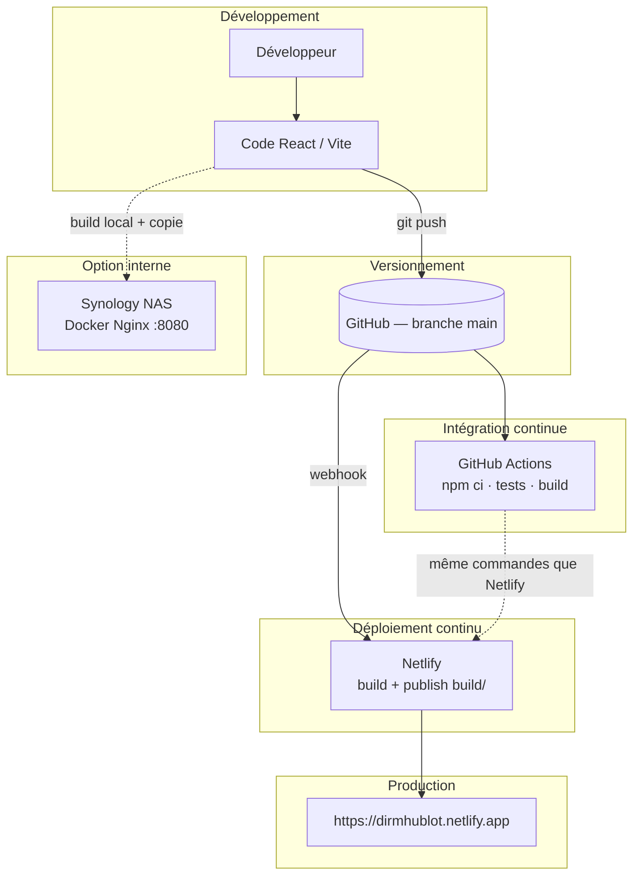
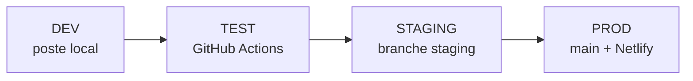

# Toutes les annexes (01 à 13)

Regroupement des pièces jointes — projet **Hublot**.

Index : [README.md](./README.md)

---


## Annexe_01_build.yml

```
# Annexe 01 — Workflow CI (GitHub Actions)
# Fichier original : .github/workflows/ci.yml

# CI — qualité et build (sans déploiement)
# CD cloud : Netlify (voir cd-netlify.yml + netlify.toml)
# CD NAS   : scripts/deploy-nas.sh + cd-nas.yml (manuel / secrets)

name: CI

on:
  push:
    branches: [main, staging]
  pull_request:
    branches: [main, staging]
  workflow_dispatch:

concurrency:
  group: ci-${{ github.ref }}
  cancel-in-progress: true

jobs:
  lint:
    name: ESLint
    runs-on: ubuntu-latest
    steps:
      - uses: actions/checkout@v4
      - uses: actions/setup-node@v4
        with:
          node-version: "20"
          cache: npm
      - run: npm ci
      - run: npm run lint

  unit-tests:
    name: Tests unitaires
    runs-on: ubuntu-latest
    steps:
      - uses: actions/checkout@v4
      - uses: actions/setup-node@v4
        with:
          node-version: "20"
          cache: npm
      - run: npm ci
      - run: npm run test:run

  audit:
    name: Audit npm (production)
    runs-on: ubuntu-latest
    steps:
      - uses: actions/checkout@v4
      - uses: actions/setup-node@v4
        with:
          node-version: "20"
          cache: npm
      - run: npm ci
      - run: npm run audit:prod

  build:
    name: Build production
    runs-on: ubuntu-latest
    needs: [lint, unit-tests, audit]
    steps:
      - uses: actions/checkout@v4
      - uses: actions/setup-node@v4
        with:
          node-version: "20"
          cache: npm
      - run: npm ci
      - run: npm run build
      - run: |
          test -f build/index.html
          test -d build/assets
      - uses: actions/upload-artifact@v4
        with:
          name: build-${{ github.sha }}
          path: build/
          retention-days: 7

  e2e:
    name: Tests E2E (Playwright)
    runs-on: ubuntu-latest
    needs: build
    steps:
      - uses: actions/checkout@v4
      - uses: actions/setup-node@v4
        with:
          node-version: "20"
          cache: npm
      - run: npm ci
      - run: npx playwright install --with-deps chromium
      - run: npm run build:e2e
      - run: npm run test:e2e
        env:
          CI: true
```

---

## Annexe_02_netlify.toml

```
# Annexe 02 — Configuration Netlify (build, headers, redirects)
# Fichier original : netlify.toml

# Netlify : build + function agents (Neon)
# La variable NETLIFY_DATABASE_URL est créée par l'extension Neon sur Netlify.

[build]
  command   = "npm run build"
  publish   = "build"

# Headers de sécurité (voir docs/SECURITE_4_DEPLOIEMENT.md)
[[headers]]
  for = "/*"
  [headers.values]
    X-Frame-Options = "DENY"
    X-Content-Type-Options = "nosniff"
    Referrer-Policy = "strict-origin-when-cross-origin"
    Permissions-Policy = "camera=(), microphone=(), geolocation=()"

# Ne pas rediriger les functions vers index.html
[[redirects]]
  from = "/.netlify/functions/*"
  to   = "/.netlify/functions/:splat"
  status = 200

# SPA : toutes les autres URLs → index.html
[[redirects]]
  from = "/*"
  to   = "/index.html"
  status = 200
```

---

## Annexe_03_package.json

```
{
  "name": "Statistiques DIRM Application",
  "version": "0.1.0",
  "private": true,
  "scripts": {
    "dev": "vite",
    "build": "vite build",
    "test": "vitest",
    "test:run": "vitest run"
  },
  "dependencies": {},
  "devDependencies": {
    "@types/node": "^20.10.0",
    "@vitejs/plugin-react-swc": "^3.10.2",
    "jsdom": "^25.0.0",
    "vite": "6.3.5",
    "vitest": "^2.1.0"
  }
}
```

---

## Annexe_04_gitignore

```
# Annexe 04 — Fichiers exclus du dépôt (sécurité, secrets)
# Fichier original : .gitignore

# Dépendances
node_modules
npm-debug.log
yarn-error.log
package-lock.json
yarn.lock

# Build
build
dist
.next
out

# Environnement (ne jamais commiter de vrais identifiants)
.env
.env.*
!.env.example
.env.local
.env.development.local
.env.test.local
.env.production.local
.env.production

# IDE
.vscode
.idea
*.swp
*.swo
*~

# OS
.DS_Store
Thumbs.db

# Git
.git
.gitignore
.gitattributes

# Documentation (README à la racine + tout le dossier docs/)
*.md
!README.md
!docs/
!docs/*.md

# Scripts Python (gardés séparément)
__pycache__
*.pyc
*.pyo
*.pyd
.Python
venv/
env/

# Données sensibles - NE JAMAIS COMMITTER
trdata/
src/data/
**/agents.json
*.xlsx
*.xls
*.htpasswd
*.pem
*.key
*.crt
*.p12
*.pfx
scripts/rapport_analyse.json
**/rapport*.json

# Rapports et logs
*.log
coverage
.nyc_output

# Tests
test-results
playwright-report

# Sécurité
secrets/
*.secret
```

---

## Annexe_05_ARCHITECTURE_DEPLOIEMENT.md

```
# Annexe 05 — Architecture de déploiement

> Copie pour livrable — document principal : `../ARCHITECTURE_DEPLOIEMENT.md`

---

# 1️⃣ Architecture de déploiement

Document de référence pour la compétence **« Préparer le déploiement d'une application sécurisée »** — projet **Hublot** (DIRM Méditerranée).

**Annexe associée :** [Annexe 05](./Annexes/Annexe_05_ARCHITECTURE_DEPLOIEMENT.md)

---

## Objectif

Décrire comment le code source devient une application accessible en production, avec **traçabilité**, **automatisation** et **sécurité**.

---

## Composants

| Composant | Rôle | Technologie |
|-----------|------|-------------|
| **Dépôt Git** | Source de vérité, historique, collaboration | GitHub `Meriem1403/Hublot` |
| **CI** | Vérification automatique (deps, tests, build) | GitHub Actions — workflow `CI/CD Pipeline` |
| **CD cloud** | Publication automatique après push | Netlify |
| **CD local** | Hébergement réseau interne (optionnel) | Synology NAS + Docker + Nginx |
| **Base de données** | Données agents en production (option) | PostgreSQL via Neon + Netlify Functions |
| **Secrets** | Identifiants et URLs sensibles | Variables d'environnement (jamais dans Git) |

---

## Schéma global



---

## Flux détaillé (push sur `main`)

1. **Développeur** : commit + `git push origin main`
2. **GitHub Actions** (CI) :
   - Checkout du code
   - Node.js 20 + `npm ci`
   - `npm run test:run` (32 tests Vitest)
   - `npm run build` → dossier `build/`
   - Vérification : `build/index.html` et `build/assets/` présents
   - `npm audit` (informatif)
3. **Netlify** (CD) — en parallèle / après le push :
   - `npm run build`
   - Publication du dossier `build/`
   - HTTPS, headers de sécurité (`netlify.toml`)
4. **Utilisateur** : accès à l'URL de production

---

## Fichiers de configuration

| Fichier | Annexe | Rôle |
|---------|--------|------|
| `.github/workflows/build.yml` | [01](./Annexes/Annexe_01_build.yml) | Pipeline CI/CD (YAML) |
| `netlify.toml` | [02](./Annexes/Annexe_02_netlify.toml) | Build, publish, redirects SPA, headers |
| `package.json` | [03](./Annexes/Annexe_03_package.json) | Scripts `dev`, `build`, `test:run` |
| `.gitignore` | [04](./Annexes/Annexe_04_gitignore) | Exclusion secrets et données RH |
| `docker-compose.yml` | — | Déploiement NAS (Nginx + `dist` ou `build`) |

---

## Alignement CI ↔ Netlify

| Étape | GitHub Actions | Netlify |
|-------|----------------|---------|
| Install | `npm ci` | `npm ci` (auto) |
| Tests | `npm run test:run` | — |
| Build | `npm run build` | `npm run build` |
| Publish | vérifie `build/` | `publish = build` |

Cette cohérence garantit que **ce qui passe en CI** correspond à **ce qui est déployé**.

---

## Déploiement NAS (complément)

Le NAS n'est **pas** dans la chaîne CD automatique Git :

1. Build sur poste de dev : `npm run build`
2. Copie du projet (dont `build/` ou `dist/`) sur le NAS
3. Lancement via **Container Manager** + `docker-compose.yml`
4. Accès : `http://IP_DU_NAS:8080`

Voir [DEPLOIEMENT_NAS_SYNOLOGY.md](./DEPLOIEMENT_NAS_SYNOLOGY.md).

---

## Rollback

| Canal | Méthode |
|-------|---------|
| **Netlify** | Restaurer un deploy précédent (Dashboard → Deploys → Publish deploy) |
| **Git** | Revert du commit + nouveau push |
| **NAS** | Remplacer les fichiers + redémarrer le conteneur |

Détail : [DOCUMENTATION_DEPLOIEMENT.md](./DOCUMENTATION_DEPLOIEMENT.md#2-procédure-de-rollback).

---

## Documents liés

- [DEVOPS.md](./DEVOPS.md) — Synthèse démarche DevOps complète
- [ENVIRONNEMENT_TEST.md](./ENVIRONNEMENT_TEST.md) — DEV / TEST / PROD
- [SECURITE_4_DEPLOIEMENT.md](./SECURITE_4_DEPLOIEMENT.md) — Sécurité du déploiement
- [DOCUMENTATION_DEPLOIEMENT.md](./DOCUMENTATION_DEPLOIEMENT.md) — Installation, logs, captures CI
```

---

## Annexe_06_ENVIRONNEMENT_TEST.md

```
# Annexe 06 — Environnements DEV, TEST, STAGING, PROD

> Copie pour livrable — document principal : `../ENVIRONNEMENT_TEST.md`

---

# 2️⃣ Les bases d'un environnement de test

Document de référence **Studi** — séparation **DEV**, **TEST**, **STAGING** et **PROD** pour Hublot.

**Annexe :** [Annexe 06](./Annexes/Annexe_06_ENVIRONNEMENT_TEST.md) · **Staging :** [ENVIRONNEMENT_STAGING.md](./ENVIRONNEMENT_STAGING.md)

---

## Principe

Chaque environnement a un **rôle**, une **configuration** et des **données** distincts. On ne teste jamais directement en production : on progresse de la machine locale vers la CI, puis la préproduction, puis la prod.



---

## Tableau récapitulatif

| Env. | Rôle | Où | URL / accès | Fichier config |
|------|------|-----|-------------|----------------|
| **DEV** | Coder, debug, tests manuels | Poste développeur | http://localhost:3000 | `.env.development` |
| **TEST** | Qualité automatisée (reproductible) | GitHub Actions — workflow **CI** | github.com/Meriem1403/Hublot/actions | `.github/workflows/ci.yml` |
| **TEST local** | QA manuelle « comme la prod » | Docker ou preview | http://localhost:4173 | `.env.test` + `docker-compose.test.yml` |
| **STAGING** | Préproduction métier | Netlify — branche `staging` | `staging--dirmhublot.netlify.app` | `netlify.toml` + variables Netlify |
| **PROD** | Utilisateurs habilités | Netlify — branche `main` | https://dirmhublot.netlify.app | Variables Netlify (secrets) |

---

## 1. DEV — Développement

### Objectif

Environnement **isolé** : aucun impact sur les utilisateurs ni sur la production.

### Démarrage

```bash
git clone https://github.com/Meriem1403/Hublot.git
cd Hublot
npm ci
cp .env.example .env    # optionnel : surcharges perso
npm run dev
```

| Élément | Détail |
|---------|--------|
| Commande | `npm run dev` → Vite mode `development` |
| URL | http://localhost:3000 |
| Variables | `.env.development` (versionné, comptes **démo** locaux) |
| Badge UI | Bandeau **« Développement (DEV) »** dans l'app |
| Tests avant push | `npm run test:run` · `npm run lint` |

### Fichier `.env.development`

```env
VITE_APP_ENV=development
VITE_APP_USERNAME=admin
VITE_APP_PASSWORD=demo
```

---

## 2. TEST — Intégration continue (CI)

### Objectif

Même chaîne pour **tous les développeurs** : impossible de merger du code qui ne compile pas, ne passe pas les tests ou ne respecte pas l'audit sécurité.

### Où

- **Plateforme :** GitHub Actions
- **Workflow :** **CI** (`.github/workflows/ci.yml`)
- **Déclencheurs :** push / PR sur `main` et `staging`

### Pipeline (environnement TEST)

| Étape | Commande / action |
|-------|-------------------|
| ESLint | `npm run lint` |
| Tests unitaires | `npm run test:run` (33 tests) |
| Audit npm prod | `npm run audit:prod` |
| Build | `npm run build` |
| E2E | `npm run test:e2e` (Playwright) |

### Critère de succès

- Tous les jobs **verts** sur l'onglet Actions
- Netlify (PROD) : **Deploy only when required checks pass** → check **CI**

### Ce n'est pas un serveur

L'environnement TEST est **éphémère** : une VM Ubuntu est créée, exécute la chaîne, puis est détruite. Pas de base de données partagée — données mockées / JSON de test dans les tests unitaires.

---

## 3. TEST local — QA manuelle (complément)

### Objectif

Tester le **build de production** (fichiers statiques) sans déployer sur Netlify.

### Option A — Preview Vite

```bash
npm run build:test
npm run preview:test
# → http://localhost:4173  (identifiants e2e-user / e2e-pass)
```

### Option B — Docker (comme le NAS)

```bash
npm run test:preview:docker
# build:test + nginx sur le port 4173
```

Fichiers : `.env.test`, `docker-compose.test.yml`

### Vérification complète (checklist machine)

```bash
npm run check:env
```

Exécute : présence des `.env`, `npm ci`, lint, tests, audit, `build:test`.

---

## 4. STAGING — Préproduction

Branche Git **`staging`** → déploiement Netlify séparé de `main`.

Voir [ENVIRONNEMENT_STAGING.md](./ENVIRONNEMENT_STAGING.md).

| Élément | Valeur |
|---------|--------|
| Branche | `staging` |
| Variable | `VITE_APP_ENV=staging` (netlify.toml) |
| Badge UI | **« Préproduction (STAGING) »** |
| Promotion | Merge `staging` → `main` après validation |

---

## 5. PROD — Production

| Élément | Valeur |
|---------|--------|
| Branche | `main` |
| URL | https://dirmhublot.netlify.app |
| Secrets | Uniquement dans Netlify (jamais dans Git) |
| Badge UI | **aucun** (environnement production) |

---

## Matrice : quel test où ?

| Type | DEV | TEST (CI) | TEST local | STAGING | PROD |
|------|-----|-----------|------------|---------|------|
| Unitaires Vitest | `npm run test:run` | Auto | `check:env` | — | — |
| ESLint | `npm run lint` | Auto | `check:env` | — | — |
| E2E Playwright | `npm run test:e2e` | Auto | `build:test` + preview | Manuel | — |
| Build | `npm run build` | Auto | `build:test` | Auto Netlify | Auto Netlify |
| Audit npm prod | `npm run audit:prod` | Auto | `check:env` | — | — |
| Tests manuels UI | Navigateur | — | :4173 | URL staging | URL prod |
| Headers sécurité | — | — | — | curl -I | curl -I |

Plan détaillé : [PLAN_TEST.md](./PLAN_TEST.md)

---

## Variables d'environnement (résumé)

| Fichier | Commité | Usage |
|---------|---------|--------|
| `.env.example` | Oui | Modèle documentation |
| `.env.development` | Oui | DEV — démo locale |
| `.env.test` | Oui | TEST local + E2E |
| `.env.staging.example` | Oui | Modèle STAGING |
| `.env` / `.env.staging` | **Non** | Secrets réels |

Code : `src/config/environment.ts` — libellé et badge selon `VITE_APP_ENV`.

---

## Parcours jury (5 minutes)

1. Montrer **DEV** : `npm run dev` → badge « Développement » + login démo.
2. Montrer **TEST** : GitHub Actions → workflow **CI** → jobs verts.
3. Montrer **TEST local** : `npm run check:env` ou preview :4173.
4. Montrer **STAGING** : branche `staging` + URL Netlify (si activée).
5. Montrer **PROD** : https://dirmhublot.netlify.app — pas de badge.

---

## Bonnes pratiques

1. Développer sur **DEV**, valider avec `npm run check:env` avant push.
2. Pousser sur **`staging`** pour une démo métier ; merger vers **`main`** seulement si CI verte.
3. Ne jamais committer `.env` avec mots de passe réels.
4. Conserver des identifiants **différents** entre STAGING et PROD.
```

---

## Annexe_07_SECURITE_4_DEPLOIEMENT.md

```
# Annexe 07 — Sécurité du déploiement

> Copie pour livrable — document principal : `../SECURITE_4_DEPLOIEMENT.md`

---

# 4️⃣ Sécurité du déploiement

Mesures de sécurité pour le déploiement de **Hublot** (DIRM Méditerranée).

**Annexe associée :** [Annexe 07](./Annexes/Annexe_07_SECURITE_4_DEPLOIEMENT.md)

---

## 1. HTTPS

| Canal | Mise en œuvre |
|-------|----------------|
| **Netlify (PROD)** | Certificat TLS géré automatiquement par Netlify |
| **NAS (local)** | HTTP par défaut ; HTTPS possible via **Reverse Proxy DSM** + certificat interne |

**Vérification :**

```bash
curl -I https://dirmhublot.netlify.app
```

Attendu : URL en `https://`, réponse `200` ou `304`.

---

## 2. Variables d'environnement sécurisées

Les secrets ne sont **jamais** dans le dépôt Git.

| Variable (exemples) | Où la configurer | Usage |
|---------------------|------------------|--------|
| `VITE_APP_USERNAME` | Netlify → Environment variables | Connexion application |
| `VITE_APP_PASSWORD` | Netlify → Environment variables | Connexion application |
| `NETLIFY_DATABASE_URL` | Netlify (extension Neon) | Accès base PostgreSQL |

En local : fichier `.env` (listé dans `.gitignore`).

---

## 3. Gestion des secrets

| Règle | Application |
|-------|-------------|
| Pas de commit de secrets | `.gitignore` : `.env`, `agents.json`, `*.xlsx`, certificats |
| Séparation des rôles | Comptes Netlify / GitHub distincts des comptes métier |
| Données RH internes | Hors dépôt public ; accès restreint aux équipes habilitées |
| Rotation | Changer les mots de passe en cas de fuite suspectée |

Fichier de référence : [Annexe 04 — .gitignore](./Annexes/Annexe_04_gitignore)

---

## 4. Pas de données sensibles exposées

- Aucun export métier dans le README public.
- Données agents non versionnées (`src/data/`, `trdata/` ignorés).
- API / base en production protégées par authentification applicative.

---

## 5. Headers de sécurité

Configurés dans **`netlify.toml`** (Annexe 02) :

| Header | Valeur | Protection |
|--------|--------|------------|
| `X-Frame-Options` | `DENY` | Clickjacking |
| `X-Content-Type-Options` | `nosniff` | MIME sniffing |
| `Referrer-Policy` | `strict-origin-when-cross-origin` | Fuite de référent |
| `Permissions-Policy` | camera/micro/geo désactivés | Permissions navigateur |

**Vérification :**

```bash
curl -I https://dirmhublot.netlify.app | grep -i x-frame
```

Configuration Nginx (NAS) : voir `nginx.conf` (CSP, X-Frame-Options en commentaire ou actif selon version).

---

## 6. Tests de vulnérabilité (npm audit)

| Contexte | Commande | CI |
|----------|----------|-----|
| Local | `npm audit` | — |
| Pipeline | `npm audit --audit-level=high` | Étape **informatif** (n'empêche pas le build) |

**Interprétation :** certaines alertes concernent des dépendances de **développement** (Vitest, outils de build). Le site en production sert uniquement les fichiers statiques du dossier `build/`.

**Plan d'action :**

1. `npm audit` régulier
2. `npm audit fix` pour les correctifs sans breaking change
3. Documenter les vulnérabilités résiduelles acceptées

---

## 7. Authentification applicative

- Page de connexion avant accès au tableau de bord.
- Identifiants injectés au build via variables d'environnement (`import.meta.env`).
- Session côté navigateur (`sessionStorage`) — à renforcer (JWT / SSO) en évolution future.

Test manuel : voir [PLAN_TEST.md](./PLAN_TEST.md) — scénario authentification.

---

## 8. Checklist avant mise en production

Utiliser [CHECKLIST_SECURITE.md](./CHECKLIST_SECURITE.md) :

- [ ] Mots de passe forts configurés sur Netlify
- [ ] `.env` absent du dépôt
- [ ] CI verte sur `main`
- [ ] Headers vérifiés en production
- [ ] Rollback testé (au moins une fois)

Compléments : [SECURITE.md](./SECURITE.md), [DEPLOIEMENT_SECURISE.md](./DEPLOIEMENT_SECURISE.md)

---

## Synthèse jury

> « Le déploiement est sécurisé par HTTPS en production, des variables d'environnement pour les secrets, l'exclusion des données RH du dépôt, des headers HTTP durcis et un audit npm intégré à la CI. L'authentification protège l'accès aux tableaux de bord. »
```

---

## Annexe_08_PLAN_TEST.md

```
# Annexe 08 — Plan de test

> Copie pour livrable — document principal : `../PLAN_TEST.md`

---

# 5️⃣ Plan de test

Chaque test est décrit avec un **objectif**, un **résultat attendu** et le **statut** constaté après exécution. La colonne **Type** indique si le test est **automatisé** ou **manuel**.

**Enjeux (référentiel Studi) :** voir [ENJEUX_PLAN_TEST.md](./ENJEUX_PLAN_TEST.md) — pourquoi planifier, risques RH, automatisation vs manuel, traçabilité.

**Annexes :** [08](./Annexes/Annexe_08_PLAN_TEST.md) (plan synthétique) · [13](./Annexes/Annexe_13_SCENARIOS_TEST.md) (scénarios détaillés) · **Exécution :** [DEMO_EPREUVE.md](./DEMO_EPREUVE.md)

Document maître scénarios : [SCENARIOS_TEST.md](./SCENARIOS_TEST.md).

---

## Enjeux en résumé

| Enjeu | Comment le plan y répond |
|-------|---------------------------|
| **Données RH fiables** | 20 tests calculs + 12 tests filtres / normalisation |
| **Pas de régression en CI/CD** | Workflow **CI** à chaque push (`main`, `staging`) |
| **Sécurité** | Auth, headers, audit npm, E2E login |
| **Traçabilité jury** | Tableau Objectif / Résultat / **Statut** + logs Actions |
| **Coût maîtrisé** | Pyramide : beaucoup d'unitaires, peu d'E2E ciblés |

---

## Batterie automatisée (36 exécutions)

| Fichier / outil | Nombre | Couverture |
|-----------------|--------|------------|
| **dataService.test.ts** | 12 | Filtres, normalisation, chargement — **Annexe 11** |
| **dataCalculations.test.ts** | 20 | Âge, ETP, répartitions, stats service — **Annexe 12** |
| **environment.test.ts** | 1 | Libellé environnement (DEV / staging…) |
| **e2e/smoke.spec.ts** | 3 | Login, dashboard, `/health.json` — Playwright en CI |
| **ESLint** | — | Qualité code (`npm run lint`) |
| **audit prod** | — | `npm run audit:prod` — **SECURITE_AUDIT.md** |

Commandes : `npm run test:run` · `npm run test:e2e` · workflow **CI** — **Annexe 01** (`ci.yml`).

---

## Tableau des tests

| Test | Type | Objectif | Résultat attendu | Statut |
|------|------|----------|------------------|--------|
| **Lint (ESLint)** | Automatisé | Détecter erreurs et mauvaises pratiques avant merge. | `npm run lint` sans erreur en local et en CI. | Passé |
| **Tests unitaires** | Automatisé | Valider la logique métier (filtres, statistiques). | `npm run test:run` : 33 tests passés (3 fichiers). CI verte. | Passé |
| **Tests E2E** | Automatisé | Valider le parcours critique (connexion, accès app). | `npm run test:e2e` : 3 scénarios Playwright passés en CI. | Passé |
| **Build production** | Automatisé | Vérifier que l'app compile pour Netlify/NAS. | `npm run build` → `build/index.html` + `assets/`. CI + Netlify OK. | Passé |
| **Audit npm (production)** | Automatisé | Limiter les vulnérabilités des dépendances runtime. | `npm run audit:prod` : critical bloquant ; high hors allowlist documentée. | Passé |
| **Test authentification** | Manuel | Accès protégé ; login / logout. | Page login sans session ; identifiants invalides refusés ; accès dashboard si valides. | À exécuter |
| **Test chargement des données** | Manuel | Données cohérentes sur tous les onglets. | Graphiques et tableaux alimentés ; pas d'erreur bloquante en console. | À exécuter |
| **Test responsive** | Manuel | Usage mobile / tablette / desktop. | Pas de débordement ; filtres et onglets utilisables (≈ 375 px). | À exécuter |
| **Test performance** | Manuel | Temps de chargement acceptable. | Page interactive en quelques secondes ; navigation fluide. | À exécuter |
| **Test des filtres** | Manuel | Filtres globaux (région, service, statut, PASA…). | Sélection met à jour vues ; « DIRM Méditerranée » cohérent. | À exécuter |
| **Test badge environnement** | Manuel | Distinguer DEV / staging de la PROD. | Badge visible hors production ; absent sur dirmhublot.netlify.app. | À exécuter |
| **Test sécurité (headers)** | Automatisé | Headers durcis en production. | `curl -I https://dirmhublot.netlify.app` : HTTPS, `X-Frame-Options`, `X-Content-Type-Options`. | À vérifier |

---

## Détail des scénarios manuels

Les scénarios **formalisés** (priorité, préconditions, *Étant donné / Quand / Alors*, traçabilité **ST-F***) sont dans **[SCENARIOS_TEST.md](./SCENARIOS_TEST.md)** — **Annexe 13**.

### Rappels exécution rapide

- **Auth** → ST-F01 · **Données** → ST-F02 · **Filtres** → ST-F03 · **Responsive** → ST-F04 · **Perf** → ST-F05 · **Badge** → ST-F06 · **Headers** → ST-SEC01

---

## Statuts

| Statut | Signification |
|--------|----------------|
| **Passé** | Exécuté, conforme au résultat attendu |
| **Échec** | Exécuté, non conforme — à corriger |
| **À exécuter** | Manuel à faire (puis Passé / Échec) |
| **À vérifier** | À contrôler après deploy (ex. headers) |

---

## Alignement référentiel Studi

| Attendu | Couverture |
|---------|------------|
| **Enjeux des plans de test** | [ENJEUX_PLAN_TEST.md](./ENJEUX_PLAN_TEST.md) |
| **Élaborer un scénario** | [SCENARIOS_TEST.md](./SCENARIOS_TEST.md) — Annexe 13 |
| **Environnement de test** | [ENVIRONNEMENT_TEST.md](./ENVIRONNEMENT_TEST.md) — Annexe 06 |
| **Tests de sécurité** | Auth, headers, audit — Annexe 07 |
| **Valider les résultats** | Colonne **Statut** + CI |
| **Automatiser (DevOps)** | CI : lint, Vitest, E2E, audit, build |

---

## Annexes

| Annexe | Document |
|--------|----------|
| **08** | [Annexe_08_PLAN_TEST.md](./Annexes/Annexe_08_PLAN_TEST.md) |
| **13** | [Annexe_13_SCENARIOS_TEST.md](./Annexes/Annexe_13_SCENARIOS_TEST.md) |
| **09** | [Annexe_09_DEMO.md](./Annexes/Annexe_09_DEMO.md) |
| **06** | [Annexe_06_ENVIRONNEMENT_TEST.md](./Annexes/Annexe_06_ENVIRONNEMENT_TEST.md) |
| **07** | [Annexe_07_SECURITE_4_DEPLOIEMENT.md](./Annexes/Annexe_07_SECURITE_4_DEPLOIEMENT.md) |
| **01** | [Annexe_01_build.yml](./Annexes/Annexe_01_build.yml) (CI) |
| **11–12** | Tests unitaires sources |

Index : [Annexes/README.md](./Annexes/README.md).
```

---

## Annexe_09_DEMO.md

```
# Annexe 09 — Procédure d'exécution des tests

> Copie pour livrable — document principal : `../DEMO.md`

---

# Procédure d’exécution des tests

Ce document liste les **commandes à exécuter** pour reproduire les résultats du plan de test. À lancer dans un terminal ouvert à la racine du projet (`StatDirm`).

---

## 1. Tests unitaires automatisés (CI)

**Commande :**

```bash
npm run test:run
```

**Résultat attendu :**  
- Message du type : `Test Files  2 passed (2)` et `Tests  32 passed (32)`  
- Pas d’erreur rouge

Les tests unitaires (Vitest) passent en local ; la même commande est exécutée en CI à chaque push sur `main`.

---

## 2. Build de production

**Commande :**

```bash
npm run build
```

**Résultat attendu :**  
- `✓ built in …` sans erreur  
- Dossier `build/` créé avec `index.html` et `assets/`

Le build de production réussit ; Netlify exécute cette commande à chaque déploiement.

---

## 3. Audit des vulnérabilités

**Commande :**

```bash
npm audit
```

**Résultat attendu :**  
- Un rapport s’affiche. Il peut rester des vulnérabilités dans des dépendances de **développement** (ex. `react-simple-maps`, `vitest`).  
Les alertes restantes concernent des dépendances de développement ou des mises à jour majeures. En production, le site sert uniquement les fichiers buildés ; les recommandations de sécurité (headers, HTTPS, variables d’env) sont appliquées.

---

## 4. Lancer l’app en local (optionnel)

**Commande :**

```bash
npm run dev
```

Puis ouvrir **http://localhost:5173** dans le navigateur pour montrer :
- la page de connexion (sans être connecté) ;
- après connexion : les onglets, les données, les filtres (ex. « DIRM Méditerranée »).

---

## 5. Vérifier les headers de sécurité (production)

**Commande :**

```bash
curl -I https://dirmhublot.netlify.app
```

**À montrer dans la sortie :**  
- `X-Frame-Options: DENY`  
- `X-Content-Type-Options: nosniff`  
- Réponse `200` ou `304` et URL en `https://`

---

## Ordre d’exécution recommandé

| Ordre | Action | Commande ou action |
|-------|--------|---------------------|
| 1 | Tests unitaires | `npm run test:run` |
| 2 | Build | `npm run build` |
| 3 | Audit | `npm audit` |
| 4 | Site en prod | Ouvrir https://dirmhublot.netlify.app → connexion → parcourir les onglets |
| 5 | Headers de sécurité | `curl -I https://dirmhublot.netlify.app` |

---

## Résultats constatés

- **Tests :** 2 fichiers, 32 tests (Vitest) — tous passent.  
- **Build :** réussi ; sortie dans `build/`.  
- **Audit :** des vulnérabilités restent sur des dépendances de dev ; aucune donnée sensible exposée ; pas de secret dans le dépôt.
```

---

## Annexe_10_COMPETENCE_DEPLOIEMENT_STUDI.md

```
# Annexe 10 — Validation compétence Studi

> Copie pour livrable — document principal : `../COMPETENCE_DEPLOIEMENT_STUDI.md`

---

# Validation compétence Studi : Préparer le déploiement d'une application sécurisée

**Application :** Hublot – Tableau de bord DIRM Méditerranée ([dirm.mediterranee.developpement-durable.gouv.fr](https://www.dirm.mediterranee.developpement-durable.gouv.fr), Ministère chargé de la Mer et de la Pêche)  
**Déploiement en ligne :** https://dirmhublot.netlify.app  
**Référentiel :** Programme en vigueur le 21/02/2024 – Déploiement, DevOps, CI/CD, tests, sécurité.

---

## 1. Déploiement continu (CD) et hébergement

- **Application hébergée et accessible :** https://dirmhublot.netlify.app  
- **Pipeline de déploiement :** À chaque `git push` sur la branche `main`, Netlify déclenche automatiquement un build puis un déploiement (livraison continue).
- **Configuration du déploiement :** Fichier **`netlify.toml`** à la racine du projet :
  - Commande de build : `npm run build`
  - Dossier publié : `build`
  - Règles de redirection (SPA, fonctions serverless).
- **Documentation du processus :** Voir **`HOSTING.md`** (options Docker, build manuel, Netlify/Vercel) et **`COMMENT_VOIR_LES_DONNEES_SUR_NETLIFY.md`** pour la mise en œuvre sur Netlify.

---

## 2. Intégration continue (CI) et YAML

- **Workflow d’intégration continue :** Le dépôt contient un workflow GitHub Actions nommé **« CI/CD Pipeline »** (fichier **`.github/workflows/build.yml`**, **Annexe 01**) qui :
  - se déclenche sur chaque push et pull request sur `main` (et manuellement via `workflow_dispatch`) ;
  - exécute `npm ci`, puis **`npm run test:run`** (32 tests Vitest), puis `npm run build` ;
  - vérifie le dossier `build/` (aligné sur Netlify) et exécute `npm audit` (informatif).
- **Synthèse DevOps :** voir **`DEVOPS.md`**, **`ARCHITECTURE_DEPLOIEMENT.md`**, **`DOCUMENTATION_DEPLOIEMENT.md`**.
- **Rédaction en YAML :** La pipeline CI est décrite en YAML (syntaxe et structure attendues dans le référentiel).
- **Automatisation des tests en DevOps :** Batterie de **32 tests** unitaires (Vitest), exécutés automatiquement dans le workflow CI. Fichiers : **`src/services/dataService.test.ts`** (12 tests : filtres région/service/statut/mission, DIRM Méditerranée, normalisation, chargement), **`src/utils/dataCalculations.test.ts`** (20 tests : âge, tranches d’âge, ETP, répartitions statut/contrat/genre/responsabilité/âge, vue d’ensemble, stats par service). Commande : `npm run test:run`.

---

## 3. Préparer le déploiement d’une application sécurisée

- **Authentification :** Page de connexion (identifiants configurés via variables d’environnement au build) ; accès aux données protégé après authentification.
- **Données sensibles :** Fichiers sensibles (`.env`, `agents.json`, données Excel, etc.) sont exclus du dépôt via **`.gitignore`** ; pas de secrets committés.
- **Documentation sécurité et déploiement :**
  - **`DEPLOIEMENT_SECURISE.md`** : étapes pour un déploiement sécurisé (HTTPS, Docker, firewall, etc.).
  - **`CHECKLIST_SECURITE.md`** : checklist avant mise en production (authentification, HTTPS, headers, Docker, sauvegardes).
  - **`SECURITE.md`** : mesures de sécurité implémentées dans l’application.
- **Environnement de test :** Possibilité de lancer l’application en local (`npm run dev`) ou avec Docker (`make dev` / `docker-compose`) pour tester avant déploiement.
- **Scripts dans la démarche DevOps :**
  - Script de conversion des données : **`scripts/convert_excel_to_json.py`** (préparation des données pour l’app).
  - Scripts npm : `npm run build`, `npm run dev` ; possibilité d’utiliser `make` pour Docker et conversion (voir **`README.md`**).

---

## 4. Synthèse pour le jury

| Attendu du référentiel | Élément dans le projet |
|------------------------|-------------------------|
| Déploiement d’une application | Application en ligne : https://dirmhublot.netlify.app |
| Déploiement continu (CD) | Netlify : build + déploiement automatique à chaque push |
| Intégration continue (CI) | Workflow GitHub Actions – tests automatiques puis build |
| YAML | `netlify.toml`, `.github/workflows/build.yml` |
| Documentation du processus de déploiement | `DEVOPS.md`, `DOCUMENTATION_DEPLOIEMENT.md`, `HOSTING.md`, `README.md` (racine) |
| Application sécurisée | Authentification, `.gitignore` pour les secrets, docs sécurité |
| Scripts / automatisation | Scripts npm, Python (conversion), configuration Netlify |
| Environnement de test | Instructions en local et Docker dans `README.md` et `HOSTING.md` ; voir **`ENVIRONNEMENT_TEST.md`** (DEV / TEST / PROD). |
| Plan de test, scénarios, validation | **`PLAN_TEST.md`** : tableau Test / Objectif / Résultat attendu / Statut (auth, API, responsive, performance, tests automatisés CI, sécurité). |

---

**Conclusion :** Le projet Hublot permet de valider la compétence « Préparer le déploiement d’une application sécurisée » et les éléments associés du référentiel Studi (démarche DevOps, bases du déploiement automatique, CI/CD, YAML, documentation et sécurisation).
```

---

## Annexe_11_dataService.test.ts

```
/**
 * Annexe 11 — Tests unitaires dataService (fichier original : src/services/dataService.test.ts)
 * 12 tests : filtres (région, service DIRM Méditerranée, statut, mission), normalisation, chargement.
 */

import { describe, it, expect } from 'vitest';
import {
  filterAgentsFrom,
  DIRM_MEDITERANEE_LABEL,
  normalizeAgents,
  loadAgentsDataFrom
} from './dataService';
import type { Agent, StatDirmData } from '../types/data';

function mockAgent(overrides: Partial<Agent> = {}): Agent {
  return {
    id: '1',
    nom: 'Test',
    prenom: 'Agent',
    dateNaissance: '1990-01-01',
    genre: 'H',
    statut: 'Titulaire',
    contratType: 'Temps plein',
    region: 'Marseille',
    service: 'DDTM 13',
    mission: 'Mission test',
    metier: 'Métier test',
    niveauResponsabilite: 'Opérationnel',
    poste: 'Poste test',
    dateEmbauche: '2020-01-01',
    etp: 1,
    actif: true,
    dateMaj: '2025-01-01',
    enConges: false,
    enFormation: false,
    enArretMaladie: false,
    ...overrides
  };
}

describe('filterAgentsFrom', () => {
  const agents: Agent[] = [
    mockAgent({ id: '1', region: 'Marseille', service: 'DDTM 13' }),
    mockAgent({ id: '2', region: 'Nice', service: 'DDTM 06' }),
    mockAgent({ id: '3', region: 'Toulon', service: 'DDTM 83' }),
    mockAgent({ id: '4', region: 'Sète', service: 'DDTM 34' }),
    mockAgent({ id: '5', region: 'Paris', service: 'DIRM BNEM' })
  ];

  it('filtre par région', () => {
    const result = filterAgentsFrom(agents, { region: 'Marseille' });
    expect(result).toHaveLength(1);
    expect(result[0].region).toBe('Marseille');
  });

  it('filtre par service DIRM Méditerranée (régions Marseille, Nice, Toulon, Sète)', () => {
    const result = filterAgentsFrom(agents, { service: DIRM_MEDITERANEE_LABEL });
    expect(result).toHaveLength(4);
    const regions = result.map((a) => a.region).sort();
    expect(regions).toEqual(['Marseille', 'Nice', 'Sète', 'Toulon']);
  });

  it('filtre par service classique', () => {
    const result = filterAgentsFrom(agents, { service: 'DDTM 06' });
    expect(result).toHaveLength(1);
    expect(result[0].service).toBe('DDTM 06');
    expect(result[0].region).toBe('Nice');
  });

  it('sans filtre retourne tous les agents', () => {
    const result = filterAgentsFrom(agents, {});
    expect(result).toHaveLength(5);
  });

  it('filtre "all" pour région ne filtre pas', () => {
    const result = filterAgentsFrom(agents, { region: 'all' });
    expect(result).toHaveLength(5);
  });

  it('filtre par statut', () => {
    const agentsWithStatut = [
      mockAgent({ id: '1', statut: 'Titulaire' }),
      mockAgent({ id: '2', statut: 'CDD' }),
      mockAgent({ id: '3', statut: 'Titulaire' })
    ];
    const result = filterAgentsFrom(agentsWithStatut, { statut: 'Titulaire' });
    expect(result).toHaveLength(2);
    expect(result.every((a) => a.statut === 'Titulaire')).toBe(true);
  });

  it('filtre par mission', () => {
    const agentsWithMission = [
      mockAgent({ id: '1', mission: 'Sauvetage en mer' }),
      mockAgent({ id: '2', mission: 'Police des pêches' }),
      mockAgent({ id: '3', mission: 'Sauvetage en mer' })
    ];
    const result = filterAgentsFrom(agentsWithMission, { mission: 'Sauvetage en mer' });
    expect(result).toHaveLength(2);
    expect(result.every((a) => a.mission === 'Sauvetage en mer')).toBe(true);
  });

  it('filtre "all" pour mission ne filtre pas', () => {
    const agentsWithMission = [
      mockAgent({ id: '1', mission: 'M1' }),
      mockAgent({ id: '2', mission: 'M2' })
    ];
    const result = filterAgentsFrom(agentsWithMission, { mission: 'all' });
    expect(result).toHaveLength(2);
  });
});

describe('normalizeAgents', () => {
  it('mappe la région depuis le code service (ex. DDTM 13 → Marseille)', () => {
    const agents: Agent[] = [
      mockAgent({ id: '1', service: 'DDTM 13', region: 'Inconnu' })
    ];
    const result = normalizeAgents(agents);
    expect(result).toHaveLength(1);
    expect(result[0].region).toBe('Marseille');
  });

  it('mappe le service vers le nom normalisé (ex. DDTM 13 → Surveillance et contrôle)', () => {
    const agents: Agent[] = [
      mockAgent({ id: '1', service: 'DDTM 13' })
    ];
    const result = normalizeAgents(agents);
    expect(result[0].service).toBe('Surveillance et contrôle');
  });

  it('conserve les agents sans mapping inchangés pour les champs non mappés', () => {
    const agents: Agent[] = [
      mockAgent({ id: '1', service: 'Service inconnu', region: 'Paris' })
    ];
    const result = normalizeAgents(agents);
    expect(result).toHaveLength(1);
    expect(result[0].region).toBe('Paris');
    expect(result[0].service).toBe('Service inconnu');
  });
});

describe('loadAgentsDataFrom', () => {
  it('charge et normalise les agents depuis un StatDirmData', () => {
    const data: StatDirmData = {
      agents: [
        mockAgent({ id: '1', service: 'DDTM 06', region: '?' })
      ],
      capacites: { missions: [], regions: [] }
    };
    const result = loadAgentsDataFrom(data);
    expect(result).toHaveLength(1);
    expect(result[0].region).toBe('Nice');
    expect(result[0].service).toBe('Opérations maritimes');
  });
});
```

---

## Annexe_12_dataCalculations.test.ts

```
/**
 * Annexe 12 — Tests unitaires dataCalculations (fichier original : src/utils/dataCalculations.test.ts)
 * 20 tests : âge, tranches d'âge, ETP, répartitions (statut, contrat, genre, responsabilité, âge), vue d'ensemble, stats par service.
 */

import { describe, it, expect } from 'vitest';
import {
  calculerAge,
  getTrancheAge,
  calculerETP,
  calculerRepartitionStatut,
  calculerRepartitionContrat,
  calculerOverviewStats,
  calculerStatsParService,
  calculerRepartitionGenre,
  calculerRepartitionResponsabilite,
  calculerRepartitionAge
} from './dataCalculations';
import type { Agent } from '../types/data';

function mockAgent(overrides: Partial<Agent> = {}): Agent {
  return {
    id: '1',
    nom: 'Test',
    prenom: 'Agent',
    dateNaissance: '1990-01-01',
    genre: 'H',
    statut: 'Titulaire',
    contratType: 'Temps plein',
    region: 'Marseille',
    service: 'Service A',
    mission: 'Mission test',
    metier: 'Métier test',
    niveauResponsabilite: 'Opérationnel',
    poste: 'Poste test',
    dateEmbauche: '2020-01-01',
    etp: 1,
    actif: true,
    dateMaj: '2025-01-01',
    enConges: false,
    enFormation: false,
    enArretMaladie: false,
    ...overrides
  };
}

describe('calculerAge', () => {
  it('calcule l'âge à partir d'une date de naissance', () => {
    const age = calculerAge('1990-06-15');
    expect(typeof age).toBe('number');
    expect(age).toBeGreaterThanOrEqual(34);
    expect(age).toBeLessThanOrEqual(36);
  });

  it('retourne un âge cohérent pour 1985', () => {
    const age = calculerAge('1985-01-01');
    expect(age).toBeGreaterThanOrEqual(39);
    expect(age).toBeLessThanOrEqual(41);
  });
});

describe('getTrancheAge', () => {
  it('retourne la tranche < 25 ans pour 24', () => {
    expect(getTrancheAge(24)).toBe('< 25 ans');
  });

  it('retourne la tranche 25-29 ans pour 27', () => {
    expect(getTrancheAge(27)).toBe('25-29 ans');
  });

  it('retourne la tranche 25-29 ans pour 25 (limite)', () => {
    expect(getTrancheAge(25)).toBe('25-29 ans');
  });

  it('retourne la tranche 55-59 ans pour 55', () => {
    expect(getTrancheAge(55)).toBe('55-59 ans');
  });

  it('retourne la tranche 60-64 ans pour 64', () => {
    expect(getTrancheAge(64)).toBe('60-64 ans');
  });

  it('retourne la tranche ≥ 65 ans pour 65 et 70', () => {
    expect(getTrancheAge(65)).toBe('≥ 65 ans');
    expect(getTrancheAge(70)).toBe('≥ 65 ans');
  });
});

describe('calculerETP', () => {
  const baseAgent: Agent = {
    id: '1',
    nom: 'Test',
    prenom: 'Agent',
    dateNaissance: '1990-01-01',
    genre: 'H',
    statut: 'Titulaire',
    contratType: 'Temps plein',
    region: 'Marseille',
    service: 'DDTM 13',
    mission: 'Mission test',
    metier: 'Métier test',
    niveauResponsabilite: 'Opérationnel',
    poste: 'Poste test',
    dateEmbauche: '2020-01-01',
    etp: 1,
    actif: true,
    dateMaj: '2025-01-01',
    enConges: false,
    enFormation: false,
    enArretMaladie: false
  };

  it('retourne 1 pour un agent temps plein', () => {
    expect(calculerETP({ ...baseAgent, contratType: 'Temps plein' })).toBe(1);
  });

  it('retourne 0.8 pour un temps partiel à 80%', () => {
    expect(
      calculerETP({
        ...baseAgent,
        contratType: 'Temps partiel',
        tempsPartielPourcentage: 80
      })
    ).toBe(0.8);
  });

  it('retourne etp si fourni quand temps partiel sans pourcentage', () => {
    expect(
      calculerETP({ ...baseAgent, contratType: 'Temps partiel', etp: 0.5 })
    ).toBe(0.5);
  });
});

describe('calculerRepartitionStatut', () => {
  it('calcule la répartition par statut avec effectifs et pourcentages', () => {
    const agents: Agent[] = [
      mockAgent({ id: '1', statut: 'Titulaire' }),
      mockAgent({ id: '2', statut: 'Titulaire' }),
      mockAgent({ id: '3', statut: 'CDD' })
    ];
    const result = calculerRepartitionStatut(agents);
    expect(result).toHaveLength(2);
    const titulaires = result.find((r) => r.statut === 'Titulaire');
    const cdd = result.find((r) => r.statut === 'CDD');
    expect(titulaires?.nombre).toBe(2);
    expect(titulaires?.pourcentage).toBeCloseTo(66.67, 1);
    expect(cdd?.nombre).toBe(1);
    expect(cdd?.pourcentage).toBeCloseTo(33.33, 1);
  });

  it('exclut les agents inactifs', () => {
    const agents: Agent[] = [
      mockAgent({ id: '1', statut: 'Titulaire', actif: true }),
      mockAgent({ id: '2', statut: 'Titulaire', actif: false })
    ];
    const result = calculerRepartitionStatut(agents);
    expect(result).toHaveLength(1);
    expect(result[0].nombre).toBe(1);
  });
});

describe('calculerRepartitionContrat', () => {
  it('répartit par service : temps plein, temps partiel, CDD, stagiaires', () => {
    const agents: Agent[] = [
      mockAgent({ id: '1', service: 'S1', statut: 'Titulaire', contratType: 'Temps plein' }),
      mockAgent({ id: '2', service: 'S1', statut: 'CDD' }),
      mockAgent({ id: '3', service: 'S1', statut: 'Stagiaire' }),
      mockAgent({ id: '4', service: 'S2', statut: 'Titulaire', contratType: 'Temps partiel' })
    ];
    const result = calculerRepartitionContrat(agents);
    expect(result).toHaveLength(2);
    const s1 = result.find((r) => r.service === 'S1');
    const s2 = result.find((r) => r.service === 'S2');
    expect(s1?.tempsPlein).toBe(1);
    expect(s1?.cdd).toBe(1);
    expect(s1?.stagiaires).toBe(1);
    expect(s2?.tempsPartiel).toBe(1);
  });
});

describe('calculerOverviewStats', () => {
  it('calcule effectifs, postes pourvus/vacants et taux pourvu', () => {
    const agents: Agent[] = [
      mockAgent({ id: '1' }),
      mockAgent({ id: '2' }),
      mockAgent({ id: '3' })
    ];
    const capacitesTotal = 10;
    const result = calculerOverviewStats(agents, capacitesTotal);
    expect(result.effectifsTotaux).toBe(3);
    expect(result.postesPourvus).toBe(3);
    expect(result.postesVacants).toBe(7);
    expect(result.tauxPourvu).toBe(30);
    expect(result).toHaveProperty('ratioEncadrement');
    expect(result).toHaveProperty('tensionRH');
  });

  it('retourne taux pourvu 0 quand aucune capacité', () => {
    const result = calculerOverviewStats([mockAgent()], 0);
    expect(result.tauxPourvu).toBe(0);
  });
});

describe('calculerStatsParService', () => {
  it('retourne effectif et statut (normal/fragile/critique) par service', () => {
    const agents: Agent[] = [
      mockAgent({ id: '1', service: 'Grand service' }),
      ...Array.from({ length: 25 }, (_, i) =>
        mockAgent({ id: `g${i}`, service: 'Grand service' })
      ),
      mockAgent({ id: 's1', service: 'Petit service' })
    ];
    const result = calculerStatsParService(agents);
    expect(result.length).toBeGreaterThanOrEqual(2);
    const grand = result.find((r) => r.name === 'Grand service');
    expect(grand?.effectif).toBe(26);
    expect(['normal', 'fragile', 'critique']).toContain(grand?.status);
  });
});

describe('calculerRepartitionGenre', () => {
  it('calcule hommes et femmes avec pourcentages', () => {
    const agents: Agent[] = [
      mockAgent({ id: '1', genre: 'H' }),
      mockAgent({ id: '2', genre: 'H' }),
      mockAgent({ id: '3', genre: 'F' })
    ];
    const result = calculerRepartitionGenre(agents);
    expect(result).toHaveLength(2);
    const hommes = result.find((r) => r.genre === 'Hommes');
    const femmes = result.find((r) => r.genre === 'Femmes');
    expect(hommes?.nombre).toBe(2);
    expect(femmes?.nombre).toBe(1);
    expect(hommes?.pourcentage).toBeCloseTo(66.67, 1);
  });
});

describe('calculerRepartitionResponsabilite', () => {
  it('calcule la répartition par niveau avec pourcentages', () => {
    const agents: Agent[] = [
      mockAgent({ id: '1', niveauResponsabilite: 'Opérationnel' }),
      mockAgent({ id: '2', niveauResponsabilite: 'Opérationnel' }),
      mockAgent({ id: '3', niveauResponsabilite: 'Encadrement' })
    ];
    const result = calculerRepartitionResponsabilite(agents);
    expect(result.length).toBe(2);
    const op = result.find((r) => r.niveau === 'Opérationnel');
    expect(op?.nombre).toBe(2);
    expect(op?.pourcentage).toBeCloseTo(66.67, 1);
  });
});

describe('calculerRepartitionAge', () => {
  it('répartit les agents par tranche d'âge avec genre', () => {
    const agents: Agent[] = [
      mockAgent({ id: '1', dateNaissance: '2001-06-15', genre: 'H' }),
      mockAgent({ id: '2', dateNaissance: '1995-01-01', genre: 'F' })
    ];
    const result = calculerRepartitionAge(agents);
    expect(result.length).toBe(10);
    const tranchesAvecEffectif = result.filter((r) => r.effectif > 0);
    expect(tranchesAvecEffectif.length).toBeGreaterThanOrEqual(2);
    const totalEffectif = result.reduce((sum, r) => sum + r.effectif, 0);
    expect(totalEffectif).toBe(2);
  });
});
```

---

## Annexe_13_SCENARIOS_TEST.md

```
# Annexe 13 — Scénarios de test

> Copie pour livrable — document principal : `../SCENARIOS_TEST.md`

---

# Scénarios de test — Hublot

Document **opérationnel** pour **élaborer et exécuter** des scénarios de test, en complément du [PLAN_TEST.md](./PLAN_TEST.md) et des [enjeux](./ENJEUX_PLAN_TEST.md).

**Annexe livrable :** [Annexe 13](./Annexes/Annexe_13_SCENARIOS_TEST.md)

---

## 1. Ce qu'est un scénario de test

Un **scénario** décrit un comportement attendu de l'application dans un **cas d'usage identifié**. Il va plus loin qu'une ligne dans le plan de test :

| Élément | Rôle |
|---------|------|
| **Préconditions** | État du système avant l'action (données, session, URL) |
| **Actions** | Étapes ordonnées, reproductibles |
| **Résultats attendus** | Critères observables (OK / non OK) |
| **Trace** | Identifiant stable + lien vers ligne du plan |

**Convention de rédaction :** chaque scénario utilise la structure **Étant donné / Quand / Alors** (équivalent Gherkin *Given / When / Then*), largement utilisée en test et en Agile.

---

## 2. Correspondance avec le plan de test

| ID scénario | Ligne du tableau [PLAN_TEST.md](./PLAN_TEST.md) |
|-------------|--------------------------------------------------|
| ST-F01 | Test authentification |
| ST-F02 | Test chargement des données |
| ST-F03 | Test des filtres |
| ST-F04 | Test responsive |
| ST-F05 | Test performance |
| ST-F06 | Test badge environnement |
| ST-SEC01 | Test sécurité (headers) |
| ST-AUTO-* | Lint, tests unitaires, E2E, build, audit |

---

## 3. Méthode d'élaboration (checklist Studi)

1. **Identifier l'acteur** : utilisateur interne RH, développeur, CI.
2. **Définir le périmètre** : quel écran, quelles données métier réelles uniquement après connexion habilitée.
3. **Formuler une intention** en une phrase (ex. « un utilisateur non authentifié ne voit pas le tableau de bord »).
4. **Découper en étapes atomiques** (une action par étape lorsque possible).
5. **Rendre observable le succès** : texte visible, code HTTP, absence d'erreur console.
6. **Choisir l'environnement** : préférer **STAGING** pour les tests manuels hors DEV — voir [ENVIRONNEMENT_TEST.md](./ENVIRONNEMENT_TEST.md).

---

## 4. Scénarios fonctionnels (manuels)

### ST-F01 — Connexion refusée sans identifiants valides

| Champ | Détail |
|-------|--------|
| **Priorité** | Critique |
| **Type** | Manuel — sécurité / accès |
| **Plan** | Test authentification |
| **Environnement conseillé** | STAGING puis PROD (à valider après STAGING) |
| **Préconditions** | Aucune session active (nouvelle fenêtre privée ou `sessionStorage` vidé). URL de déploiement connue (variables Netlify définies). |

**Étant donné** que l'utilisateur ouvre la page d'accueil de Hublot **sans être connecté**,

**Quand** il saisit un identifiant ou un mot de passe **incorrect** et valide le formulaire,

**Alors** un message d'erreur explicite s'affiche **et** le tableau de bord (onglets, graphiques) **n'est pas** accessible.

**Étant donné** que l'utilisateur saisit les **identifiants valides** (conformément aux variables d'environnement du déploiement),

**Quand** il soumet le formulaire,

**Alors** le tableau de bord s'affiche **et** le bouton permettant de se déconnecter est visible (`title="Se déconnecter"`).

**Étant donné** que l'utilisateur est connecté,

**Quand** il déclenche la déconnexion et confirme si une boîte de dialogue apparaît,

**Alors** il revient à l'écran de connexion sans accès résiduel au contenu métier tant qu'il ne se reconnecte pas.

---

### ST-F02 — Chargement des données sur les principaux écrans

| Champ | Détail |
|-------|--------|
| **Priorité** | Critique |
| **Type** | Manuel — données / intégration |
| **Plan** | Test chargement des données |
| **Préconditions** | Utilisateur **connecté**. Données réelles configurées selon la procédure interne (`agents.json` / Neon — hors dépôt public). |

**Étant donné** que l'utilisateur est authentifié,

**Quand** il ouvre successivement au minimum trois onglets distincts (par ex. **Vue d'ensemble**, **Vue dynamique**, **effectifs ou missions**),

**Alors** chaque écran affiche des **éléments valorisés** (chiffres, graphiques ou tableaux non vides lorsque les données métier sont présentes),

**Et** aucune erreur **bloquante** n'apparaît dans la console développeur (F12 → Console) pour ces navigations,

**Et** les libellés de métier restent lisibles et cohérents avec la DIRM Méditerranée (pas de page blanche).

---

### ST-F03 — Filtres globaux et cohérence des vues

| Champ | Détail |
|-------|--------|
| **Priorité** | Haute |
| **Type** | Manuel — logique métier |
| **Plan** | Test des filtres |
| **Préconditions** | Utilisateur connecté sur un onglet avec filtres actifs (barre « Filtres »). |

**Étant donné** que les filtres sont à leur valeur par défaut (« tous » ou équivalent),

**Quand** l'utilisateur sélectionne une **région** ou un **service** dans la liste (ex. filtre « DIRM Méditerranée » si présent),

**Alors** les indicateurs et graphiques de l'onglet courant se **mettent à jour** sans rechargement complet anormal,

**Et** la sélection reste visible tant qu'il ne réinitialise pas les filtres.

**Quand** l'utilisateur réinitialise les filtres (bouton ou action prévue),

**Alors** la vue revient à l'état agrégé initial.

---

### ST-F04 — Utilisation sur petit écran (responsive)

| Champ | Détail |
|-------|--------|
| **Priorité** | Moyenne |
| **Type** | Manuel — ergonomie |
| **Plan** | Test responsive |
| **Préconditions** | Navigateur Chromium ou équivalent avec outils développeur. |

**Étant donné** une largeur viewport **375 px** (mobile type),

**Quand** l'utilisateur fait défiler la page et utilise les **onglets** et la zone **filtres**,

**Alors** le contenu ne déborde pas horizontalement de manière gênante,

**Et** au moins un graphique principal reste lisible ou accessible par défilement vertical.

---

### ST-F05 — Réactivité perçue (performance)

| Champ | Détail |
|-------|--------|
| **Priorité** | Moyenne |
| **Type** | Manuel — perception |
| **Plan** | Test performance |
| **Préconditions** | Connexion possible sur PROD ou STAGING. |

**Étant donné** que la page d'accueil métier est chargée (connexion OK),

**Quand** l'utilisateur enchaîne **trois changements d'onglet** en moins de 15 secondes,

**Alors** chaque transition s'effectue avec un délai **acceptable** (< 5 s perçues en réseau standard, hors cas extrême),

**Et** aucun gel prolongé sans retour utilisateur.

---

### ST-F06 — Distinction environnement développement vs production

| Champ | Détail |
|-------|--------|
| **Priorité** | Basse |
| **Type** | Manuel — environnement |
| **Plan** | Test badge environnement |
| **Préconditions** | Accès DEV local (`npm run dev`) et navigateur pour PROD. |

**Étant donné** l'application en **mode développement** local selon la doc,

**Quand** l'utilisateur affiche login ou tableau de bord,

**Alors** le **badge d'environnement** (étiquette type « Développement ») est visible conformément au code.

**Étant donné** l'URL de **production** officielle (`dirmhublot.netlify.app`),

**Quand** une session valide ou l'écran de login s'affiche,

**Alors** **aucun** badge orange / indication « staging » ou « preview » prévu pour les non-productions n'est affiché (comportement actuel).

---

## 5. Scénarios sécurité

### ST-SEC01 — Headers HTTP en production

| Champ | Détail |
|-------|--------|
| **Priorité** | Haute |
| **Type** | Semi-automatisable (CLI) |
| **Plan** | Test sécurité (headers) |
| **Trace** | [SECURITE_4_DEPLOIEMENT.md](./SECURITE_4_DEPLOIEMENT.md), Annexe 02 |

**Étant donné** le site déployé en HTTPS sur Netlify,

**Quand** l'exécutant lance :

```bash
curl -sI https://dirmhublot.netlify.app
```

**Alors** la réponse utilise **HTTPS** ou une redirection équivalente sûre,

**Et** au moins les en-têtes **X-Frame-Options** et **X-Content-Type-Options** sont présents avec des valeurs restrictives (**Annexe 02**),

**Et** le statut HTTP est acceptable (200, 304, etc.).

---

## 6. Scénarios couverts par l'automatisation (référence)

Ces comportements correspondent à une **suite automatisée** ; le scénario « métier » est : *À chaque intégration, la chaîne bloque la livraison si la qualité n'est pas atteinte.*

| ID | Intention métier technique | Moyen |
|----|----------------------------|-------|
| ST-AUTO-01 | Pas de violation des règles ESLint | `npm run lint` dans la CI |
| ST-AUTO-02 | Régression sur filtres ou calculs | `npm run test:run` (Vitest) |
| ST-AUTO-03 | Régression login / santé exposition | `npm run test:e2e` (Playwright — `e2e/smoke.spec.ts`) |
| ST-AUTO-04 | Artefact déployable | `npm run build` + vérif dossier dans CI |
| ST-AUTO-05 | Risque dépendances prod maîtrisé | `npm run audit:prod` dans la CI |

Détail d'exécution : [DEMO_EPREUVE.md](./DEMO_EPREUVE.md).

---

## 7. Gabarit pour nouveau scénario

Copier-colier et renseigner :

```
### ST-FXX — [Titre court]

| Champ | Détail |
|-------|--------|
| **Priorité** | Critique / Haute / Moyenne / Basse |
| **Type** | Manuel / Automatisé |
| **Plan** | [Référencer la ligne PLAN_TEST.md] |
| **Environnement** | DEV / STAGING / PROD |
| **Préconditions** | ... |

**Étant donné** ...

**Quand** ...

**Alors** ...

**Trace** | Exécutant : ___ — Date : ___ — Statut : Passé / Échec |
```

---

## 8. Suivi d'exécution (pour le rapport ou le jury)

| ID | Scénario | Exécutant | Date | Environnement | Résultat |
|----|----------|-----------|------|----------------|----------|
| ST-F01 | Authentification | | | | |
| ST-F02 | Chargement données | | | | |
| ST-F03 | Filtres | | | | |
| ST-F04 | Responsive | | | | |
| ST-F05 | Performance | | | | |
| ST-F06 | Badge environnement | | | | |
| ST-SEC01 | Headers | | | prod | |

À compléter au fil des campagnes de test avant ou après mise en staging.
```

---
