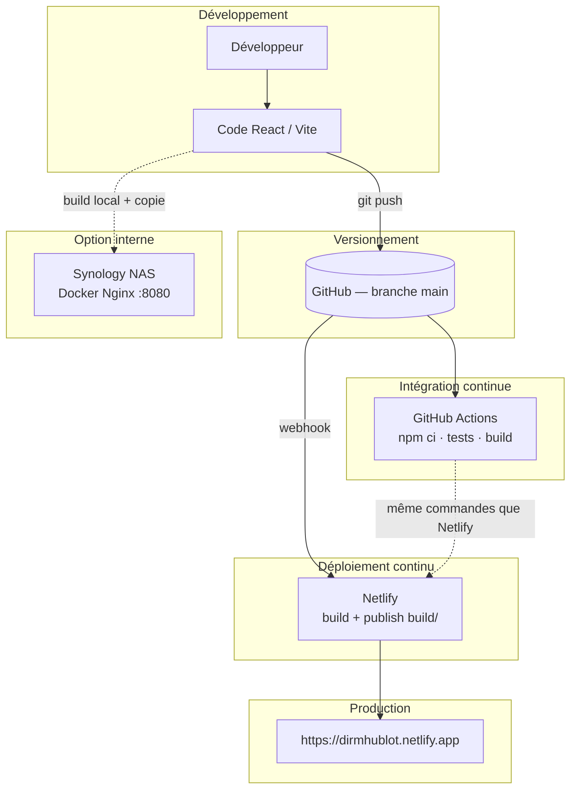

# Toutes les annexes (01 à 12)

Regroupement des pièces jointes du livrable déploiement — projet **Hublot**.

Index détaillé : [Annexes/README.md](./Annexes/README.md)

---


## Annexe_01_build.yml

```
# Annexe 01 — Workflow CI/CD (GitHub Actions)
# Fichier original : .github/workflows/build.yml

# Pipeline CI/CD Hublot — alignée sur Netlify (netlify.toml)
# CI  : GitHub Actions (tests + build)
# CD  : Netlify (déploiement automatique après push sur main)

name: CI/CD Pipeline

on:
  push:
    branches: [main]
  pull_request:
    branches: [main]
  workflow_dispatch:

concurrency:
  group: ci-${{ github.ref }}
  cancel-in-progress: true

jobs:
  quality-and-build:
    name: Tests et build (même config que Netlify)
    runs-on: ubuntu-latest
    steps:
      - name: Checkout
        uses: actions/checkout@v4

      - name: Setup Node.js 20
        uses: actions/setup-node@v4
        with:
          node-version: '20'
          cache: 'npm'

      - name: Install dependencies
        run: npm ci

      - name: Tests unitaires
        run: npm run test:run

      - name: Build production
        run: npm run build

      - name: Vérifier le dossier publish Netlify
        run: |
          test -f build/index.html
          test -d build/assets
          echo "build/ OK — publish directory identique à Netlify (netlify.toml)"

      - name: Audit sécurité npm (informatif)
        continue-on-error: true
        run: npm audit --audit-level=high
```

---

## Annexe_02_netlify.toml

```
# Annexe 02 — Configuration Netlify (build, headers, redirects)
# Fichier original : netlify.toml

# Netlify : build + function agents (Neon)
# La variable NETLIFY_DATABASE_URL est créée par l'extension Neon sur Netlify.

[build]
  command   = "npm run build"
  publish   = "build"

# Headers de sécurité (voir docs/SECURITE_4_DEPLOIEMENT.md)
[[headers]]
  for = "/*"
  [headers.values]
    X-Frame-Options = "DENY"
    X-Content-Type-Options = "nosniff"
    Referrer-Policy = "strict-origin-when-cross-origin"
    Permissions-Policy = "camera=(), microphone=(), geolocation=()"

# Ne pas rediriger les functions vers index.html
[[redirects]]
  from = "/.netlify/functions/*"
  to   = "/.netlify/functions/:splat"
  status = 200

# SPA : toutes les autres URLs → index.html
[[redirects]]
  from = "/*"
  to   = "/index.html"
  status = 200
```

---

## Annexe_03_package.json

```
{
  "name": "Statistiques DIRM Application",
  "version": "0.1.0",
  "private": true,
  "scripts": {
    "dev": "vite",
    "build": "vite build",
    "test": "vitest",
    "test:run": "vitest run"
  },
  "dependencies": {},
  "devDependencies": {
    "@types/node": "^20.10.0",
    "@vitejs/plugin-react-swc": "^3.10.2",
    "jsdom": "^25.0.0",
    "vite": "6.3.5",
    "vitest": "^2.1.0"
  }
}
```

---

## Annexe_04_gitignore

```
# Annexe 04 — Fichiers exclus du dépôt (sécurité, secrets)
# Fichier original : .gitignore

# Dépendances
node_modules
npm-debug.log
yarn-error.log
package-lock.json
yarn.lock

# Build
build
dist
.next
out

# Environnement (ne jamais commiter de vrais identifiants)
.env
.env.*
!.env.example
.env.local
.env.development.local
.env.test.local
.env.production.local
.env.production

# IDE
.vscode
.idea
*.swp
*.swo
*~

# OS
.DS_Store
Thumbs.db

# Git
.git
.gitignore
.gitattributes

# Documentation (README à la racine + tout le dossier docs/)
*.md
!README.md
!docs/
!docs/*.md

# Scripts Python (gardés séparément)
__pycache__
*.pyc
*.pyo
*.pyd
.Python
venv/
env/

# Données sensibles - NE JAMAIS COMMITTER
trdata/
src/data/
**/agents.json
*.xlsx
*.xls
*.htpasswd
*.pem
*.key
*.crt
*.p12
*.pfx
scripts/rapport_analyse.json
**/rapport*.json

# Rapports et logs
*.log
coverage
.nyc_output

# Tests
test-results
playwright-report

# Sécurité
secrets/
*.secret
```

---

## Annexe_05_ARCHITECTURE_DEPLOIEMENT.md

```
# Annexe 05 — Architecture de déploiement

> Copie pour livrable — document principal : `../ARCHITECTURE_DEPLOIEMENT.md`

---

# 1️⃣ Architecture de déploiement

Document de référence pour la compétence **« Préparer le déploiement d'une application sécurisée »** — projet **Hublot** (DIRM Méditerranée).

**Annexe associée :** [Annexe 05](./Annexes/Annexe_05_ARCHITECTURE_DEPLOIEMENT.md)

---

## Objectif

Décrire comment le code source devient une application accessible en production, avec **traçabilité**, **automatisation** et **sécurité**.

---

## Composants

| Composant | Rôle | Technologie |
|-----------|------|-------------|
| **Dépôt Git** | Source de vérité, historique, collaboration | GitHub `Meriem1403/Hublot` |
| **CI** | Vérification automatique (deps, tests, build) | GitHub Actions — workflow `CI/CD Pipeline` |
| **CD cloud** | Publication automatique après push | Netlify |
| **CD local** | Hébergement réseau interne (optionnel) | Synology NAS + Docker + Nginx |
| **Base de données** | Données agents en production (option) | PostgreSQL via Neon + Netlify Functions |
| **Secrets** | Identifiants et URLs sensibles | Variables d'environnement (jamais dans Git) |

---

## Schéma global



---

## Flux détaillé (push sur `main`)

1. **Développeur** : commit + `git push origin main`
2. **GitHub Actions** (CI) :
   - Checkout du code
   - Node.js 20 + `npm ci`
   - `npm run test:run` (32 tests Vitest)
   - `npm run build` → dossier `build/`
   - Vérification : `build/index.html` et `build/assets/` présents
   - `npm audit` (informatif)
3. **Netlify** (CD) — en parallèle / après le push :
   - `npm run build`
   - Publication du dossier `build/`
   - HTTPS, headers de sécurité (`netlify.toml`)
4. **Utilisateur** : accès à l'URL de production

---

## Fichiers de configuration

| Fichier | Annexe | Rôle |
|---------|--------|------|
| `.github/workflows/build.yml` | [01](./Annexes/Annexe_01_build.yml) | Pipeline CI/CD (YAML) |
| `netlify.toml` | [02](./Annexes/Annexe_02_netlify.toml) | Build, publish, redirects SPA, headers |
| `package.json` | [03](./Annexes/Annexe_03_package.json) | Scripts `dev`, `build`, `test:run` |
| `.gitignore` | [04](./Annexes/Annexe_04_gitignore) | Exclusion secrets et données RH |
| `docker-compose.yml` | — | Déploiement NAS (Nginx + `dist` ou `build`) |

---

## Alignement CI ↔ Netlify

| Étape | GitHub Actions | Netlify |
|-------|----------------|---------|
| Install | `npm ci` | `npm ci` (auto) |
| Tests | `npm run test:run` | — |
| Build | `npm run build` | `npm run build` |
| Publish | vérifie `build/` | `publish = build` |

Cette cohérence garantit que **ce qui passe en CI** correspond à **ce qui est déployé**.

---

## Déploiement NAS (complément)

Le NAS n'est **pas** dans la chaîne CD automatique Git :

1. Build sur poste de dev : `npm run build`
2. Copie du projet (dont `build/` ou `dist/`) sur le NAS
3. Lancement via **Container Manager** + `docker-compose.yml`
4. Accès : `http://IP_DU_NAS:8080`

Voir [DEPLOIEMENT_NAS_SYNOLOGY.md](./DEPLOIEMENT_NAS_SYNOLOGY.md).

---

## Rollback

| Canal | Méthode |
|-------|---------|
| **Netlify** | Restaurer un deploy précédent (Dashboard → Deploys → Publish deploy) |
| **Git** | Revert du commit + nouveau push |
| **NAS** | Remplacer les fichiers + redémarrer le conteneur |

Détail : [DOCUMENTATION_DEPLOIEMENT.md](./DOCUMENTATION_DEPLOIEMENT.md#2-procédure-de-rollback).

---

## Documents liés

- [DEVOPS.md](./DEVOPS.md) — Synthèse démarche DevOps complète
- [ENVIRONNEMENT_TEST.md](./ENVIRONNEMENT_TEST.md) — DEV / TEST / PROD
- [SECURITE_4_DEPLOIEMENT.md](./SECURITE_4_DEPLOIEMENT.md) — Sécurité du déploiement
- [DOCUMENTATION_DEPLOIEMENT.md](./DOCUMENTATION_DEPLOIEMENT.md) — Installation, logs, captures CI
```

---

## Annexe_06_ENVIRONNEMENT_TEST.md

```
# Annexe 06 — Environnements DEV, TEST, PROD

> Copie pour livrable — document principal : `../ENVIRONNEMENT_TEST.md`

---

# 2️⃣ Environnement de test

Définition des environnements **DEV**, **TEST** et **PROD** pour le projet Hublot.

**Annexe associée :** [Annexe 06](./Annexes/Annexe_06_ENVIRONNEMENT_TEST.md)

---

## Vue d'ensemble

| Environnement | Rôle | Où | Accès |
|---------------|------|-----|--------|
| **DEV** | Développement et debug local | Poste développeur | `http://localhost:5173` |
| **TEST** | Validation automatisée (CI) | GitHub Actions | Onglet Actions (run vert) |
| **PROD** | Utilisation réelle | Netlify (+ option NAS) | https://dirmhublot.netlify.app |

---

## DEV — Développement

### Objectif

Coder, tester manuellement, itérer rapidement sans impacter la production.

### Configuration

```bash
npm ci
npm run dev
```

| Élément | Valeur |
|---------|--------|
| URL | `http://localhost:5173` |
| Build | Non (Vite HMR) |
| Données | Référentiel local ou API de test (hors dépôt public) |
| Secrets | Fichier `.env` local (non commité) |
| Authentification | Variables `VITE_APP_USERNAME` / `VITE_APP_PASSWORD` |

### Commandes utiles

```bash
npm run test:run    # tests avant commit
npm run build       # vérifier le build localement
```

---

## TEST — Intégration continue

### Objectif

Vérifier automatiquement que chaque modification sur `main` (ou PR) respecte la qualité minimale avant / pendant le déploiement.

### Configuration

| Élément | Détail |
|---------|--------|
| Plateforme | GitHub Actions |
| Workflow | `CI/CD Pipeline` (`.github/workflows/build.yml`) |
| Déclencheurs | `push` et `pull_request` sur `main`, `workflow_dispatch` |
| Runner | `ubuntu-latest`, Node.js 20 |

### Étapes exécutées

1. `npm ci`
2. `npm run test:run` (32 tests)
3. `npm run build`
4. Vérification du dossier `build/`
5. `npm audit --audit-level=high` (informatif)

### Critère de succès

- Job **Tests et build** en statut **success** (coche verte)
- Aucune régression sur les tests unitaires
- Build reproductible

### Où consulter

- GitHub → **Actions** → workflow **CI/CD Pipeline**
- Exemple : https://github.com/Meriem1403/Hublot/actions

---

## PROD — Production

### Objectif

Servir l'application aux utilisateurs habilités en conditions sécurisées.

### Configuration cloud (Netlify)

| Paramètre | Valeur |
|-----------|--------|
| URL | https://dirmhublot.netlify.app |
| Branche déployée | `main` |
| Build command | `npm run build` |
| Publish directory | `build` |
| HTTPS | Fourni par Netlify |
| Headers sécurité | `netlify.toml` |
| Variables d'env | Interface Netlify (auth, `NETLIFY_DATABASE_URL`) |

### Configuration locale (NAS — optionnelle)

| Paramètre | Valeur |
|-----------|--------|
| URL | `http://IP_DU_NAS:8080` |
| Stack | Docker + Nginx (`docker-compose.yml`) |
| Données | Même référentiel que la prod ou jeu interne |
| HTTPS | Reverse Proxy DSM (optionnel) |

Voir [DEPLOIEMENT_NAS_SYNOLOGY.md](./DEPLOIEMENT_NAS_SYNOLOGY.md).

---

## Environnement de préproduction (Deploy Preview)

Netlify peut générer des **Deploy Previews** sur les pull requests (si activé dans les paramètres du site).

| Usage | Bénéfice |
|-------|----------|
| Valider une PR avant merge | URL temporaire par branche |
| Démonstration jury | Montrer une version sans toucher la PROD |

---

## Matrice des tests par environnement

| Type de test | DEV | TEST (CI) | PROD |
|--------------|-----|-----------|------|
| Tests unitaires Vitest | `npm run test:run` | Automatique | — |
| Build production | `npm run build` | Automatique | Automatique (Netlify) |
| Tests manuels (UI, filtres) | Navigateur local | — | Navigateur production |
| Headers sécurité | — | — | `curl -I` sur URL prod |
| npm audit | Local | CI (informatif) | Recommandé avant release |

Plan détaillé : [PLAN_TEST.md](./PLAN_TEST.md)

---

## Bonnes pratiques

1. Toujours lancer `npm run test:run` avant un push important.
2. Ne jamais committer `.env`, données RH ou secrets.
3. Vérifier le run CI vert avant de considérer une livraison terminée.
4. En cas de bug en PROD : rollback Netlify + analyse des logs (Actions + Netlify Deploys).
```

---

## Annexe_07_SECURITE_4_DEPLOIEMENT.md

```
# Annexe 07 — Sécurité du déploiement

> Copie pour livrable — document principal : `../SECURITE_4_DEPLOIEMENT.md`

---

# 4️⃣ Sécurité du déploiement

Mesures de sécurité pour le déploiement de **Hublot** (DIRM Méditerranée).

**Annexe associée :** [Annexe 07](./Annexes/Annexe_07_SECURITE_4_DEPLOIEMENT.md)

---

## 1. HTTPS

| Canal | Mise en œuvre |
|-------|----------------|
| **Netlify (PROD)** | Certificat TLS géré automatiquement par Netlify |
| **NAS (local)** | HTTP par défaut ; HTTPS possible via **Reverse Proxy DSM** + certificat interne |

**Vérification :**

```bash
curl -I https://dirmhublot.netlify.app
```

Attendu : URL en `https://`, réponse `200` ou `304`.

---

## 2. Variables d'environnement sécurisées

Les secrets ne sont **jamais** dans le dépôt Git.

| Variable (exemples) | Où la configurer | Usage |
|---------------------|------------------|--------|
| `VITE_APP_USERNAME` | Netlify → Environment variables | Connexion application |
| `VITE_APP_PASSWORD` | Netlify → Environment variables | Connexion application |
| `NETLIFY_DATABASE_URL` | Netlify (extension Neon) | Accès base PostgreSQL |

En local : fichier `.env` (listé dans `.gitignore`).

---

## 3. Gestion des secrets

| Règle | Application |
|-------|-------------|
| Pas de commit de secrets | `.gitignore` : `.env`, `agents.json`, `*.xlsx`, certificats |
| Séparation des rôles | Comptes Netlify / GitHub distincts des comptes métier |
| Données RH internes | Hors dépôt public ; accès restreint aux équipes habilitées |
| Rotation | Changer les mots de passe en cas de fuite suspectée |

Fichier de référence : [Annexe 04 — .gitignore](./Annexes/Annexe_04_gitignore)

---

## 4. Pas de données sensibles exposées

- Aucun export métier dans le README public.
- Données agents non versionnées (`src/data/`, `trdata/` ignorés).
- API / base en production protégées par authentification applicative.

---

## 5. Headers de sécurité

Configurés dans **`netlify.toml`** (Annexe 02) :

| Header | Valeur | Protection |
|--------|--------|------------|
| `X-Frame-Options` | `DENY` | Clickjacking |
| `X-Content-Type-Options` | `nosniff` | MIME sniffing |
| `Referrer-Policy` | `strict-origin-when-cross-origin` | Fuite de référent |
| `Permissions-Policy` | camera/micro/geo désactivés | Permissions navigateur |

**Vérification :**

```bash
curl -I https://dirmhublot.netlify.app | grep -i x-frame
```

Configuration Nginx (NAS) : voir `nginx.conf` (CSP, X-Frame-Options en commentaire ou actif selon version).

---

## 6. Tests de vulnérabilité (npm audit)

| Contexte | Commande | CI |
|----------|----------|-----|
| Local | `npm audit` | — |
| Pipeline | `npm audit --audit-level=high` | Étape **informatif** (n'empêche pas le build) |

**Interprétation :** certaines alertes concernent des dépendances de **développement** (Vitest, outils de build). Le site en production sert uniquement les fichiers statiques du dossier `build/`.

**Plan d'action :**

1. `npm audit` régulier
2. `npm audit fix` pour les correctifs sans breaking change
3. Documenter les vulnérabilités résiduelles acceptées

---

## 7. Authentification applicative

- Page de connexion avant accès au tableau de bord.
- Identifiants injectés au build via variables d'environnement (`import.meta.env`).
- Session côté navigateur (`sessionStorage`) — à renforcer (JWT / SSO) en évolution future.

Test manuel : voir [PLAN_TEST.md](./PLAN_TEST.md) — scénario authentification.

---

## 8. Checklist avant mise en production

Utiliser [CHECKLIST_SECURITE.md](./CHECKLIST_SECURITE.md) :

- [ ] Mots de passe forts configurés sur Netlify
- [ ] `.env` absent du dépôt
- [ ] CI verte sur `main`
- [ ] Headers vérifiés en production
- [ ] Rollback testé (au moins une fois)

Compléments : [SECURITE.md](./SECURITE.md), [DEPLOIEMENT_SECURISE.md](./DEPLOIEMENT_SECURISE.md)

---

## Synthèse jury

> « Le déploiement est sécurisé par HTTPS en production, des variables d'environnement pour les secrets, l'exclusion des données RH du dépôt, des headers HTTP durcis et un audit npm intégré à la CI. L'authentification protège l'accès aux tableaux de bord. »
```

---

## Annexe_08_PLAN_TEST.md

```
# Annexe 08 — Plan de test

> Copie pour livrable — document principal : `../PLAN_TEST.md`

---

# 5️⃣ Plan de test

Chaque test est décrit avec un **objectif**, un **résultat attendu** et le **statut** constaté après exécution. La colonne **Type** indique si le test est **automatisé** (lancé en ligne de commande) ou **manuel** (à exécuter dans le navigateur). Les tests automatiques listés ci-dessous ont été exécutés ; les tests manuels sont à réaliser selon les scénarios détaillés, puis à marquer Passé ou Échec.

### Batterie de tests automatisés (32 tests)

| Fichier | Nombre de tests | Couverture |
|---------|-----------------|------------|
| **dataService.test.ts** | 12 | Filtres (région, service, DIRM Méditerranée, statut, mission), normalisation des agents (mapping région/service), chargement depuis `StatDirmData`. Voir **Annexe 11**. |
| **dataCalculations.test.ts** | 20 | Âge et tranches d’âge, ETP (temps plein / partiel), répartition par statut, par contrat, par genre, par responsabilité, par âge ; statistiques de vue d’ensemble ; statistiques par service (effectif, statut normal/fragile/critique). Voir **Annexe 12**. |

Commande : `npm run test:run` (exécution en local et en CI). Workflow CI : **Annexe 01**.

---

## Tableau des tests

| Test | Type | Objectif | Résultat attendu | Statut |
|------|------|----------|------------------|--------|
| **Tests unitaires automatisés (CI)** | Automatisé | Valider que les tests automatisés s’exécutent en intégration continue (DevOps). | `npm run test:run` réussit en local (32 tests, 2 fichiers). Le workflow GitHub Actions exécute les tests à chaque push/PR sur `main` ; job vert = tous les tests passent. | Passé |
| **Test build et déploiement** | Automatisé | Vérifier que le build et le déploiement automatiques fonctionnent. | `npm run build` réussit en local. CI (GitHub Actions) et déploiement Netlify réussissent après un push sur `main`. Site accessible à l’URL de production. | Passé |
| **Test vulnérabilités (npm audit)** | Automatisé | Vérifier l’état des vulnérabilités dans les dépendances. | `npm audit` exécuté à la racine ; rapport consulté. Vulnérabilités restantes documentées (dépendances de dev, plan de correction si besoin). | Passé |
| **Test authentification** | Manuel | Vérifier que l’accès au tableau de bord est protégé et que la connexion fonctionne. | Sans identifiants : redirection vers la page de connexion. Avec identifiants valides (variables d’env) : accès au tableau de bord. Déconnexion possible. | À exécuter |
| **Test API / chargement des données** | Manuel | Vérifier que les données (effectifs, statistiques) sont correctement chargées et affichées. | Les données sont récupérées (JSON ou Netlify Function). Les onglets affichent des chiffres cohérents, pas d’erreur en console. | À exécuter |
| **Test responsive** | Manuel | Vérifier que l’application est utilisable sur mobile, tablette et desktop. | Mise en page adaptée ; pas de débordement horizontal ; navigation et filtres utilisables sur petit écran. | À exécuter |
| **Test performance** | Manuel | Vérifier que le site se charge et répond dans un temps acceptable. | Premier chargement raisonnable. Navigation entre onglets fluide. | À exécuter |
| **Test des filtres** | Manuel | Vérifier que les filtres (région, service, statut) mettent à jour correctement les vues. | Sélection d’un filtre : tableaux et graphiques se mettent à jour. Filtre « DIRM Méditerranée » et autres options cohérents. | À exécuter |
| **Test sécurité (headers)** | Automatisé | Vérifier que les headers de sécurité sont envoyés en production. | `curl -I https://dirmhublot.netlify.app` : HTTPS, HSTS ; X-Frame-Options et X-Content-Type-Options si configurés (voir **Annexe 02**). | À vérifier |

---

## Détail des scénarios (optionnel)

### Test authentification

1. Ouvrir [https://dirmhublot.netlify.app](https://dirmhublot.netlify.app).
2. Sans se connecter : on doit être redirigé vers la page de connexion.
3. Saisir des identifiants invalides : message d’erreur, pas d’accès.
4. Saisir les identifiants configurés (variables d’environnement Netlify) : accès au tableau de bord.
5. Se déconnecter : retour à l’écran de connexion.

### Test API / chargement des données

1. Une fois connecté, parcourir chaque onglet (Vue d’ensemble, Vue dynamique, Effectifs par service, Par mission, Contrats, etc.).
2. Vérifier que des données s’affichent (nombres, graphiques, tableaux).
3. Ouvrir la console développeur (F12) : pas d’erreur réseau ou JavaScript bloquante.

### Test responsive

1. Ouvrir le site sur desktop, puis redimensionner la fenêtre (ou utiliser les outils de développement « mode appareil »).
2. Vérifier la lisibilité et l’utilisation des menus, filtres, tableaux et graphiques sur une largeur type mobile (ex. 375 px).

### Test performance

1. Charger la page en production (éventuellement avec « throttling » réseau).
2. Vérifier que la page devient interactive en quelques secondes.
3. Optionnel : `npm run build` et regarder la taille du bundle (ex. rapport Vite).

---

## Statut

Le statut indique le résultat de l’exécution du test :

- **Passé** : test exécuté, résultat conforme au résultat attendu.
- **Échec** : test exécuté, résultat non conforme (à corriger).
- **À exécuter** : test manuel à réaliser selon le scénario décrit (puis passer à Passé ou Échec).
- **À vérifier** : test dont le résultat doit être contrôlé (ex. headers après déploiement).

---

## Alignement avec le référentiel (compétence licence)

| Attendu du référentiel | Ce que ce plan couvre |
|------------------------|------------------------|
| **Enjeux des plans de test** | Tableau structuré (objectif, résultat attendu, statut) pour planifier et tracer les validations. |
| **Élaborer un scénario de test** | Scénarios détaillés pour authentification, API, responsive, performance (section « Détail des scénarios »). |
| **Environnement de test** | Tests en local (DEV), en CI (TEST) et en production (PROD) — voir **Annexe 06**. |
| **Tests de sécurité** | Test des headers, test des vulnérabilités (npm audit), authentification. |
| **Valider les résultats des tests** | Colonne **Statut** (Passé / Échec) ; CI exécute les tests unitaires automatiquement. |
| **Automatiser les tests en DevOps** | Ligne « Tests unitaires automatisés (CI) » ; workflow **Annexe 01** exécute `npm run test:run`. |

---

## Fichiers et annexes liés

| Annexe | Document | Description |
|--------|----------|-------------|
| **Annexe 09** | [Annexes/Annexe_09_DEMO.md](./Annexes/Annexe_09_DEMO.md) | Procédure d’exécution des tests (commandes) |
| **Annexe 06** | [Annexes/Annexe_06_ENVIRONNEMENT_TEST.md](./Annexes/Annexe_06_ENVIRONNEMENT_TEST.md) | Où exécuter les tests (DEV, TEST, PROD) |
| **Annexe 07** | [Annexes/Annexe_07_SECURITE_4_DEPLOIEMENT.md](./Annexes/Annexe_07_SECURITE_4_DEPLOIEMENT.md) | Contexte sécurité (HTTPS, headers, variables d’env) |
| **Annexe 01** | [Annexes/Annexe_01_build.yml](./Annexes/Annexe_01_build.yml) | CI : exécution automatique des tests unitaires et du build |

Index de toutes les annexes : [Annexes/README.md](./Annexes/README.md).
```

---

## Annexe_09_DEMO.md

```
# Annexe 09 — Procédure d'exécution des tests

> Copie pour livrable — document principal : `../DEMO.md`

---

# Procédure d’exécution des tests

Ce document liste les **commandes à exécuter** pour reproduire les résultats du plan de test. À lancer dans un terminal ouvert à la racine du projet (`StatDirm`).

---

## 1. Tests unitaires automatisés (CI)

**Commande :**

```bash
npm run test:run
```

**Résultat attendu :**  
- Message du type : `Test Files  2 passed (2)` et `Tests  32 passed (32)`  
- Pas d’erreur rouge

Les tests unitaires (Vitest) passent en local ; la même commande est exécutée en CI à chaque push sur `main`.

---

## 2. Build de production

**Commande :**

```bash
npm run build
```

**Résultat attendu :**  
- `✓ built in …` sans erreur  
- Dossier `build/` créé avec `index.html` et `assets/`

Le build de production réussit ; Netlify exécute cette commande à chaque déploiement.

---

## 3. Audit des vulnérabilités

**Commande :**

```bash
npm audit
```

**Résultat attendu :**  
- Un rapport s’affiche. Il peut rester des vulnérabilités dans des dépendances de **développement** (ex. `react-simple-maps`, `vitest`).  
Les alertes restantes concernent des dépendances de développement ou des mises à jour majeures. En production, le site sert uniquement les fichiers buildés ; les recommandations de sécurité (headers, HTTPS, variables d’env) sont appliquées.

---

## 4. Lancer l’app en local (optionnel)

**Commande :**

```bash
npm run dev
```

Puis ouvrir **http://localhost:5173** dans le navigateur pour montrer :
- la page de connexion (sans être connecté) ;
- après connexion : les onglets, les données, les filtres (ex. « DIRM Méditerranée »).

---

## 5. Vérifier les headers de sécurité (production)

**Commande :**

```bash
curl -I https://dirmhublot.netlify.app
```

**À montrer dans la sortie :**  
- `X-Frame-Options: DENY`  
- `X-Content-Type-Options: nosniff`  
- Réponse `200` ou `304` et URL en `https://`

---

## Ordre d’exécution recommandé

| Ordre | Action | Commande ou action |
|-------|--------|---------------------|
| 1 | Tests unitaires | `npm run test:run` |
| 2 | Build | `npm run build` |
| 3 | Audit | `npm audit` |
| 4 | Site en prod | Ouvrir https://dirmhublot.netlify.app → connexion → parcourir les onglets |
| 5 | Headers de sécurité | `curl -I https://dirmhublot.netlify.app` |

---

## Résultats constatés

- **Tests :** 2 fichiers, 32 tests (Vitest) — tous passent.  
- **Build :** réussi ; sortie dans `build/`.  
- **Audit :** des vulnérabilités restent sur des dépendances de dev ; aucune donnée sensible exposée ; pas de secret dans le dépôt.
```

---

## Annexe_10_COMPETENCE_DEPLOIEMENT_STUDI.md

```
# Annexe 10 — Validation compétence Studi

> Copie pour livrable — document principal : `../COMPETENCE_DEPLOIEMENT_STUDI.md`

---

# Validation compétence Studi : Préparer le déploiement d'une application sécurisée

**Application :** Hublot – Tableau de bord DIRM Méditerranée ([dirm.mediterranee.developpement-durable.gouv.fr](https://www.dirm.mediterranee.developpement-durable.gouv.fr), Ministère chargé de la Mer et de la Pêche)  
**Déploiement en ligne :** https://dirmhublot.netlify.app  
**Référentiel :** Programme en vigueur le 21/02/2024 – Déploiement, DevOps, CI/CD, tests, sécurité.

---

## 1. Déploiement continu (CD) et hébergement

- **Application hébergée et accessible :** https://dirmhublot.netlify.app  
- **Pipeline de déploiement :** À chaque `git push` sur la branche `main`, Netlify déclenche automatiquement un build puis un déploiement (livraison continue).
- **Configuration du déploiement :** Fichier **`netlify.toml`** à la racine du projet :
  - Commande de build : `npm run build`
  - Dossier publié : `build`
  - Règles de redirection (SPA, fonctions serverless).
- **Documentation du processus :** Voir **`HOSTING.md`** (options Docker, build manuel, Netlify/Vercel) et **`COMMENT_VOIR_LES_DONNEES_SUR_NETLIFY.md`** pour la mise en œuvre sur Netlify.

---

## 2. Intégration continue (CI) et YAML

- **Workflow d’intégration continue :** Le dépôt contient un workflow GitHub Actions (fichier **`.github/workflows/build.yml`**) qui :
  - se déclenche sur chaque push et pull request sur `main` ;
  - exécute `npm ci`, puis **`npm run test:run`** (tests unitaires), puis `npm run build`.
- **Rédaction en YAML :** La pipeline CI est décrite en YAML (syntaxe et structure attendues dans le référentiel).
- **Automatisation des tests en DevOps :** Batterie de **32 tests** unitaires (Vitest), exécutés automatiquement dans le workflow CI. Fichiers : **`src/services/dataService.test.ts`** (12 tests : filtres région/service/statut/mission, DIRM Méditerranée, normalisation, chargement), **`src/utils/dataCalculations.test.ts`** (20 tests : âge, tranches d’âge, ETP, répartitions statut/contrat/genre/responsabilité/âge, vue d’ensemble, stats par service). Commande : `npm run test:run`.

---

## 3. Préparer le déploiement d’une application sécurisée

- **Authentification :** Page de connexion (identifiants configurés via variables d’environnement au build) ; accès aux données protégé après authentification.
- **Données sensibles :** Fichiers sensibles (`.env`, `agents.json`, données Excel, etc.) sont exclus du dépôt via **`.gitignore`** ; pas de secrets committés.
- **Documentation sécurité et déploiement :**
  - **`DEPLOIEMENT_SECURISE.md`** : étapes pour un déploiement sécurisé (HTTPS, Docker, firewall, etc.).
  - **`CHECKLIST_SECURITE.md`** : checklist avant mise en production (authentification, HTTPS, headers, Docker, sauvegardes).
  - **`SECURITE.md`** : mesures de sécurité implémentées dans l’application.
- **Environnement de test :** Possibilité de lancer l’application en local (`npm run dev`) ou avec Docker (`make dev` / `docker-compose`) pour tester avant déploiement.
- **Scripts dans la démarche DevOps :**
  - Script de conversion des données : **`scripts/convert_excel_to_json.py`** (préparation des données pour l’app).
  - Scripts npm : `npm run build`, `npm run dev` ; possibilité d’utiliser `make` pour Docker et conversion (voir **`README.md`**).

---

## 4. Synthèse pour le jury

| Attendu du référentiel | Élément dans le projet |
|------------------------|-------------------------|
| Déploiement d’une application | Application en ligne : https://dirmhublot.netlify.app |
| Déploiement continu (CD) | Netlify : build + déploiement automatique à chaque push |
| Intégration continue (CI) | Workflow GitHub Actions – tests automatiques puis build |
| YAML | `netlify.toml`, `.github/workflows/build.yml` |
| Documentation du processus de déploiement | `HOSTING.md`, `DEPLOIEMENT_SECURISE.md`, `README.md` |
| Application sécurisée | Authentification, `.gitignore` pour les secrets, docs sécurité |
| Scripts / automatisation | Scripts npm, Python (conversion), configuration Netlify |
| Environnement de test | Instructions en local et Docker dans `README.md` et `HOSTING.md` ; voir **`ENVIRONNEMENT_TEST.md`** (DEV / TEST / PROD). |
| Plan de test, scénarios, validation | **`PLAN_TEST.md`** : tableau Test / Objectif / Résultat attendu / Statut (auth, API, responsive, performance, tests automatisés CI, sécurité). |

---

**Conclusion :** Le projet Hublot permet de valider la compétence « Préparer le déploiement d’une application sécurisée » et les éléments associés du référentiel Studi (démarche DevOps, bases du déploiement automatique, CI/CD, YAML, documentation et sécurisation).
```

---

## Annexe_11_dataService.test.ts

```
/**
 * Annexe 11 — Tests unitaires dataService (fichier original : src/services/dataService.test.ts)
 * 12 tests : filtres (région, service DIRM Méditerranée, statut, mission), normalisation, chargement.
 */

import { describe, it, expect } from 'vitest';
import {
  filterAgentsFrom,
  DIRM_MEDITERANEE_LABEL,
  normalizeAgents,
  loadAgentsDataFrom
} from './dataService';
import type { Agent, StatDirmData } from '../types/data';

function mockAgent(overrides: Partial<Agent> = {}): Agent {
  return {
    id: '1',
    nom: 'Test',
    prenom: 'Agent',
    dateNaissance: '1990-01-01',
    genre: 'H',
    statut: 'Titulaire',
    contratType: 'Temps plein',
    region: 'Marseille',
    service: 'DDTM 13',
    mission: 'Mission test',
    metier: 'Métier test',
    niveauResponsabilite: 'Opérationnel',
    poste: 'Poste test',
    dateEmbauche: '2020-01-01',
    etp: 1,
    actif: true,
    dateMaj: '2025-01-01',
    enConges: false,
    enFormation: false,
    enArretMaladie: false,
    ...overrides
  };
}

describe('filterAgentsFrom', () => {
  const agents: Agent[] = [
    mockAgent({ id: '1', region: 'Marseille', service: 'DDTM 13' }),
    mockAgent({ id: '2', region: 'Nice', service: 'DDTM 06' }),
    mockAgent({ id: '3', region: 'Toulon', service: 'DDTM 83' }),
    mockAgent({ id: '4', region: 'Sète', service: 'DDTM 34' }),
    mockAgent({ id: '5', region: 'Paris', service: 'DIRM BNEM' })
  ];

  it('filtre par région', () => {
    const result = filterAgentsFrom(agents, { region: 'Marseille' });
    expect(result).toHaveLength(1);
    expect(result[0].region).toBe('Marseille');
  });

  it('filtre par service DIRM Méditerranée (régions Marseille, Nice, Toulon, Sète)', () => {
    const result = filterAgentsFrom(agents, { service: DIRM_MEDITERANEE_LABEL });
    expect(result).toHaveLength(4);
    const regions = result.map((a) => a.region).sort();
    expect(regions).toEqual(['Marseille', 'Nice', 'Sète', 'Toulon']);
  });

  it('filtre par service classique', () => {
    const result = filterAgentsFrom(agents, { service: 'DDTM 06' });
    expect(result).toHaveLength(1);
    expect(result[0].service).toBe('DDTM 06');
    expect(result[0].region).toBe('Nice');
  });

  it('sans filtre retourne tous les agents', () => {
    const result = filterAgentsFrom(agents, {});
    expect(result).toHaveLength(5);
  });

  it('filtre "all" pour région ne filtre pas', () => {
    const result = filterAgentsFrom(agents, { region: 'all' });
    expect(result).toHaveLength(5);
  });

  it('filtre par statut', () => {
    const agentsWithStatut = [
      mockAgent({ id: '1', statut: 'Titulaire' }),
      mockAgent({ id: '2', statut: 'CDD' }),
      mockAgent({ id: '3', statut: 'Titulaire' })
    ];
    const result = filterAgentsFrom(agentsWithStatut, { statut: 'Titulaire' });
    expect(result).toHaveLength(2);
    expect(result.every((a) => a.statut === 'Titulaire')).toBe(true);
  });

  it('filtre par mission', () => {
    const agentsWithMission = [
      mockAgent({ id: '1', mission: 'Sauvetage en mer' }),
      mockAgent({ id: '2', mission: 'Police des pêches' }),
      mockAgent({ id: '3', mission: 'Sauvetage en mer' })
    ];
    const result = filterAgentsFrom(agentsWithMission, { mission: 'Sauvetage en mer' });
    expect(result).toHaveLength(2);
    expect(result.every((a) => a.mission === 'Sauvetage en mer')).toBe(true);
  });

  it('filtre "all" pour mission ne filtre pas', () => {
    const agentsWithMission = [
      mockAgent({ id: '1', mission: 'M1' }),
      mockAgent({ id: '2', mission: 'M2' })
    ];
    const result = filterAgentsFrom(agentsWithMission, { mission: 'all' });
    expect(result).toHaveLength(2);
  });
});

describe('normalizeAgents', () => {
  it('mappe la région depuis le code service (ex. DDTM 13 → Marseille)', () => {
    const agents: Agent[] = [
      mockAgent({ id: '1', service: 'DDTM 13', region: 'Inconnu' })
    ];
    const result = normalizeAgents(agents);
    expect(result).toHaveLength(1);
    expect(result[0].region).toBe('Marseille');
  });

  it('mappe le service vers le nom normalisé (ex. DDTM 13 → Surveillance et contrôle)', () => {
    const agents: Agent[] = [
      mockAgent({ id: '1', service: 'DDTM 13' })
    ];
    const result = normalizeAgents(agents);
    expect(result[0].service).toBe('Surveillance et contrôle');
  });

  it('conserve les agents sans mapping inchangés pour les champs non mappés', () => {
    const agents: Agent[] = [
      mockAgent({ id: '1', service: 'Service inconnu', region: 'Paris' })
    ];
    const result = normalizeAgents(agents);
    expect(result).toHaveLength(1);
    expect(result[0].region).toBe('Paris');
    expect(result[0].service).toBe('Service inconnu');
  });
});

describe('loadAgentsDataFrom', () => {
  it('charge et normalise les agents depuis un StatDirmData', () => {
    const data: StatDirmData = {
      agents: [
        mockAgent({ id: '1', service: 'DDTM 06', region: '?' })
      ],
      capacites: { missions: [], regions: [] }
    };
    const result = loadAgentsDataFrom(data);
    expect(result).toHaveLength(1);
    expect(result[0].region).toBe('Nice');
    expect(result[0].service).toBe('Opérations maritimes');
  });
});
```

---

## Annexe_12_dataCalculations.test.ts

```
/**
 * Annexe 12 — Tests unitaires dataCalculations (fichier original : src/utils/dataCalculations.test.ts)
 * 20 tests : âge, tranches d'âge, ETP, répartitions (statut, contrat, genre, responsabilité, âge), vue d'ensemble, stats par service.
 */

import { describe, it, expect } from 'vitest';
import {
  calculerAge,
  getTrancheAge,
  calculerETP,
  calculerRepartitionStatut,
  calculerRepartitionContrat,
  calculerOverviewStats,
  calculerStatsParService,
  calculerRepartitionGenre,
  calculerRepartitionResponsabilite,
  calculerRepartitionAge
} from './dataCalculations';
import type { Agent } from '../types/data';

function mockAgent(overrides: Partial<Agent> = {}): Agent {
  return {
    id: '1',
    nom: 'Test',
    prenom: 'Agent',
    dateNaissance: '1990-01-01',
    genre: 'H',
    statut: 'Titulaire',
    contratType: 'Temps plein',
    region: 'Marseille',
    service: 'Service A',
    mission: 'Mission test',
    metier: 'Métier test',
    niveauResponsabilite: 'Opérationnel',
    poste: 'Poste test',
    dateEmbauche: '2020-01-01',
    etp: 1,
    actif: true,
    dateMaj: '2025-01-01',
    enConges: false,
    enFormation: false,
    enArretMaladie: false,
    ...overrides
  };
}

describe('calculerAge', () => {
  it('calcule l'âge à partir d'une date de naissance', () => {
    const age = calculerAge('1990-06-15');
    expect(typeof age).toBe('number');
    expect(age).toBeGreaterThanOrEqual(34);
    expect(age).toBeLessThanOrEqual(36);
  });

  it('retourne un âge cohérent pour 1985', () => {
    const age = calculerAge('1985-01-01');
    expect(age).toBeGreaterThanOrEqual(39);
    expect(age).toBeLessThanOrEqual(41);
  });
});

describe('getTrancheAge', () => {
  it('retourne la tranche < 25 ans pour 24', () => {
    expect(getTrancheAge(24)).toBe('< 25 ans');
  });

  it('retourne la tranche 25-29 ans pour 27', () => {
    expect(getTrancheAge(27)).toBe('25-29 ans');
  });

  it('retourne la tranche 25-29 ans pour 25 (limite)', () => {
    expect(getTrancheAge(25)).toBe('25-29 ans');
  });

  it('retourne la tranche 55-59 ans pour 55', () => {
    expect(getTrancheAge(55)).toBe('55-59 ans');
  });

  it('retourne la tranche 60-64 ans pour 64', () => {
    expect(getTrancheAge(64)).toBe('60-64 ans');
  });

  it('retourne la tranche ≥ 65 ans pour 65 et 70', () => {
    expect(getTrancheAge(65)).toBe('≥ 65 ans');
    expect(getTrancheAge(70)).toBe('≥ 65 ans');
  });
});

describe('calculerETP', () => {
  const baseAgent: Agent = {
    id: '1',
    nom: 'Test',
    prenom: 'Agent',
    dateNaissance: '1990-01-01',
    genre: 'H',
    statut: 'Titulaire',
    contratType: 'Temps plein',
    region: 'Marseille',
    service: 'DDTM 13',
    mission: 'Mission test',
    metier: 'Métier test',
    niveauResponsabilite: 'Opérationnel',
    poste: 'Poste test',
    dateEmbauche: '2020-01-01',
    etp: 1,
    actif: true,
    dateMaj: '2025-01-01',
    enConges: false,
    enFormation: false,
    enArretMaladie: false
  };

  it('retourne 1 pour un agent temps plein', () => {
    expect(calculerETP({ ...baseAgent, contratType: 'Temps plein' })).toBe(1);
  });

  it('retourne 0.8 pour un temps partiel à 80%', () => {
    expect(
      calculerETP({
        ...baseAgent,
        contratType: 'Temps partiel',
        tempsPartielPourcentage: 80
      })
    ).toBe(0.8);
  });

  it('retourne etp si fourni quand temps partiel sans pourcentage', () => {
    expect(
      calculerETP({ ...baseAgent, contratType: 'Temps partiel', etp: 0.5 })
    ).toBe(0.5);
  });
});

describe('calculerRepartitionStatut', () => {
  it('calcule la répartition par statut avec effectifs et pourcentages', () => {
    const agents: Agent[] = [
      mockAgent({ id: '1', statut: 'Titulaire' }),
      mockAgent({ id: '2', statut: 'Titulaire' }),
      mockAgent({ id: '3', statut: 'CDD' })
    ];
    const result = calculerRepartitionStatut(agents);
    expect(result).toHaveLength(2);
    const titulaires = result.find((r) => r.statut === 'Titulaire');
    const cdd = result.find((r) => r.statut === 'CDD');
    expect(titulaires?.nombre).toBe(2);
    expect(titulaires?.pourcentage).toBeCloseTo(66.67, 1);
    expect(cdd?.nombre).toBe(1);
    expect(cdd?.pourcentage).toBeCloseTo(33.33, 1);
  });

  it('exclut les agents inactifs', () => {
    const agents: Agent[] = [
      mockAgent({ id: '1', statut: 'Titulaire', actif: true }),
      mockAgent({ id: '2', statut: 'Titulaire', actif: false })
    ];
    const result = calculerRepartitionStatut(agents);
    expect(result).toHaveLength(1);
    expect(result[0].nombre).toBe(1);
  });
});

describe('calculerRepartitionContrat', () => {
  it('répartit par service : temps plein, temps partiel, CDD, stagiaires', () => {
    const agents: Agent[] = [
      mockAgent({ id: '1', service: 'S1', statut: 'Titulaire', contratType: 'Temps plein' }),
      mockAgent({ id: '2', service: 'S1', statut: 'CDD' }),
      mockAgent({ id: '3', service: 'S1', statut: 'Stagiaire' }),
      mockAgent({ id: '4', service: 'S2', statut: 'Titulaire', contratType: 'Temps partiel' })
    ];
    const result = calculerRepartitionContrat(agents);
    expect(result).toHaveLength(2);
    const s1 = result.find((r) => r.service === 'S1');
    const s2 = result.find((r) => r.service === 'S2');
    expect(s1?.tempsPlein).toBe(1);
    expect(s1?.cdd).toBe(1);
    expect(s1?.stagiaires).toBe(1);
    expect(s2?.tempsPartiel).toBe(1);
  });
});

describe('calculerOverviewStats', () => {
  it('calcule effectifs, postes pourvus/vacants et taux pourvu', () => {
    const agents: Agent[] = [
      mockAgent({ id: '1' }),
      mockAgent({ id: '2' }),
      mockAgent({ id: '3' })
    ];
    const capacitesTotal = 10;
    const result = calculerOverviewStats(agents, capacitesTotal);
    expect(result.effectifsTotaux).toBe(3);
    expect(result.postesPourvus).toBe(3);
    expect(result.postesVacants).toBe(7);
    expect(result.tauxPourvu).toBe(30);
    expect(result).toHaveProperty('ratioEncadrement');
    expect(result).toHaveProperty('tensionRH');
  });

  it('retourne taux pourvu 0 quand aucune capacité', () => {
    const result = calculerOverviewStats([mockAgent()], 0);
    expect(result.tauxPourvu).toBe(0);
  });
});

describe('calculerStatsParService', () => {
  it('retourne effectif et statut (normal/fragile/critique) par service', () => {
    const agents: Agent[] = [
      mockAgent({ id: '1', service: 'Grand service' }),
      ...Array.from({ length: 25 }, (_, i) =>
        mockAgent({ id: `g${i}`, service: 'Grand service' })
      ),
      mockAgent({ id: 's1', service: 'Petit service' })
    ];
    const result = calculerStatsParService(agents);
    expect(result.length).toBeGreaterThanOrEqual(2);
    const grand = result.find((r) => r.name === 'Grand service');
    expect(grand?.effectif).toBe(26);
    expect(['normal', 'fragile', 'critique']).toContain(grand?.status);
  });
});

describe('calculerRepartitionGenre', () => {
  it('calcule hommes et femmes avec pourcentages', () => {
    const agents: Agent[] = [
      mockAgent({ id: '1', genre: 'H' }),
      mockAgent({ id: '2', genre: 'H' }),
      mockAgent({ id: '3', genre: 'F' })
    ];
    const result = calculerRepartitionGenre(agents);
    expect(result).toHaveLength(2);
    const hommes = result.find((r) => r.genre === 'Hommes');
    const femmes = result.find((r) => r.genre === 'Femmes');
    expect(hommes?.nombre).toBe(2);
    expect(femmes?.nombre).toBe(1);
    expect(hommes?.pourcentage).toBeCloseTo(66.67, 1);
  });
});

describe('calculerRepartitionResponsabilite', () => {
  it('calcule la répartition par niveau avec pourcentages', () => {
    const agents: Agent[] = [
      mockAgent({ id: '1', niveauResponsabilite: 'Opérationnel' }),
      mockAgent({ id: '2', niveauResponsabilite: 'Opérationnel' }),
      mockAgent({ id: '3', niveauResponsabilite: 'Encadrement' })
    ];
    const result = calculerRepartitionResponsabilite(agents);
    expect(result.length).toBe(2);
    const op = result.find((r) => r.niveau === 'Opérationnel');
    expect(op?.nombre).toBe(2);
    expect(op?.pourcentage).toBeCloseTo(66.67, 1);
  });
});

describe('calculerRepartitionAge', () => {
  it('répartit les agents par tranche d'âge avec genre', () => {
    const agents: Agent[] = [
      mockAgent({ id: '1', dateNaissance: '2001-06-15', genre: 'H' }),
      mockAgent({ id: '2', dateNaissance: '1995-01-01', genre: 'F' })
    ];
    const result = calculerRepartitionAge(agents);
    expect(result.length).toBe(10);
    const tranchesAvecEffectif = result.filter((r) => r.effectif > 0);
    expect(tranchesAvecEffectif.length).toBeGreaterThanOrEqual(2);
    const totalEffectif = result.reduce((sum, r) => sum + r.effectif, 0);
    expect(totalEffectif).toBe(2);
  });
});
```

---
