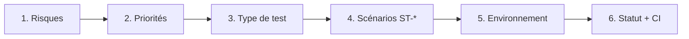
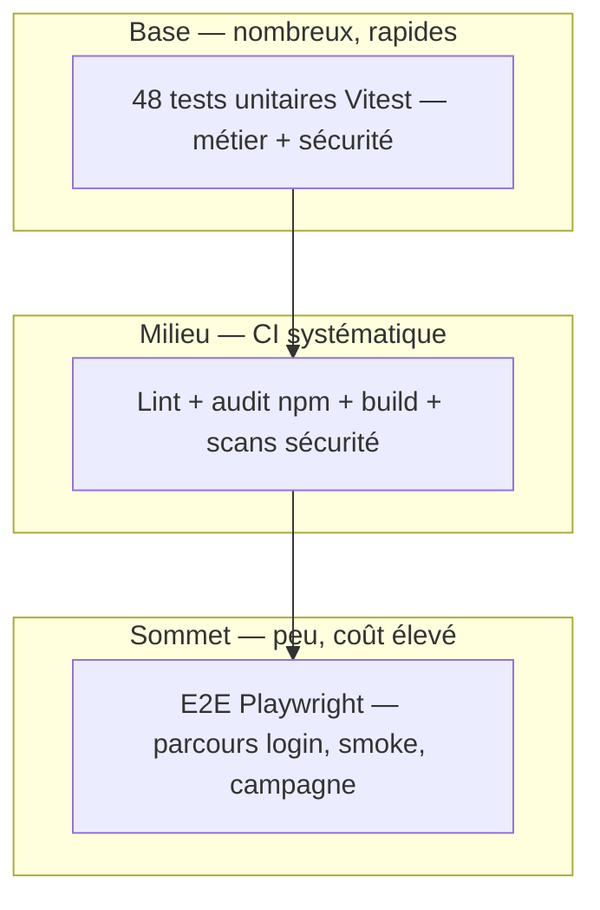

# 📋 Planifier efficacement les tests

Guide méthodologique pour **construire, prioriser et exécuter** un plan de test efficace sur **Hublot** (DIRM Méditerranée).

Ce document complète :
- [ENJEUX_PLAN_TEST.md](./ENJEUX_PLAN_TEST.md) — *pourquoi* planifier (enjeux, risques)
- [PLAN_TEST.md](./PLAN_TEST.md) — *quoi* tester (tableau Objectif / Résultat / Statut)
- [SCENARIOS_TEST.md](./SCENARIOS_TEST.md) — *comment* décrire chaque cas (ST-F*, ST-SEC*)
- [ENVIRONNEMENT_TEST.md](./ENVIRONNEMENT_TEST.md) — *où* exécuter (DEV, CI, STAGING, PROD)
- [OUTILS_STRATEGIES_TESTS_SECURITE.md](./OUTILS_STRATEGIES_TESTS_SECURITE.md) — tests de sécurité

**Annexes :** [08](./Annexes/Annexe_08_PLAN_TEST.md) (plan synthétique) · [13](./Annexes/Annexe_13_SCENARIOS_TEST.md) (scénarios)

---

## 1. Planifier efficacement : c'est quoi ?

**Planifier efficacement** ne veut pas dire « tout tester ». Cela veut dire :

1. **Identifier les risques** qui feraient le plus de dégâts s'ils se produisaient.
2. **Choisir le bon type de test** pour chaque risque (rapide vs complet, auto vs manuel).
3. **Exécuter au bon moment** (commit, PR, staging, prod).
4. **Tracer les résultats** pour prouver qu'on peut livrer.

> **Efficace** = le maximum de confiance avec un effort maîtrisé (temps CI, maintenance, relecture jury).

---

## 2. La méthode en 6 étapes (Hublot)



| Étape | Question | Livrable Hublot |
|-------|----------|-----------------|
| **1. Risques** | Qu'est-ce qui ferait mal si ça casse ? | Tableau §3 (risques RH, auth, régression…) |
| **2. Priorités** | Critique / Haute / Moyenne / Basse ? | Colonne priorité dans [SCENARIOS_TEST.md](./SCENARIOS_TEST.md) |
| **3. Type de test** | Automatiser ou garder manuel ? | Pyramide §4 + règles §5 |
| **4. Scénarios** | Cas reproductible Étant donné / Quand / Alors ? | ST-F01…ST-F06, ST-SEC01…ST-SEC05 |
| **5. Environnement** | DEV, CI, STAGING ou PROD ? | [ENVIRONNEMENT_TEST.md](./ENVIRONNEMENT_TEST.md) |
| **6. Traçabilité** | Passé / Échec / À exécuter ? | [PLAN_TEST.md](./PLAN_TEST.md) + runs GitHub Actions |

---

## 3. Partir des risques (pas des écrans)

Un plan efficace commence par les **conséquences**, pas par la liste des onglets.

| Risque | Impact | Priorité | Réponse dans le plan |
|--------|--------|----------|----------------------|
| **Données RH fausses** (filtres, calculs ETP, parité) | Décisions de gestion erronées | **Critique** | 32 tests unitaires métier + ST-F02, ST-F03 |
| **Accès non autorisé** | Consultation du tableau de bord sans habilitation | **Critique** | ST-F01 + E2E login + 15 tests sécurité session |
| **Régression à chaque push** | Bug livré en production | **Critique** | CI bloquante (lint, tests, audit, build, E2E) |
| **Fuite de secret / CVE** | Compromission ou non-conformité | **Critique** | Gitleaks, `audit:prod`, CodeQL — voir doc sécurité |
| **UI illisible (mobile)** | Usage terrain impossible | **Moyenne** | ST-F04 (manuel / Playwright campagne) |
| **Lenteur perçue** | Perte d'adoption | **Moyenne** | ST-F05 (manuel) |
| **Confusion d'environnement** | Test sur prod par erreur | **Basse** | ST-F06 (badge DEV vs PROD) |

**Règle d'or :** un test **Critique** doit être **automatisé en CI** dès que c'est techniquement faisable.

---

## 4. La pyramide des tests (équilibre coût / confiance)

Trop d'E2E = CI lente et fragile. Trop peu = trous sur le parcours réel. Hublot suit une **pyramide** :



| Niveau | Volume Hublot | Durée typique | Quand |
|--------|---------------|---------------|-------|
| **Unitaires** | **48** tests (4 fichiers) | < 2 s | Chaque commit / PR |
| **CI statique** | lint + audit + build | ~5–8 min | Chaque push `main`, `staging` |
| **E2E** | 3 smoke + campagne manuelle | ~2–5 min | Après build en CI |
| **Manuels** | ST-F01…F06 | Variable | STAGING / PROD avant démo |

**Batterie unitaire actuelle :**

| Fichier | Tests | Rôle |
|---------|-------|------|
| `dataCalculations.test.ts` | 20 | Calculs RH (âge, ETP, répartitions) |
| `dataService.test.ts` | 12 | Filtres, normalisation, chargement |
| `security.test.ts` | 15 | Sanitization, session, masquage |
| `environment.test.ts` | 1 | Libellé environnement |

---

## 5. Automatiser ou garder manuel ?

| Critère | → Automatiser (CI) | → Manuel documenté |
|---------|---------------------|-------------------|
| Répétitif à chaque commit | ✅ | ❌ |
| Logique pure (calcul, filtre) | ✅ | ❌ |
| Parcours critique court (login) | ✅ E2E | Compléter si UX |
| Responsive / perf perçue | ❌ | ✅ ST-F04, ST-F05 |
| Données réelles métier (Excel) | ❌ en CI | ✅ ST-F02 en STAGING |
| Headers prod, secrets | ✅ scripts + workflows | Vérifier après deploy |

**Décision Hublot :** tout ce qui est **déterministe et répétitif** est dans la CI ; l'**expérience utilisateur** et les **données réelles** restent en scénarios manuels tracés (ST-F*).

---

## 6. Planning par moment de la vie du projet

| Moment | Actions de test | Outils / docs |
|--------|-----------------|---------------|
| **Développement local** | Unitaires ciblés, lint | `npm run test`, `npm run lint` |
| **Avant commit** | Suite unitaire complète | `npm run test:run` |
| **Pull request** | CI complète (bloquante) | workflow `ci.yml` |
| **Merge `main`** | CI + déploiement Netlify | CI + CD |
| **Avant démo jury** | Campagne ST-F* + sécurité | `npm run test:campaign`, `npm run security:*` |
| **Après deploy PROD** | Headers, health | `npm run security:headers`, `/health.json` |
| **Hebdomadaire** | Audit npm, CodeQL, Trivy | `audit-scheduled.yml`, `codeql.yml` |

---

## 7. Definition of Done (qualité) — quand peut-on livrer ?

Avant merge sur `main` ou démo jury :

- [ ] **CI verte** : lint, 48 tests unitaires, `audit:prod`, build, E2E smoke
- [ ] **Scans sécurité** : Gitleaks OK (workflow `security-scan.yml`)
- [ ] **Scénarios critiques** : ST-F01 (auth), ST-F02 (données), ST-F03 (filtres) — statut **Passé**
- [ ] **Statuts à jour** dans [PLAN_TEST.md](./PLAN_TEST.md)
- [ ] **Pas de secret** dans le diff (`.gitignore`, revue)

Optionnel avant PROD : ST-F04, ST-F05 sur STAGING ; ST-SEC01 sur URL prod.

---

## 8. Traçabilité : du risque au statut

Chaîne de preuve pour le jury :

```
Risque métier
    → Priorité (Critique…)
        → Scénario ST-* (SCENARIOS_TEST.md)
            → Ligne PLAN_TEST (Objectif / Résultat / Statut)
                → Preuve (log CI, rapport, capture)
```

| Scénario | Plan de test | Preuve automatisée |
|----------|--------------|-------------------|
| ST-F01 | Test authentification | Playwright `e2e/smoke.spec.ts` |
| ST-F03 | Test des filtres | `dataService.test.ts` + campagne Playwright |
| ST-SEC02 | Garde-fous applicatifs | `security.test.ts` |
| ST-SEC01 | Headers HTTP | `npm run security:headers` |
| ST-AUTO-* | Lint, build, audit | Job CI correspondant |

Rapport d'exécution : [RAPPORT_EXECUTION_TESTS.md](./RAPPORT_EXECUTION_TESTS.md).

Validation des résultats : [VALIDER_RESULTATS_TESTS.md](./VALIDER_RESULTATS_TESTS.md).

---

## 9. Commandes pour la démo (jury)

Ordre conseillé pour montrer une **planification efficace** : d'abord les tests rapides (base pyramide), puis la CI, puis la campagne.

| # | Commande | Message à dire au jury |
|---|----------|------------------------|
| 1 | `npm run test:run` | « 48 tests unitaires couvrent la logique métier et la sécurité — exécutés à chaque CI. » |
| 2 | `npm run lint` | « Qualité statique avant merge. » |
| 3 | `npm run audit:prod` | « Les dépendances prod sont auditées — bloquant en CI. » |
| 4 | `npm run build` | « L'artefact déployable est vérifié. » |
| 5 | `npm run test:e2e` | « Le parcours critique login est couvert en E2E. » |
| 6 | `npm run test:campaign` | « La campagne ST-F* reproduit les scénarios manuels documentés. » |
| 7 | `npm run check:env` | « Environnement de test local complet (lint + tests + audit + build). » |

### Bloc copier-coller (démo complète)

```bash
# Plan efficace : rapide d'abord, puis intégration, puis E2E
npm run test:run          # 48 tests — base de la pyramide
npm run lint
npm run audit:prod
npm run build
npm run test:e2e          # parcours login (nécessite build:e2e si pas déjà fait)
npm run test:campaign     # scénarios ST-F* (campagnes documentées)
```

### À montrer sur GitHub (sans terminal)

- Onglet **Actions** : pipeline CI avec jobs lint → unit-tests → audit → build → e2e.
- Fichiers **PLAN_TEST.md** et **SCENARIOS_TEST.md** : traçabilité Objectif / Statut / ST-*.

---

## 10. Glossaire

| Terme | Définition |
|-------|------------|
| **Plan de test** | Document qui liste *quoi* tester, *comment*, *résultat attendu* et *statut*. |
| **Scénario de test** | Description reproductible d'un cas (préconditions, actions, résultats) — format ST-F*. |
| **Test unitaire** | Test d'une fonction isolée, rapide, sans navigateur. |
| **Test E2E** | *End-to-End* : test du parcours complet dans un navigateur réel (Playwright). |
| **Test manuel** | Exécuté par une personne, tracé dans le plan (statut Passé/Échec). |
| **CI** | *Continuous Integration* : exécution automatique des tests à chaque push. |
| **Pyramide des tests** | Stratégie : beaucoup de tests rapides en base, peu de tests lents au sommet. |
| **Régression** | Bug réintroduit après une modification — ce que la CI doit attraper. |
| **Priorité Critique** | Doit être testé avant toute livraison ; idéalement automatisé. |
| **Definition of Done** | Liste de critères à remplir pour considérer une livraison acceptable. |
| **Traçabilité** | Lien vérifiable entre un risque, un scénario, un test et une preuve d'exécution. |
| **ST-F*** | Identifiant scénario **fonctionnel** (ST-F01 = auth, ST-F03 = filtres…). |
| **ST-SEC*** | Identifiant scénario **sécurité** (ST-SEC01 = headers…). |
| **ST-AUTO*** | Scénario couvert par l'automatisation CI (lint, build, audit…). |
| **Shift-left** | Tester tôt dans le cycle (commit/CI) plutôt qu'en fin de projet. |
| **Environnement de test** | Contexte d'exécution (DEV, CI, STAGING, PROD) — voir ENVIRONNEMENT_TEST.md. |
| **Campagne de tests** | Série de scénarios exécutés ensemble (`npm run test:campaign`). |
| **Statut Passé / Échec** | Résultat constaté après exécution — preuve pour le jury. |

---

## Synthèse jury

> « Pour planifier efficacement les tests de Hublot, on part des **risques métier** (données RH, accès, régression), on les **priorise**, puis on choisit le **bon niveau** de test : **48 tests unitaires** en base, **CI bloquante** au milieu, **E2E** sur le parcours login au sommet, complétés par des **scénarios manuels documentés** (ST-F*). Chaque test est **tracé** dans le plan (Objectif / Résultat / Statut) et **prouvé** par les logs CI ou le rapport d'exécution. On ne teste pas tout : on teste ce qui **coûte cher** s'il casse, au **bon moment**, avec le **bon outil**. »
